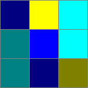
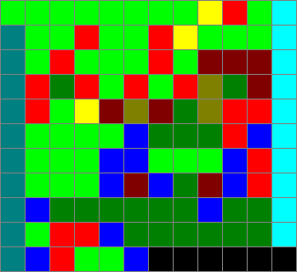
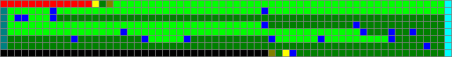

# brainloller

* **Author**: Lode Vandevenne
* **Year**: 2005
* **Canonical source**: https://esolangs.org/wiki/Brainloller (CC0)
* **In LangLib**:
  - `Langlib/Languages/Brainloller/`,
  - runner `lake exe brainloller`,
  - [examples](../../Langlib/Examples/Brainloller/),
  - tests in [`Langlib/Tests/Brainloller.lean`](../../Langlib/Tests/Brainloller.lean),
  - Turing completeness, inherited from brainfuck, in [`Langlib/Computability/Brainloller.lean`](../../Langlib/Computability/Brainloller.lean), and
  - a Turpentine backend via brainfuck in [`Langlib/Languages/Turpentine/Compile/Brainloller.lean`](../../Langlib/Languages/Turpentine/Compile/Brainloller.lean), plus a certified one derived from the completeness proof ([docs/brainloller/compiler.md](compiler.md))

## The idea

Brainloller is brainfuck, encoded one command per pixel. Where Piet makes
you *compute* with colour, Brainloller just spray-paints brainfuck onto a
bitmap: eight colours for the eight commands, two more to steer the
reading head, and every other colour is a comment. Vandevenne (also the
author of LodePNG, a man who clearly thinks in pixels) published it in
2005; the wiki page is CC0, so the design is free to implement.

## Decoding

The ten colours that mean something, in the order of the table below:


| colour | RGB | means |
|--------|-----|-------|
| red | 255,0,0 | `>` |
| dark red | 128,0,0 | `<` |
| green | 0,255,0 | `+` |
| dark green | 0,128,0 | `-` |
| blue | 0,0,255 | `.` |
| dark blue | 0,0,128 | `,` |
| yellow | 255,255,0 | `[` |
| dark yellow | 128,128,0 | `]` |
| cyan | 0,255,255 | rotate the instruction pointer 90° clockwise |
| dark cyan | 0,128,128 | rotate it 90° counterclockwise |
| anything else | | no-op |

The instruction pointer starts on the top-left pixel heading east, reads
the pixel it stands on, then moves one pixel in its current heading.
Rotations take effect before the move. When the pointer walks off the
image, decoding ends and the collected brainfuck program runs. The
rotation colours exist so a long program can snake through a rectangle
instead of being one endless row.

Every program on this page is shown as a picture as well as a text, in the
[Example programs](#example-programs) section at the end.

## Semantic decisions in LangLib

1. **Colours match exactly.** Only the ten RGB values above mean
   anything; all 16777206 others are no-ops (that is the spec, and it is
   also how Brainloller programs carry decorations).
2. **Execution is our brainfuck core**, `Langlib.Brainfuck.evalProg`,
   with all of its documented conventions (8-bit wrapping cells, tape
   unbounded to the right, error left of cell 0, EOF `unchanged` by
   default with `--eof zero|minus1` available): see
   `docs/brainfuck/spec.md`. Vandevenne's page says little more than
   "wrapping bytes", so we inherit rather than invent. Bracket mismatches
   in the decoded pixels are reported by the brainfuck parser.
3. **A pointer that never leaves the image is a parse error.** The
   pointer's state is (pixel, heading), so a walk longer than
   `4 * width * height` steps has repeated a state and will loop forever;
   we detect that instead of spinning.
4. **The encoder** (`Langlib.Brainloller.encode`, or
   `lake exe brainloller --encode out.ppm [--width N] file.b`) lays
   commands left to right, and with `--width N` wraps them into a
   serpentine: two clockwise turns (cyan) take the pointer down and back
   west at the right edge, two counterclockwise turns (dark cyan) turn it
   at the left edge, and black pixels pad the gaps. Decoding an encoded
   image yields exactly the command characters of the source (comments
   are dropped); round-trip tests pin this down.

## Trying it

The runner reads program files as text, so feed it ASCII PPM (P3);
convert anything else first, for example with
`magick prog.png -compress none prog.ppm`.

Hello world, as a 12 by 11 picture.

```
lake exe brainloller Langlib/Examples/Brainloller/hello.ppm
```

Output:

```
Hello World!
```

cat, which needs `--eof zero` for the same reason its brainfuck original
does.

```
echo -n meow | lake exe brainloller --eof zero Langlib/Examples/Brainloller/cat.ppm
```

Output:

```
meow
```

The encoder turns any brainfuck program into a picture. The width
controls how often the image snakes back on itself with rotation codels.

```
lake exe brainloller --encode /tmp/hello.ppm --width 12 Langlib/Examples/Brainfuck/hello.b
```

Output:

```
brainloller: wrote 12x12 image to /tmp/hello.ppm
```

That picture is a program, so run it.

```
lake exe brainloller /tmp/hello.ppm
```

Output:

```
Hello World!
```

Both shipped examples were produced by our own encoder from the command
characters of the brainfuck examples, which makes them LangLib originals of
programs that were already CC0 or folklore. Encoding `hello.b` as it stands
on disk gives a slightly wider picture than `hello.ppm`, because the
bracketed prose at the head of that file is a brainfuck loop like any other
and the encoder paints it too.


## Example programs

Brainloller programs are images, and our runner reads ASCII PPM (P3), so a
program text is a grid of RGB triples. Each example below is given as the
rendered picture, as a **codel map** — `>` `<` `+` `-` `.` `,` `[` `]` for
the eight brainfuck commands, `↻` for clockwise (cyan), `↺` for
counterclockwise (dark cyan), and `·` for any other colour, which is a
no-op — and, where it is short enough, as the file itself. The grid lines
in the pictures are drawn for legibility and are not part of the program.

### `cat.ppm`: five commands in a ring



Three pixels square, and it is the whole of `cat`: read a byte, print it,
repeat until end of input.

```
, [ ↻
↺ . ↻
↺ , ]
```

The pointer starts top left heading east, so it takes dark blue `,`, yellow
`[`, then cyan turns it south. Down the right column it meets cyan again,
turning west; the middle row read right to left is blue `.` and then dark
cyan, which turns it north — and the snake closes. Five commands, `,[.,]`,
laid out as a closed walk. Nine pixels is also small enough to print whole:

```
P3
3 3
255
0 0 128 255 255 0 0 255 255
0 128 128 0 0 255 0 255 255
0 128 128 0 0 128 128 128 0
```

Run it with `--eof zero`, as its brainfuck original needs.

### `hello.ppm`: the serpentine at a glance



The same trick at twelve by eleven, and the shape of the walk is visible
without decoding anything: a dark cyan column down the left edge, a cyan
column down the right, and the brainfuck between them read alternately east
and west.

```
+ + + + + + + + [ > + ↻
↺ + + > + + > [ + + + ↻
↺ + > + + + > + < < < ↻
↺ > - > + > + > ] - < ↻
↺ > + [ < ] < - ] > > ↻
↺ + + + + . - - - > . ↻
↺ + + + . . + + + . > ↻
↺ + + + . < . - < . > ↻
↺ . - - - - - - . - - ↻
↺ + > > . - - - - - - ↻
↺ . > + + . · · · · · ·
```

The first row is read east, the second west, the third east, and so on.
Decoded, it is exactly `hello.b` from the brainfuck examples. The `·` cells
in the last row are black padding — an illustration of the rule that every
colour outside the ten means nothing at all.

### `compiled/letter-a.ppm`: what the compiler emits


The Turpentine backend paints its output in a serpentine of fixed width, 64
codels by default. A Turpentine program that prints `A` and a newline
compiles to two rows, whose first is

```
> > > [ - ] + + + + + + + + + + + + + + + + + + + + + + + + + … + ↻
```

— `>>>[-]` to clear a cell, then sixty-five `+` in one unbroken green line,
because a compiled constant is counted out one increment at a time. The
whole program decodes to

```
>>>[-]+++++ … +++++>[-]<.[-]++++++++++>[-]<.
```

with runs of 65 and 10: the code point of `A`, then the newline. That is how
you tell machine-generated Brainloller from a hand-drawn program across the
room — long monochrome bars where a person would have written a loop.

### `compiled/hello.ppm`: eight rows of the same



`Hello, Turpentine!` at 64 codels wide and eight rows: 460 brainfuck
commands, almost all of them `+` and `-`. The compiler does at least reach
each letter from the one before it rather than starting from zero every
time, so after the 72 increments that build `H` the runs are the
differences — 29 to `e`, 7 to `l`, none at all for the second `l`, then a
long dark-green descent of 67 for the comma.

Both compiled examples were produced with
`lake exe turpentine compile --to brainloller`.

### Rendering these pictures

Brainloller is one of the two graphical languages in the library, so its
pictures are derived files: everything under `docs/brainloller/img/` is
generated from the programs in `Langlib/Examples/Brainloller/` and must
never be edited by hand. Regenerate the whole set — this page's and Piet's —
with one command:

```
scripts/render-docs-images.sh
```

To check that the committed images still match the examples without touching
the tree, which is what to run after changing an example:

```
scripts/render-docs-images.sh --check
```

Output:

```
docs images are up to date
```

The renderer is `scripts/ppm-to-png.py`, which writes the PNG by hand out of
`zlib` and `struct` so that a bare checkout can regenerate the documentation
with no image library installed. It blows each codel up to a square block
and draws the grid between blocks; the trailing number is the scale in
pixels per codel, chosen per image so that a three-pixel program and a
64-wide one both arrive at a legible size:

```
python3 scripts/ppm-to-png.py Langlib/Examples/Brainloller/cat.ppm docs/brainloller/img/cat.png 48
```

Output:

```
docs/brainloller/img/cat.png: 3x3 codels -> 148x148 px (scale 48, grid True)
```

The colour key at the top of this page is not a program and has no source
image; the script draws it from the same table the decoder uses:

```
python3 scripts/ppm-to-png.py --legend docs/brainloller/img/colours.png
```

Output:

```
docs/brainloller/img/colours.png: 466x52 legend, 10 colours
```

Pass `--no-grid` for a picture at true proportions, and note that any
Brainloller image can be rendered this way, not only the examples: use
`lake exe brainloller --encode` to paint a brainfuck program first.
