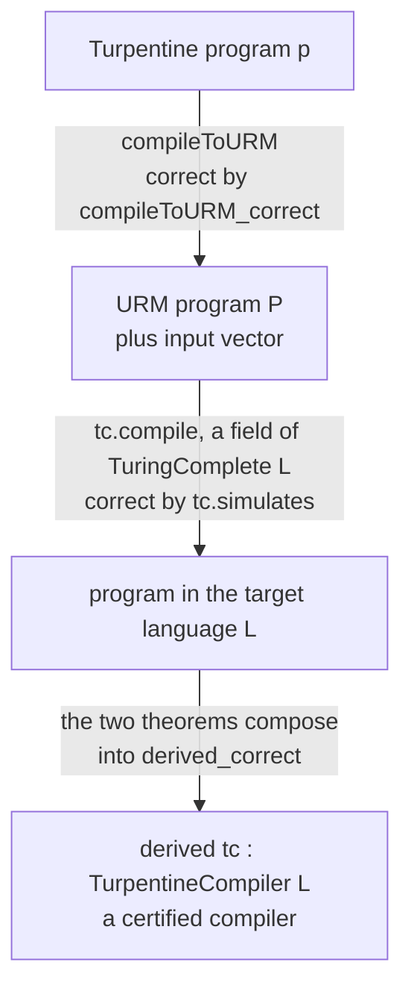
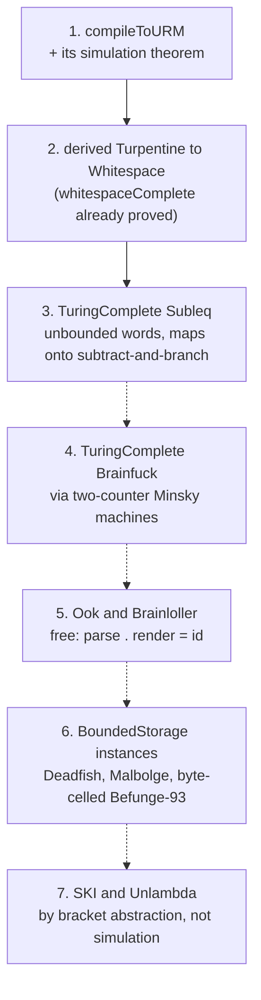

# Certified compilation via the URM

How LangLib gets verified compilers from Turpentine into esoteric
languages without writing a verified backend for each one, and the order
in which the pieces have to land.

This is the concrete plan behind Stage 9 of [PLAN.md](PLAN.md). The design
argument is in [verification.md](verification.md); this page is the
engineering.

## Where the definitions live

| Definition | File |
|---|---|
| `ProgLang`, the class of runnable languages | [Class.lean:40](../Langlib/Computability/Class.lean#L40) |
| `computes_of_turingComplete`, the bridge to cslib | [Class.lean](../Langlib/Computability/Class.lean) |
| `TurpentineCompiler`, a compiler bundled with its proof | [Derived.lean:55](../Langlib/Computability/Derived.lean#L55) |
| **`derived`**, the general correctness theorem | [Derived.lean:83](../Langlib/Computability/Derived.lean#L83) |
| `derivedWhitespace`, `derivedSubleq`, the instances | [Derived.lean:101](../Langlib/Computability/Derived.lean#L101) |
| `agree`, two compilers give one answer | [Derived.lean:115](../Langlib/Computability/Derived.lean#L115) |
| `compileToURM_correct`, the shared first hop | [Compile/URM.lean:2075](../Langlib/Turpentine/Compile/URM.lean#L2075) |
| **`TuringComplete`**, the completeness claim | [Class.lean:80](../Langlib/Computability/Class.lean#L80) |
| `BoundedStorage`, the incompleteness claim | [Class.lean:134](../Langlib/Computability/Class.lean#L134) |
| `halts_iff_search`, decidability from a bound | [Class.lean:162](../Langlib/Computability/Class.lean#L162) |
| `whitespaceComplete`, a proved instance | [Whitespace.lean:1117](../Langlib/Computability/Whitespace.lean#L1117) |
| `subleqComplete`, a proved instance | [Subleq.lean](../Langlib/Computability/Subleq.lean) |
| its compiler, `compile` | [Whitespace.lean:126](../Langlib/Computability/Whitespace.lean#L126) |
| its `simulation` theorem | [Whitespace.lean:1048](../Langlib/Computability/Whitespace.lean#L1048) |
| our URM helpers over cslib's | [URM.lean](../Langlib/Computability/URM.lean) |
| cslib's `Instr` and `Program` | `Cslib/Computability/URM/Defs.lean` |
| **`compileToURM`**, Turpentine to the URM | [Compile/URM.lean:404](../Langlib/Turpentine/Compile/URM.lean#L404) |
| **`compileToURM_correct`**, its simulation | [Compile/URM.lean:2075](../Langlib/Turpentine/Compile/URM.lean#L2075) |
| `TurpentineHaltsWith`, the answer convention | [Compile/URM.lean:2060](../Langlib/Turpentine/Compile/URM.lean#L2060) |
| `TurpentineCompiler`, the interface | [Derived.lean:55](../Langlib/Computability/Derived.lean#L55) |
| `derived`, one construction for every target | [Derived.lean:83](../Langlib/Computability/Derived.lean#L83) |
| `derivedWhitespace` | [Derived.lean:101](../Langlib/Computability/Derived.lean#L101) |
| `derivedSubleq` | [Derived.lean:105](../Langlib/Computability/Derived.lean#L105) |
| `agree`, two compilers give one answer | [Derived.lean:115](../Langlib/Computability/Derived.lean#L115) |
| its tests | [Tests/DerivedWhitespace.lean](../Langlib/Tests/DerivedWhitespace.lean) |
| the axiom audit | [scripts/axioms.lean](../scripts/axioms.lean) |

The bespoke backends, for contrast, are
[Brainfuck.lean](../Langlib/Turpentine/Compile/Brainfuck.lean),
[Whitespace.lean](../Langlib/Turpentine/Compile/Whitespace.lean) and
[Subleq.lean](../Langlib/Turpentine/Compile/Subleq.lean).

## The pipeline

```
Turpentine program
      │
      │  compileToURM          one compiler, proved once
      ▼
URM program + input vector          (cslib's unlimited register machine)
      │
      │  TuringComplete.compile     already proved, per language
      ▼
target program
```

The second arrow is free. It is not a new compiler: it is the `compile`
field of that language's `TuringComplete` instance, which exists because
somebody proved the language Turing complete. Whitespace already has one
([`whitespaceComplete`](../Langlib/Computability/Whitespace.lean#L1117)),
so the only work for a verified Turpentine-to-Whitespace compiler was the
first arrow. `derivedWhitespace` is the composition.

## The interface it plugs into

[`Langlib/Computability/Class.lean`](../Langlib/Computability/Class.lean)
fixes the shape:

```lean
structure TuringComplete (L : Type) [ProgLang L] where
  compile      : URM.Program → List Nat → ProgLang.Prog L
  encodeInput  : List Nat → Input
  decodeOutput : ByteArray → Option Nat
  simulates    : ∀ P inputs result, HaltsWithResult P inputs result →
                   ∃ m, (run (compile P inputs) (encodeInput inputs) m).exit = .halted ∧
                        decodeOutput (…).output = some result
```

`compile` takes the input vector as an argument rather than reading a
stream, because a URM has no I/O: it starts with registers set and halts
with registers set. That choice is what makes the composition below
type-check, and it is also what bounds the fragment.

## What is built

### 1. `compileToURM`

[`Langlib/Turpentine/Compile/URM.lean`](../Langlib/Turpentine/Compile/URM.lean):

```lean
def compileToURM : Turpentine.Program → Except String (URM.Program × List Nat)
```

The URM instruction set is four instructions: `Z n` (zero a register),
`S n` (increment), `T m n` (copy), `J m n k` (jump to `k` if registers `m`
and `n` are equal). Everything else is a macro.

* **Registers.** Register 0 is the answer, register 1 is a permanent zero so
  that `J r 1 k` reads as "jump if `r` is zero", registers 2 upward hold one
  Turpentine variable each in declaration order, and the block above them is
  scratch for the arithmetic macros.
* **Arithmetic.** Addition counts a scratch register up to the second operand
  while incrementing the accumulator; multiplication is that loop nested
  inside another. Both are quadratic, which is fine because this compiler is
  not for speed.
* **Comparison and booleans.** `J` tests equality only, so `<`, `<=`, `>` and
  `>=` all count a scratch register up from zero and see which operand it
  meets first. `==` and `!=` are one `J` and a two-instruction tail. `!`
  tests against the permanent zero.
* **Control flow.** `if` and `while` are jumps, and the targets are absolute
  from the moment the code is emitted: `compileExpr slots q e d` places the
  code for `e` *at position `q`*, so there is no label-resolution pass. The
  price is a pair of size functions, `exprSize` and `stmtSize`, that have to
  agree with the emitted length; `length_compileExpr` and `length_compileStmt`
  prove that they do.

The output has no I/O and no input vector: `compileToURM` always returns
`[]` for the input (`compileToURM_inputs`), because the fragment is I/O-free
and every value the machine needs is built from zero.

**The answer convention.** A URM has no output. It starts with registers set
and halts with registers set, and `Cslib.URM.HaltsWithResult` reads the
answer out of register 0. So the answer is named by a variable rather than
printed: a compilable program declares a scalar `int` variable **`answer`**,
and the compiled machine's last instruction copies it into register 0. This
is why every printing statement is rejected: with `print` in the language
there is a *stream* of answers and no single `Nat` for the theorem to name.

### 2. `TurpentineCompiler`: one interface, many instances

[`Langlib/Computability/Derived.lean`](../Langlib/Computability/Derived.lean)
makes "a verified compiler from Turpentine into `L`" a first-class thing, the
way `TuringComplete L` is, so that the derived compiler and a future verified
hand-written one are two inhabitants of one interface rather than two
unrelated definitions:

```lean
structure TurpentineCompiler (L : Type) [ProgLang L] where
  compile : Turpentine.Program → Except String (ProgLang.Prog L)
  encodeInput : Input
  decodeOutput : ByteArray → Option Nat
  correct : ∀ (p : Turpentine.Program) (prog : ProgLang.Prog L) (result n : Nat),
    compile p = .ok prog → TurpentineHaltsWith p n result →
      ∃ m,
        (ProgLang.run prog encodeInput m).exit = Exit.halted ∧
        decodeOutput (ProgLang.run prog encodeInput m).output = some result
```

`compile` is total, and `Except.error` names the constructs outside the
fragment, so the fragment is part of the data rather than prose. Because
`correct` quantifies over *everything* `compile` accepts, `compileToURM`
accepts exactly the fragment it can prove itself correct on.

`encodeInput` is a single stream rather than a function of the program
because `TurpentineHaltsWith` is I/O-free: the source reads nothing, so
there is nothing for a caller to supply.

**A structure, not a `class`.** The point of the exercise is to have
*several* compilers for the same target at once (a derived one and an
effective one for Whitespace, today), and instance resolution is built to
pick exactly one. A `class` would either be ambiguous or silently choose for
you, which is the opposite of what is wanted. So this is bundled data with
named inhabitants, exactly like `TuringComplete`, and callers say which
compiler they mean. `ProgLang L` stays a real class, because there is only
ever one way to run a given language.

What the interface buys:

* **The derived construction is one function**, not one per language:

  ```lean
  def derived [ProgLang L] (tc : TuringComplete L) : TurpentineCompiler L
  ```

  `L` and `tc` are arbitrary, so it is proved once and every completeness
  proof that lands afterwards yields a verified Turpentine compiler by
  applying it. `derivedWhitespace := derived whitespaceComplete` is the first
  end-to-end certified compiler in the library, and
  `derivedSubleq := derived subleqComplete` is the second, written on one
  line with no new proof.

* **Agreement is a theorem about the interface**, proved once for all
  instances and all targets rather than per pair:

  ```lean
  theorem agree [ProgLang L] (c₁ c₂ : TurpentineCompiler L)
      (p : Turpentine.Program) (prog₁ prog₂ : ProgLang.Prog L) (result n : Nat)
      (h₁ : c₁.compile p = .ok prog₁) (h₂ : c₂.compile p = .ok prog₂)
      (hp : TurpentineHaltsWith p n result) :
      ∃ m₁ m₂,
        (ProgLang.run prog₁ c₁.encodeInput m₁).exit = Exit.halted ∧
        (ProgLang.run prog₂ c₂.encodeInput m₂).exit = Exit.halted ∧
        c₁.decodeOutput (ProgLang.run prog₁ c₁.encodeInput m₁).output =
          c₂.decodeOutput (ProgLang.run prog₂ c₂.encodeInput m₂).output
  ```

  It follows from the two `correct` fields against the one specification.
  That is the formal version of "the derived compiler is an oracle for the
  effective one": once the effective backend has an instance, the oracle
  claim stops being a testing practice and becomes a corollary.

* **A verified effective backend slots in without disturbing anything.**
  Proving `Langlib/Turpentine/Compile/Whitespace.lean` correct means
  producing a second `TurpentineCompiler WhitespaceLang`, and every consumer
  keeps working.

### 3. The theorem, and why it composes

The whole design rests on one statement lining up with `TuringComplete`'s
`simulates` field, so it is written to match that field's shape exactly.

`TuringComplete L` gives, for any URM program `P`, input vector `inputs` and
answer `result`:

```lean
HaltsWithResult P inputs result →
  ∃ m, (run (tc.compile P inputs) (tc.encodeInput inputs) m).exit = .halted ∧
       tc.decodeOutput (…).output = some result
```

`compileToURM` discharges the *hypothesis* of that implication:

```lean
theorem compileToURM_correct
    (p : Turpentine.Program) (P : UProg) (inputs : List Nat)
    (result n : Nat)
    (hc : compileToURM p = .ok (P, inputs))
    (hp : TurpentineHaltsWith p n result) :
    Cslib.URM.HaltsWithResult P inputs result
```

where the source-side convention is named explicitly:

```lean
def TurpentineHaltsWith (p : Turpentine.Program) (n : Nat) (result : Nat) : Prop :=
  ∃ (env₀ : Std.HashMap String Value) (st : Turpentine.State),
    Turpentine.initEnv p = .ok env₀ ∧
    Turpentine.exec n p.body { env := env₀, input := Input.ofString "" } =
      (st, Exit.halted) ∧
    st.env[answerVar]? = some (Value.int (result : Int))
```

`Turpentine.exec` and `Turpentine.initEnv` are the *reference interpreter*
from `Langlib/Turpentine/Semantics.lean`, unmodified: the theorem is about
the language as the rest of the library defines it, not about a second
semantics written to be convenient.

The two then compose without glue, which is what `derived` does: feed the
conclusion of the first into the hypothesis of the second, the URM program
disappears from the statement, and what is left is exactly a
`TurpentineCompiler L` correctness field.

Three details make the composition work, and all three are in the statements
above:

* **The answer is a single `Nat` in register 0**, because that is what
  `HaltsWithResult` says and what `decodeOutput` returns. Hence the `answer`
  variable and the I/O-free fragment.
* **`inputs` is produced by the compiler, not supplied by the caller.**
  `compileToURM` returns the pair; a program's initial register vector comes
  from its declarations, and here it is always empty.
* **Fuel is universal on the source side and existential on the target
  side.** `n` is given, `m` is produced, and nothing relates them. The proof
  is phrased through `Langlib.Common.Reaches`, which carries an exact target
  cost and composes by `Reaches.trans`, so no fuel monotonicity lemma is
  needed and no cost model of the target leaks into the statement.

**The shape of the proof.** `Agree slots env regs` relates a Turpentine
environment to the registers: each declared variable's value is the content
of its register. `Frame d regs regs'` says a macro at destination `d` touches
no register below `d`, which is what lets an operator's left operand survive
while its right operand is computed. `reaches_compileExpr` is a structural
induction on expressions; `reaches_compileStmt` is the induction `exec`
itself is defined by, outer on the fuel and inner on the statement, because
`seq` recurses on the statement at the same fuel and everything else drops
the fuel by one.

### 4. The fragment, exactly

A URM computes a function from a vector of naturals to a natural, and the
fragment is what survives that. `compileToURM` **accepts**:

* declarations of `int` and `bool` variables **without initialisers**, one of
  them named `answer`. Every variable starts at `0` / `false`, which is what
  the registers start at;
* expressions: non-negative integer literals, boolean literals, variables,
  `!`, `+`, `*`, `==`, `!=`, `<`, `<=`, `>`, `>=`;
* statements: `skip`, sequencing, assignment, `if`, `while`, `assert`.

and **rejects**, each with a message naming the construct:

| rejected | why |
|---|---|
| `-`, unary minus, negative literals | Turpentine's integers are `Int` and a register is a `Nat`. `a - b` can be negative where the machine can only saturate at zero, so `Agree` would break on the intermediate value. |
| `/`, `%` | the same, plus `Int.ediv`/`Int.emod` reasoning. |
| `&&`, `\|\|` | Turpentine short-circuits them and the emitted code evaluates both operands. The two agree only when the right operand is total, which is a semantic side condition, not a syntactic one. |
| arrays, in declarations and expressions | a computed index needs a dispatch chain; a static one needs the block layout lemmas generalised past one register per variable. |
| `readInt`, `readByte`, `print`, `println`, `printByte` | a URM has neither an input stream nor an output stream. |

`assert` **is** compiled, and a failing assert becomes a one-instruction
self-loop: `J sb 1 q` at position `q`, taken exactly when the asserted
expression is false. So an assertion failure, which the reference
interpreter reports as a runtime error, becomes divergence in the target.
That is sound for the theorem, whose hypothesis requires the source to halt,
and it is the behaviour the whitespace and subleq backends already have.

**Lifting the restrictions.** Subtraction and division are the interesting
ones, and they need the same thing: a `Nat`-valued reference semantics for
the fragment, with `a - b` defined only when `b ≤ a`, plus a bridge theorem
saying it agrees with `Turpentine.exec` wherever it is defined. Then the
compiler is proved against the `Nat` semantics and the bridge carries the
result back to the real interpreter. That is a second interpreter and a
second simulation proof, which is why it is not here yet. `&&` and `||` need
a totality lemma for the certified expressions, which is easy once negative
intermediates are gone. Arrays need the layout lemmas generalised.

### 4b. Widening the fragment, in order

The restrictions are not equally expensive to lift, and they are not
equally often hit. Compiling every example in
`Langlib/Examples/Turpentine/` with `--tc` and recording the *first*
complaint gives the real ranking:

| first blocker | examples |
|---|---|
| a declaration has an initialiser | collatz, fib, isqrt, primes, sumdigits |
| no variable named `answer` | cat, gcd, hello |
| an array | maxelem, sieve, sort |

Subtraction, division, `&&` and `||` never come first: something cheaper
stops the program before the compiler reaches them. So the order to widen
in is:

1. **Initialisers.** `var x : int := e;` is a declaration followed by an
   assignment, and the reference semantics agrees: `initEnv` evaluates
   initialisers in order, in scope of the earlier ones. Desugaring them to
   assignments at the head of the body should be a small change to
   `compileToURM` and a correspondingly small change to the proof, and it
   unblocks five of the eleven examples. Do this first.
2. **`&&` and `||`.** The emitted code evaluates both operands where the
   source short-circuits, so they agree exactly when the right operand is
   total. Every in-fragment expression is total once negatives are gone,
   so this is a lemma rather than a redesign.
3. **Subtraction, division and modulo.** The real work: a URM register is
   a `Nat` and Turpentine's integers are `Int`, so this needs either a
   `Nat`-valued reference semantics for the fragment plus a bridge to
   `Turpentine.exec`, or a sign representation costing two registers per
   variable. Choose deliberately; the bridge is probably cheaper to prove
   and the sign encoding is certainly cheaper to explain.
4. **Arrays.** Generalise the slot layout past one register per variable.
   The addressing is easier here than in any esolang backend, because
   register indices are compile-time constants, so a computed index needs
   a dispatch chain rather than self-modifying code.
5. **I/O, by convention rather than by changing the model.** A URM has no
   input or output, but it does not need any: it *starts* with registers
   set and *halts* with registers set, which is enough if Turpentine
   agrees to say so.

   **Input** is already plumbed and unused. `compileToURM` returns
   `(UProg × List Nat)` and `TuringComplete.compile` takes that vector,
   but today the compiler always returns `[]`
   (`compileToURM_inputs`). Designate variables, `input0`, `input1` and so
   on, map them to the initial register vector, and input works with no
   change to the model, the interface, or any completeness proof.

   **Output** stays the single `Nat` in `answer`. To print a string, the
   program builds its base-256 encoding in `answer` and the runner renders
   it as bytes. That is a *presentation* convention sitting outside the
   theorem: the theorem still says the compiled program's answer equals
   the source program's, and rendering that number as text changes
   nothing about what was proved.

   What this cannot do, and the docs must say so: there is no
   interleaving. Output is observable only at halt, not as a stream, so a
   program that prints and then loops forever prints nothing. Input is
   fixed before the run, so nothing can be read that depends on what was
   printed. Programs needing genuine streaming stay with the bespoke
   compilers.

   This is preferred over extending the model to `URM+IO` with `read` and
   `write` instructions. That extension would force every completeness
   proof in the library to say what its language does with two new
   instructions, for a capability the register machine's own conventions
   already provide.

Each step keeps the same obligation: `compileToURM_correct` must still
hold for the widened fragment, with Lean asserting only what is proved.

### 5. What it is for

Not for running programs. The derived compiler emits large, slow output: a
Turpentine `while` becomes a URM loop becomes a whitespace label block, with
every arithmetic operation unrolled into unary counting. Measured numbers are
below. Its uses are:

* **A verified compiler exists at all**, for every language proved
  complete, the day the proof lands.
* **A test oracle** for the hand-written effective backends: same source,
  same input, same answer. Two independent implementations of one
  specification is a stronger check than golden files.
* **Coverage** for languages nobody will hand-write a backend for.

## Should the effective compilers survive? Yes, both stay

The question is whether a verified derived compiler makes the hand-written
whitespace and subleq backends redundant. It does not, and the numbers say
why.

**Size and speed, measured.** Both columns are the same Turpentine source
compiled to whitespace and run on the same interpreter; the effective
backend's version has `print(answer);` appended, since it has no `answer`
convention. Steps are the exact smallest fuel that halts.

| program | URM | derived: chars / steps | effective: chars / steps | ratio |
|---|---|---|---|---|
| `while i < 5 { i := i + 1; answer := answer + i; }` | 36 instrs | 1875 / 1730 | 171 / 129 | 11× / 13× |
| factorial of 6 by repeated `*` | 48 instrs | 2863 / 29729 | 216 / 167 | 13× / 178× |

Code size is about one order of magnitude. Running time is worse and gets
worse with the operand values, because the URM's only arithmetic is increment
and copy, so multiplication is a doubly nested counting loop and every round
of it is a whitespace label block. Nobody would ship that.

**Coverage, in the other direction.** The effective backends accept the
*entire* Turpentine language: I/O, arrays, negative integers. The derived
pipeline accepts the I/O-free, non-negative fragment of section 4, because
that is what a URM is. So the verified compiler is not a superset of the
practical one; each does something the other cannot.

**Cost of keeping both** is low. They share a source language, a test
suite, and the specification they are checked against. The derived one is
generated from a proof that we want anyway.

So the library keeps two compilers per target and says which is which:

| | effective | derived |
|---|---|---|
| written by | hand, per language | composition, once |
| verified | not yet | by construction |
| fragment | the whole language | I/O-free, non-negative, no `-` `/` `%` `&&` `\|\|` or arrays |
| output size | small | 10× to 15× larger, and much slower |
| purpose | running programs | proving, and testing the other one |

The long-term aim is to verify the effective compilers directly, against
the same specification (see [verification.md](verification.md)). Until
then, the derived compiler is the strongest available check on them:
compile the same source both ways, run both, compare. That is two
independent implementations of one specification, which is a much better
test than a golden file.

## Every mode, with real output

`compile` and `exec` each take `--bespoke` or `--tc`, so the choice
of compiler is explicit; passing both is an error, passing neither uses the
bespoke one, and whichever runs is named in the message, so a build log
records which compiler produced an artifact.

Two source programs are used below. `sum.turp` is inside the certified
fragment: I/O-free, no subtraction or division, and its result is in a
variable called `answer`, because a URM has no output and the theorem reads
register 0.

```
cat sum.turp
```

Output:

```
var answer : int;
var i : int;
while i < 5 {
  answer := answer + i;
  i := i + 1;
}
```

`Langlib/Examples/Turpentine/isqrt.turp` is not: it reads a number and
prints one, so only the bespoke compilers accept it.

### Interpret

```
echo 17 | lake exe turpentine run Langlib/Examples/Turpentine/isqrt.turp
```

Output:

```
4
```

### Type-check without running

```
lake exe turpentine check sum.turp
```

Output:

```
sum.turp: well typed (2 variable(s), 2 declaration(s))
```

### Compile and run in one step, bespoke

```
echo 17 | lake exe turpentine exec --via whitespace --bespoke Langlib/Examples/Turpentine/isqrt.turp
```

Output:

```
4
```

### Compile and run in one step, certified

```
lake exe turpentine exec --via whitespace --tc sum.turp
```

Output:

```
10
```

### Emit the target program, then run it yourself

```
lake exe turpentine compile --to subleq --bespoke -o isqrt.sq Langlib/Examples/Turpentine/isqrt.turp
```

Output:

```
turpentine: wrote 22615 bytes to isqrt.sq [bespoke, hand-written and unverified]
```

The emitted file is an ordinary program in that language:

```
echo 17 | lake exe subleq isqrt.sq
```

Output:

```
4
```

The certified compiler for the same target, on the in-fragment program.
Subleq's only output primitive is a single byte, so its `decodeOutput`
counts bytes: ten of them is the answer.

```
lake exe turpentine compile --to subleq --tc -o sum.sq sum.turp
```

Output:

```
turpentine: wrote 1286 bytes to sum.sq [certified, derived from the Turing-completeness proof]
```

```
lake exe subleq sum.sq
```

Output:

```
1111111111
```

### Emit to stdout

With no `-o`, the program goes to stdout and the note to stderr, so
redirecting captures only the program.

```
lake exe turpentine compile --to whitespace --bespoke sum.turp > sum.ws
```

Output:

```
turpentine: emitting 159 bytes [bespoke, hand-written and unverified]
```

### What the two schemes cost

The same program, both compilers, one target:

| | bespoke | certified |
|---|---|---|
| whitespace | 159 bytes | 1873 bytes |
| subleq | 2874 bytes | 1286 bytes |

Subleq is the surprise: the certified output is *smaller*, because the
bespoke backend carries runtime routines for multiplication, division and
decimal printing that this program never uses, while the certified one
emits only what the register machine needs. Code size is roughly one order
of magnitude apart in general; running time is worse, and grows with the
operand values.

### When it refuses

Out of fragment, the certified compiler names the construct rather than
emitting something it cannot justify:

```
echo 17 | lake exe turpentine exec --via whitespace --tc Langlib/Examples/Turpentine/isqrt.turp
```

Output:

```
turpentine exec: 'x' has an initialiser; the certified URM fragment declares variables without one, since every register starts at zero
turpentine: the certified compiler accepts only the I/O-free fragment
  (no input or output, no subtraction, division or modulo, no arrays,
  no && or ||, and the result in a variable named 'answer').
turpentine: retry with --bespoke to compile the whole language.
turpentine: nothing was run
```

A rejection says what it did *not* do, so a failed compile cannot be
mistaken for a quiet success: `compile` names the file it did not write,
`exec` says nothing was run, and both exit 1.

A target with no completeness proof has no certified compiler to offer:

```
lake exe turpentine compile --to brainfuck --tc sum.turp
```

Output:

```
turpentine compile: no certified compiler for 'brainfuck' yet
```

Running out of fuel is reported distinctly from halting, and exits 2:

```
echo 27 | lake exe turpentine exec --via brainfuck --bespoke --fuel 100000 Langlib/Examples/Turpentine/collatz.turp
```

Output:

```
turpentine exec: out of fuel after 100000 steps of brainfuck (raise with --fuel)
```

## Two diagrams

The first shows how a certified compiler is *obtained* for one target: the
arrows are the steps of the composition. The second shows the *order of
work* across targets, where dashed arrows mark what is still planned.

### How a certified compiler is obtained

A Turpentine program reaches the target in two hops, and **each hop already
has a correctness theorem**. Composing the two theorems is what produces the
certified compiler; no third proof is written.



Read the hops as follows.

**First hop, written once.** `compileToURM` turns a Turpentine program into
a URM program plus the initial register vector. Its theorem says that if the
Turpentine program halts with an answer, the URM halts with the same answer
in register 0. This is the only compiler anyone writes by hand for this
pipeline, and it is shared by every target.

**Second hop, free per target.** `tc.compile` is not new code either: it is
a *field* of `tc : TuringComplete L`, the completeness proof for `L`. Its
theorem, `tc.simulates`, says that a halting URM run becomes a halting `L`
run whose output decodes to the same answer. Anyone who proves `L` Turing
complete has, without intending to, supplied this hop.

**The composition.** `compileToURM_correct` concludes exactly what
`tc.simulates` assumes (`URM.HaltsWithResult P inputs result`), so the two
fit with no glue, and `derived_correct` quantifies over an arbitrary `L` and
an arbitrary `tc`. It is proved once and applies to every language anyone
ever proves complete. That is the sense in which a completeness proof yields
a verified compiler.

For Whitespace both hops are in place:
[`whitespaceComplete`](../Langlib/Computability/Whitespace.lean#L1117) and
`compileToURM_correct` are both proved and axiom-clean, and
`derivedWhitespace := derived whitespaceComplete` is a certified
Turpentine-to-Whitespace compiler with no further work.
[`Langlib/Tests/DerivedWhitespace.lean`](../Langlib/Tests/DerivedWhitespace.lean)
runs it: 41 cases, including a suite that compares every answer against the
Turpentine reference interpreter, a suite that pins every rejection, and a
suite that repeats the exercise through `derivedSubleq`.

### What unlocks what



Step 1 gates everything, which is why it is being built first. Steps 3 and
4 are ordered by difficulty rather than necessity: subleq needs no
encoding at all, brainfuck needs unary counters on a tape, and doing the
easy one first settles the shape of the proof. Step 6 exercises the other
half of the interface, and step 7 is the one completeness argument in the
library that is not a machine simulation.

Per-language status, including which languages have which compilers
today, lives in the status matrix in [README.md](README.md).

## Order of work

1. ~~**`compileToURM`** plus its simulation theorem.~~ Done, for the
   fragment in section 4.
2. ~~**Derived Turpentine to Whitespace**~~, by composing with the proof
   that already existed. Done: `derivedWhitespace`, the first end-to-end
   certified compiler in the library.
3. **`TuringComplete Subleq`**. Unbounded signed words, so no encoding
   pain; the URM's four instructions map onto subtract-and-branch almost
   directly. Second derived compiler, and an oracle for the effective
   subleq backend.
4. **`TuringComplete Brainfuck`**, via two-counter Minsky machines with
   unary counters on the tape rather than through the 16-bit effective
   backend. Unlocks Ook and Brainloller for free through
   `parse ∘ render = id`.
5. **The negative results**: `BoundedStorage` instances for Deadfish,
   Malbolge, and byte-celled Befunge-93. Short, and they exercise the
   other half of the interface.
6. **SKI and Unlambda** by bracket abstraction, the one completeness
   argument in the library that is not a machine simulation.

## Checking the results are real

`scripts/axioms.lean` prints the axiom dependencies of every completeness
result:

```
lake env lean scripts/axioms.lean
```

Output:

```
'Langlib.Computability.whitespaceComplete' depends on axioms: [propext, Classical.choice, Quot.sound]
'Langlib.Turpentine.Compile.URM.compileToURM_correct' depends on axioms: [propext, Classical.choice, Quot.sound]
'Langlib.Computability.derived' depends on axioms: [propext, Classical.choice, Quot.sound]
'Langlib.Computability.agree' depends on axioms: [propext, Classical.choice, Quot.sound]
```

Add a line to it for every new instance. Anything beyond those three
axioms, `sorryAx` above all, means the result is not what it claims.
