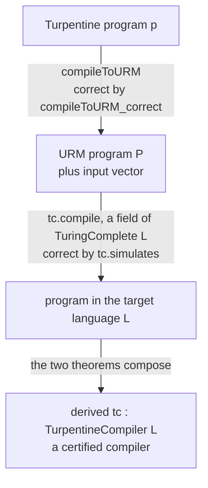

# Certified compilation

A compiler is *certified* when a machine-checked theorem says the program
it emits does what the source program does. LangLib has certified compilers
from [Turpentine](turpentine/spec.md), its own readable imperative
language, into esoteric targets — and the point of this page is that almost
none of them were written by hand.

There are two halves to that claim, and this page is organised around them.

* **What "correct" means.** Two definitions, one weaker and one stronger,
  both generic in the source language and the target:
  [`CertifiedCompiler`](../Langlib/Common/Compilation.lean#L153) preserves
  the program's *answer*, and
  [`IOCertifiedCompiler`](../Langlib/Common/Compilation.lean#L321)
  preserves its *behaviour* — the bytes it read and printed, in order. The
  second implies the first.
* **Two ways to get one.** *Derived*, by composing one shared
  Turpentine-to-register-machine pass with a language's Turing-completeness
  proof, which costs one line per target and accepts a restricted fragment;
  and *bespoke*, by hand-writing a backend for the whole language and
  proving it, which costs real work per target. Both land in the same
  interface, so where a target has both, they are provably in agreement.

Everything here is stated over
[`ProgLang`](../Langlib/Common/Compilation.lean#L93), the class every
language in the library instantiates: a program type, a parser, and a pure
fuel-based interpreter. The design argument behind the whole pipeline is in
[verification.md](verification.md); this page is the engineering, and the
staged plan is [PLAN.md](PLAN.md).

## 1. What "correct" means

### 1.1 Answer preservation

"A verified compiler" is not Turpentine's notion, and it is not the register
machine's either, so it lives with neither.
[`Langlib/Common/Compilation.lean`](../Langlib/Common/Compilation.lean)
makes it a first-class thing, generic in the source language `Src`, the
answer type `Ans` and the target `L`:

```lean
structure CertifiedCompiler {Src Ans : Type} (spec : Src → Nat → Ans → Prop)
    (L : Type) [ProgLang L] where
  compile : Src → Except String (ProgLang.Prog L)
  encodeInput : Input
  decodeOutput : ByteArray → Option Ans
  correct : ∀ (p : Src) (prog : ProgLang.Prog L) (result : Ans) (n : Nat),
    compile p = .ok prog → spec p n result →
      ∃ m,
        (ProgLang.run prog encodeInput m).exit = Exit.halted ∧
        decodeOutput (ProgLang.run prog encodeInput m).output = some result
```

`spec p n result` reads "the source program `p`, run with fuel `n`, produces
the answer `result`". It is a *parameter* and not a field, and that is the
whole reason the interface is worth having: two compilers can only be
compared when they answer to the same specification, and putting the
specification in the type is what states that.

`compile` is total, and `Except.error` names the constructs outside this
compiler's fragment, so **the fragment is part of the data rather than
prose**. Because `correct` quantifies over everything `compile` accepts, a
compiler accepts exactly what it can prove itself correct on.

`encodeInput` is a single stream and not a function of the program, because
this notion is for I/O-free source programs: they read nothing, so there is
nothing for a caller to supply. Section 1.2 is the interface for the ones
that do read.

Turpentine's compilers are this type at Turpentine's own specification, one
line in
[`Derived.lean`](../Langlib/Languages/Turpentine/Compile/Derived.lean#L82):

```lean
abbrev TurpentineCompiler (L : Type) [ProgLang L] :=
  CertifiedCompiler TurpentineHaltsWith L
```

**Data, not a `class`.** The point of the exercise is to have *several*
compilers for one target at once, and instance resolution is built to pick
exactly one; a class would be ambiguous or would choose silently. So this is
bundled data with named inhabitants, exactly like `TuringComplete`, and
callers say which compiler they mean.
[`ProgLang L`](../Langlib/Common/Compilation.lean#L93) stays a real class,
because there is only ever one way to *run* a given language.

Two theorems come with the interface, proved once for every source and
target:

* [`agree`](../Langlib/Common/Compilation.lean#L184) — on a program two
  compilers both accept and a source run producing `result`, both compiled
  programs halt and their outputs decode to the same answer. It follows from
  the two `correct` fields against the one specification, which is the formal
  version of "the derived compiler is an oracle for the hand-written one":
  once the hand-written backend has an inhabitant, the oracle claim stops
  being a testing practice and becomes a corollary.
* [`weaken`](../Langlib/Common/Compilation.lean#L216) — a compiler correct
  for `spec` is correct for anything `spec` refines. This is what lets a
  behavioural result be read back as an answer-only one.

Note what `agree` does *not* require: the two compilers may decode their
output completely differently. The derived subleq compiler prints its answer
in unary, so its `decodeOutput` is `some b.size`; `bespokeSubleq` prints a
byte and reads the output as a big-endian base-256 numeral. `agree` equates
the *decoded answers*, not the byte strings. What would be unsound is a
decoder that ignores the output, and neither does.

`Langlib/Common/Compilation.lean` imports nothing but the execution model.
It is free of Mathlib and of cslib, deliberately, so a hand-written backend
can state and prove its own correctness without either reaching the
interpreters. Only the *computability* half of the story —
[`TuringComplete`](../Langlib/Common/Computability.lean#L114),
[`BoundedStorage`](../Langlib/Common/Computability.lean#L235), and
[the bridge to cslib's vocabulary](../Langlib/Common/Computability.lean#L183)
— needs a universal model, and it lives next door in
[`Langlib/Common/Computability.lean`](../Langlib/Common/Computability.lean).

### 1.2 Behaviour preservation

`CertifiedCompiler` preserves an *answer*: the compiled program halts and
prints something that decodes to the number the source computed. It says
nothing about what the program read, what it printed on the way, or in what
order. For an I/O-free source program that is no loss — there is nothing
else to preserve — but it is far too weak to be the library's only notion.
A backend that compiled `cat` into a program printing the right final answer
and nothing else would satisfy it.

The stronger statement needs a vocabulary for what a run observably *does*.
[`Langlib/Common/Io.lean`](../Langlib/Common/Io.lean#L358) supplies it:

```lean
inductive Event where
  | inp (b : UInt8)   -- a byte was consumed from the input stream
  | out (b : UInt8)   -- a byte was emitted

abbrev Trace := List Event
```

A run that does no I/O has trace `[]`, which is why the vocabulary costs
nothing for the many LangLib programs that only compute.

**A language has to opt in.** A `RunResult` reports the bytes a run emitted
and nothing at all about the bytes it consumed, so it cannot be a run's
observable behaviour. Traces are therefore extra structure a language
supplies, not something derivable from the interpreter it already has:

```lean
class TraceLang (L : Type) [ProgLang L] where
  trace : ProgLang.Prog L → Input → Nat → Trace
  trace_outputs  : ∀ p i n, (trace p i n).outputs = (ProgLang.run p i n).output.toList
  trace_inputs   : ∀ p i n, (trace p i n).inputs <+: i.remaining
  trace_faithful : ∀ p i i' n, (ProgLang.run p i n).exit = .halted →
    (trace p i n).inputs <+: i'.remaining → i'.remaining <+: i.remaining →
    ProgLang.run p i' n = ProgLang.run p i n ∧ trace p i' n = trace p i n
```

The first two laws pin the output side exactly — `trace` can neither invent
nor lose output — and constrain the input side to a prefix of what the
stream still had to give. The third pins the input side from below: a
halting run, replayed on any stream sandwiched between the claimed reads
and the original, is the same run, so a trace that omits a read the
behaviour depends on is refuted by its own truncation. What no law can pin
is the behaviourally inert part — erroring runs (whitespace's parse error
prints a line it never consumed) and reads whose bytes nothing observable
depends on — so a [`TraceLang`](../Langlib/Common/Compilation.lean#L240)
instance remains part of a *language's* specification, written and reviewed
next to its interpreter.

The one sound shortcut is a language that provably never reads.
[`TraceLang.ofInputFree`](../Langlib/Common/Compilation.lean#L271) builds
the instance from a proof that `run` gives the same answer on every input
stream, and FRACTRAN — whose `run` takes an `Input` and never looks at it —
discharges that by `rfl`. It was the library's first instance, and it is
the cheap case.

**Whitespace and subleq are the other kind**, and both now have instances.
They read, so the interpreter has to record what it did:
`Langlib.Whitespace.State` carries the run's events, the four I/O
instructions append to them, and
[`Langlib/Languages/Whitespace/Trace.lean`](../Langlib/Languages/Whitespace/Trace.lean)
proves the bookkeeping laws and
[`Whitespace/Faithful.lean`](../Langlib/Languages/Whitespace/Faithful.lean)
the faithfulness law.
[Subleq's](../Langlib/Languages/Subleq/Trace.lean) are the same, and
shorter, because subleq has one instruction and only two of its forms do
I/O.

Both follow from one invariant on a reachable state — what the trace says
was emitted *is* the output, and what it says was consumed *followed by what
the cursor has left* is what the stream started with. The second half is
stronger than the prefix law it implies, and being an equation is exactly
what lets it survive a second read: the residue is what the next read draws
on. Subleq's read at end of input consumes nothing and so records nothing,
which is the honest report: no byte crossed the boundary.

That invariant is also why [PLAN.md](PLAN.md) had to make
`Input.readLine?` well-founded first. It was a `partial def`, an opaque
constant with no equations, so nothing at all could be said about where a
`readnum` leaves the cursor, and the invariant could not be carried past
one.

**The compiler obligation.**

```lean
structure IOCertifiedCompiler {Src Ans : Type}
    (spec : Src → Input → Nat → Trace → Ans → Prop)
    (L : Type) [ProgLang L] [TraceLang L] where
  compile : Src → Except String (ProgLang.Prog L)
  encodeInput : Input → Input
  decodeOutput : ByteArray → Option Ans
  encodeTrace : Trace → Trace
  correct : ∀ p prog σ τ result n,
    compile p = .ok prog → spec p σ n τ result →
      ∃ m,
        (ProgLang.run prog (encodeInput σ) m).exit = Exit.halted ∧
        decodeOutput (ProgLang.run prog (encodeInput σ) m).output = some result ∧
        TraceLang.trace prog (encodeInput σ) m = encodeTrace τ
```

Three things changed. The specification names the input stream `σ` and the
trace `τ` the source performs, so it describes a *behaviour* and not just an
answer. `encodeInput` became a function of that stream, because there is now
something for a caller to supply. And the conclusion has a third conjunct:
the compiled program's trace is the source's, under `encodeTrace`.

`encodeTrace` is what keeps the definition usable for more than
byte-for-byte backends. A compiler that hands the target the same bytes the
source read and wrote takes it to be the identity, and then the third
conjunct reads literally "same behaviour". A compiler that changes the
representation — whitespace's line-oriented numeric I/O, a Piet image that
prints a decimal numeral — says so *here*, once, in the compiler's own data,
instead of quietly weakening the theorem where nobody will look for it. It is
a function of the trace alone, so it cannot depend on the program, the answer
or the fuel: the encoding is a property of the compilation scheme, not an
excuse.

**The stronger implies the weaker.**

```lean
def IOCertifiedCompiler.toCertified (c : IOCertifiedCompiler spec L) (σ : Input) :
    CertifiedCompiler (specErase spec σ) L
```

where [`specErase spec σ p n a`](../Langlib/Common/Compilation.lean#L349) is
`∃ τ, spec p σ n τ a`: fix the input stream, forget which events happened,
keep that some run produced the answer. There is a second form,
[`toCertifiedOf`](../Langlib/Common/Compilation.lean#L379), which takes the
answer-only specification a backend was *already* proved against plus a proof
that the I/O-aware one accounts for every run it describes.

This is the migration path, and it is why the two notions coexist rather than
one replacing the other. Everything the library has proved so far is stated
for `CertifiedCompiler`; when a backend is upgraded, none of it has to be
reproved. Two consequences come free with the stronger notion:
[`output_eq`](../Langlib/Common/Compilation.lean#L408), that the compiled
run's output bytes are determined by the source trace — exactly the
information the answer-only statement throws away — and
[`IOCertifiedCompiler.agree`](../Langlib/Common/Compilation.lean#L421), that
two behaviourally verified compilers encoding traces the same way agree on
the trace as well as on the answer.

### 1.3 What neither definition says

Both inherit a **halting hypothesis**: they constrain the compiled program
only on source runs that finish. A run that prints and then loops forever has
emitted real bytes, so a complete statement needs a divergence clause — if
the source diverges, the target diverges and their outputs agree on every
finite prefix — and that is a coinductive obligation, not a corollary of the
terminating one. Neither definition attempts it.

Neither says anything about **value representation** either. A register of
the universal machine holds an arbitrary natural, so nothing overflows; a
real target has its own cell width, and a full theorem needs either a
representability side condition in the fragment predicate or a wrapping
source semantics to match. [verification.md](verification.md) is where both
gaps are argued.

### 1.4 What is proved behaviourally: the whitespace and Velato backends

`IOCertifiedCompiler` has two inhabitants. The first,
[`bespokeWhitespaceIO`](../Langlib/Languages/Turpentine/Certified/BespokeWhitespace.lean#L3790),
is the strongest shape the definition allows on the output side:
**`encodeTrace` is the identity**. The compiled program does not re-encode the source's I/O into a
target convention; it performs it, byte for byte and in order.

Three things make that statement mean what it appears to mean.

* The specification is
  [`BehavesWithAnswer`](../Langlib/Languages/Turpentine/Certified/Shared.lean#L714),
  which is `TurpentineBehavesWith` at `answerProgram p` — the source *with*
  the epilogue the compiler appends. The epilogue's newline and answer are
  events the compiled program really performs, and a specification that did
  not mention them would be describing a different program.
* `encodeInput` ignores the source's stream, because the verified fragment
  cannot read. That is what keeps `encodeTrace = id` honest rather than an
  artefact of running both sides on nothing: were `readInt` in the
  fragment, the input events would have to match too, and milestone 2 of
  [PLAN.md](PLAN.md) Stage 6 is where that is settled.
* `TurpentineBehavesWith` is not a trace a compiler author chose:
  [`behavesWith_wf`](../Langlib/Languages/Turpentine/Trace.lean) says the
  events it names are a real run's.

The second,
[`bespokeVelatoIO`](../Langlib/Languages/Turpentine/Certified/BespokeVelato.lean#L2032),
is the first whose fragment **reads**. Its `encodeInput` is the identity as
well as its `encodeTrace`: the compiled Velato program runs on the very
stream the source runs on, and the theorem says its trace, input events
included, is the source's. The specification it is indexed by is
[`BehavesWithAnswerNulFree`](../Langlib/Languages/Turpentine/Certified/BespokeVelato.lean#L1994),
which is `BehavesWithAnswer` on a stream with no NUL byte: Velato's `Input`
stores `0` for a NUL and at end of stream alike, and the backend turns `0`
into Turpentine's `-1` without being able to tell the two apart. The
restriction sits in the specification, where a reader will find it, rather
than in a weakened `encodeTrace`. The proof is short by the standards of
this directory, because Velato is a structured language and the simulation
is nearly "the same store, renamed":
[`simStmt`](../Langlib/Languages/Turpentine/Certified/BespokeVelato.lean#L1254)
is one induction over the source's fuel and syntax, and the only real work
is `readByte`, four target statements whose intermediate stores the proof
follows one by one. What the two proofs share, from the fragment predicates
to the answer decoder, lives in
[`Certified/Shared.lean`](../Langlib/Languages/Turpentine/Certified/Shared.lean).

The correctness statement in force elsewhere in the library is still the
answer-only one — `bespokeWhitespace` proves that directly, against a
sharper specification that does not need the epilogue's events to exist —
so the two coexist. Going the other way, from `HaltsWithAnswer` to
`BehavesWithAnswer` at the same fuel bound, is *not* free: `seq` runs its
second half at one less fuel, so a body that halts with exactly `n` leaves
nothing for the epilogue, and closing that gap needs fuel monotonicity for
`Turpentine.exec`, which this library deliberately does without.

The derived compilers of section 2 cannot be upgraded at all —
[`TurpentineHaltsWith`](../Langlib/Languages/Turpentine/Compile/URM.lean#L3970)
is I/O-free, because a register machine is — so the candidates are the
bespoke backends of section 3, which do compile Turpentine's `read` and
`print`:

| Backend | Proved today | What the upgrade needs |
|---|---|---|
| [Whitespace](../Langlib/Languages/Turpentine/Compile/Whitespace.lean) | **`IOCertifiedCompiler`**, scalars and output, `encodeTrace = id` | done for output; `readInt` is milestone 2 |
| [Velato](../Langlib/Languages/Turpentine/Compile/Velato.lean) | **`IOCertifiedCompiler`**, scalars, output and `readByte`, `encodeTrace = encodeInput = id`, on NUL-free streams | done; `/`, `%` and `printByte` stay outside the fragment, the last because Velato prints a `char` above 127 as two UTF-8 bytes |
| [Subleq](../Langlib/Languages/Turpentine/Compile/Subleq.lean) | `CertifiedCompiler`, two shapes | **`TraceLang` done**; `encodeTrace` is the identity, now checked |
| [Brainfuck](../Langlib/Languages/Turpentine/Compile/Brainfuck.lean) | tested, not proved | the correctness proof first |
| [Ook!](../Langlib/Languages/Turpentine/Compile/Ook.lean), [Brainloller](../Langlib/Languages/Turpentine/Compile/Brainloller.lean) | tested, not proved | Brainfuck's, then re-encoding |

Every row starts with the same piece of work: the interpreter has to record
its events. That is a change to the shape of a small-step semantics, not a
proof, and it is scheduled in [PLAN.md](PLAN.md) Stage 6. Whitespace's row
has had it done; the rest have not.

Whitespace's row has since had every piece: its simulation relation carries
a trace as well as a heap, the same list of events appears on both sides of
it, and the instance is inhabited. What is not yet covered there is input —
the fragment has no `readInt` — which is the one thing standing between
this row and a compiler proved behaviourally correct on programs that both
read and write.

One expectation from when this section was written has since been
corrected. `encodeTrace` for whitespace was going to have "real content",
because whitespace's I/O is line-oriented and numeric. It does not:
Turpentine's `readInt` and whitespace's `readnum` are the *same*
`Input.readLine?` call, and `print(e)` emits `Value.render e`, which is
`toString n` for an `int` and `"true"`/`"false"` for a `bool` — exactly
what the backend emits through `outnum` and through its `jz`/`emitStr`
pair. Barring `readByte` at end of input, which diverges for reasons
`docs/whitespace/compiler.md` records, `encodeTrace` is the identity and
the theorem to aim at is byte-for-byte event equality.

That is no longer only an expectation. Both interpreters now report their
events, so the claim is *executable*, and
[`Langlib/Tests/TurpentineTrace.lean`](../Langlib/Tests/TurpentineTrace.lean)
runs a program through the reference interpreter and through the
hand-written whitespace backend and fails unless the two performed the same
events in the same order. The proof is still to write; the claim it will
make is already being checked on every `lake test`.

**The same is true of subleq, which is the more surprising half.** The
table above has always said `encodeTrace` is the identity there, on the
grounds that the backend hands the target the bytes the source read and
wrote. Nothing checked it, and there was room to doubt: subleq prints
integers through the `printint` runtime routine, which builds a decimal
numeral by repeated doubling on top of a self-modifying calling convention.
It emits exactly the bytes `Value.render` does.
[`Langlib/Tests/SubleqTrace.lean`](../Langlib/Tests/SubleqTrace.lean) pins
that, alongside `readInt` agreeing on what it consumed.

## 2. Route one: derived, via the URM

A **URM** is an unlimited register machine: countably many registers holding
naturals, and four instructions — `Z n` (zero a register), `S n`
(increment), `T m n` (copy), `J m n k` (jump to `k` when registers `m` and
`n` are equal). It is the yardstick LangLib measures languages against, and
it comes from [cslib](https://github.com/leanprover/cslib) rather than being
defined here. Proving a language Turing complete means producing a
[`TuringComplete L`](../Langlib/Common/Computability.lean#L114) witness,
which *contains a verified compiler from URM programs into `L`*.

That is the observation the whole route rests on. Half of a
Turpentine-to-`L` compiler already exists, for free, for every language
anyone proves complete.



**First hop, written once.**
[`compileToURM`](../Langlib/Languages/Turpentine/Compile/URM.lean#L661)
turns a Turpentine program into a URM program plus its initial register
vector. This is the only compiler anyone writes by hand for this pipeline,
and every target shares it.

**Second hop, free per target.** `tc.compile` is not new code: it is a field
of `tc : TuringComplete L`, and its theorem `tc.simulates` says a halting URM
run becomes a halting `L` run whose output decodes to the same answer.
Whitespace's, for instance, is
[`compile`](../Langlib/Computability/Whitespace.lean#L126) and
[`simulation`](../Langlib/Computability/Whitespace.lean#L1051), inside
[`whitespaceComplete`](../Langlib/Computability/Whitespace.lean#L1147).

**The composition** is
[`derived`](../Langlib/Languages/Turpentine/Compile/Derived.lean#L96), one
function quantifying over an arbitrary `L` and an arbitrary witness:

```lean
def derived [ProgLang L] (tc : TuringComplete L) : TurpentineCompiler L
```

so it is proved once and every completeness proof landing afterwards yields a
verified Turpentine compiler by applying it. Eight exist today, each one line
and no new proof:
[whitespace](../Langlib/Languages/Turpentine/Compile/Derived.lean#L114),
[subleq](../Langlib/Languages/Turpentine/Compile/Derived.lean#L118),
[brainfuck](../Langlib/Languages/Turpentine/Compile/Derived.lean#L122),
[FRACTRAN](../Langlib/Languages/Turpentine/Compile/Derived.lean#L127),
[Thue](../Langlib/Languages/Turpentine/Compile/Derived.lean#L133),
[Piet](../Langlib/Languages/Turpentine/Compile/Derived.lean#L139),
[Ook!](../Langlib/Languages/Turpentine/Compile/Derived.lean#L145),
[Brainloller](../Langlib/Languages/Turpentine/Compile/Derived.lean#L150),
[Unlambda](../Langlib/Languages/Turpentine/Compile/Derived.lean#L156) and
[SKI](../Langlib/Languages/Turpentine/Compile/Derived.lean#L163).

### 2.1 The first hop, in detail

```lean
def compileToURM : Turpentine.Program → Except String (URM.Program × List Nat)
```

Four instructions is all there is, so everything else is a macro.

* **Registers.** Register 0 is the answer, register 1 is a permanent zero so
  that `J r 1 k` reads as "jump if `r` is zero", registers 2 upward hold the
  Turpentine variables in declaration order (one register for a scalar, `n`
  consecutive registers for an array of length `n`), and the block above them
  is scratch for the arithmetic macros and the dispatch chains.
* **Arithmetic.** Addition counts a scratch register up to the second operand
  while incrementing the accumulator; multiplication is that loop nested
  inside another; division and modulo share one loop, which counts up to the
  dividend and rolls the running remainder into the quotient every time it
  reaches the divisor. All quadratic or worse, which is fine, because this
  compiler is not for speed.
* **Comparison and booleans.** `J` tests equality only, so `<`, `<=`, `>` and
  `>=` all count a scratch register up from zero and see which operand it
  meets first. `==` and `!=` are one `J` and a two-instruction tail. `!`
  tests against the permanent zero, and `&&` and `||` are branch-free selects
  over two operands that have both already been computed.
* **Declarations.** A declaration list *is* a sequence of assignments, which
  is what `Turpentine.initEnv` computes: initialisers in declaration order,
  each in scope of the earlier ones, and `0` / `false` for the rest.
  `declPrelude` builds that statement and `compileToURM` runs it at the head
  of the body, so initialisers need no machinery of their own. Arrays are the
  one exception: no expression denotes an array, so an array declaration
  emits nothing and relies on the registers starting at zero, which is why
  declaration names have to be distinct.
* **Array access.** `a[i]` and `a[i] := e` are dispatch chains, `4n + 2`
  instructions of static code comparing the index against every valid one in
  turn; section 2.3 has the layout.
* **Control flow.** `if` and `while` are jumps, and the targets are absolute
  from the moment the code is emitted: `compileExpr slots q e d` places the
  code for `e` *at position `q`*, so there is no label-resolution pass. The
  price is a pair of size functions, `exprSize` and `stmtSize`, that have to
  agree with the emitted length; `length_compileExpr` and
  `length_compileStmt` prove that they do.

**The answer convention.** A URM has no output. It starts with registers set
and halts with registers set, and cslib's `HaltsWithResult` reads the answer
out of register 0. So the answer is *named by a variable* rather than
printed: a compilable program declares a scalar `int` variable **`answer`**,
and the compiled machine's last instruction copies it into register 0. This
is why every printing statement is rejected: with `print` in the language
there is a *stream* of answers and no single `Nat` for the theorem to name.
It is also why
[`compileToURM_inputs`](../Langlib/Languages/Turpentine/Compile/URM.lean#L3950)
holds — the input vector is always `[]`, since the fragment is I/O-free and
every value the machine needs is built from zero.

### 2.2 Why the two hops compose

The first hop's theorem is written to discharge exactly the second hop's
hypothesis:

```lean
theorem compileToURM_correct
    (p : Turpentine.Program) (P : UProg) (inputs : List Nat) (result n : Nat)
    (hc : compileToURM p = .ok (P, inputs))
    (hp : TurpentineHaltsWith p n result) :
    Cslib.URM.HaltsWithResult P inputs result
```

with the source-side convention named explicitly:

```lean
def TurpentineHaltsWith (p : Turpentine.Program) (n : Nat) (result : Nat) : Prop :=
  ∃ (env₀ : Std.HashMap String Value) (st : Turpentine.State),
    Turpentine.initEnv p = .ok env₀ ∧
    Turpentine.exec n p.body { env := env₀, input := Input.ofString "" } =
      (st, Exit.halted) ∧
    st.env[answerVar]? = some (Value.int (result : Int))
```

`Turpentine.exec` and `Turpentine.initEnv` are the *reference interpreter*
from
[`Semantics.lean`](../Langlib/Languages/Turpentine/Semantics.lean),
unmodified: the theorem is about the language as the rest of the library
defines it, not about a second semantics written to be convenient.
`HaltsWithResult` is what `tc.simulates` assumes, so the two fit with no
glue, the URM program disappears from the statement, and what is left is
exactly a `TurpentineCompiler L` correctness field.

Three details make that work:

* **The answer is a single `Nat` in register 0**, because that is what
  `HaltsWithResult` says and what `decodeOutput` returns. Hence the `answer`
  variable and the I/O-free fragment.
* **`inputs` is produced by the compiler, not supplied by the caller.**
  `compileToURM` returns the pair; a program's initial register vector comes
  from its declarations, and here it is always empty.
* **Fuel is universal on the source side and existential on the target
  side.** `n` is given, `m` is produced, and nothing relates them. The proof
  goes through `Langlib.Common.Reaches`, which carries an exact target cost
  and composes by `Reaches.trans`, so no fuel monotonicity lemma is needed
  and no cost model of the target leaks into the statement.

**The shape of the proof.** `Agree slots env regs` relates a Turpentine
environment to the registers: each declared variable's value is the content
of its register block, one register for a scalar and one per element for an
array. `Frame d regs regs'` says a macro at destination `d` touches no
register below `d`, which is what lets an operator's left operand survive
while its right operand is computed. `reaches_compileExpr` is a structural
induction on expressions; `reaches_compileStmt` is the induction `exec`
itself is defined by, outer on the fuel and inner on the statement, because
`seq` recurses on the statement at the same fuel and everything else drops
the fuel by one.

### 2.3 The fragment, exactly

A URM computes a function from a vector of naturals to a natural, and the
fragment is what survives that.

`compileToURM` **accepts**:

* declarations of `int` and `bool` variables, with or without initialisers,
  one of them named `answer`;
* declarations of **arrays** of `int` or `bool`. An array of length `n` gets
  a block of `n` consecutive registers, one per element. It takes no
  initialiser and needs none: every element starts at `0` / `false` and so
  does every register, so an array declaration emits no code at all;
* expressions: non-negative integer literals, boolean literals, variables,
  `a[i]`, `len(a)`, `!`, `+`, `*`, `/`, `%`, `&&`, `||`, `==`, `!=`, `<`,
  `<=`, `>`, `>=`. `len(a)` is a compile-time constant, so it compiles to a
  literal;
* statements: `skip`, sequencing, assignment, `a[i] := e`, `if`, `while`,
  `assert`.

and **rejects**, each with a message naming the construct:

| rejected | why |
|---|---|
| `-`, unary minus, negative literals | Turpentine's integers are `Int` and a register is a `Nat`. Subtraction is the one operation on non-negative operands whose result can be negative, and the machine can only saturate at zero, so the relation between a variable and its register has no value to hold on the intermediate. |
| an array access in the **right operand of `&&` or `\|\|`** | the emitted select evaluates that operand whether the source did or not, and an out-of-range index diverges. See "out of range" below. |
| a whole array as a value: `a` on its own, `a := …` | there is no expression that denotes an array, and no register block to copy it into. The type checker rejects these too; the fragment reaches an array only through `a[i]` and `len(a)`. |
| `readInt`, `readByte`, `print`, `println`, `printByte` | a URM has neither an input stream nor an output stream. |
| a program with no `answer` variable | for the same reason: register 0 at halt is the entire result, so something has to name it. |

**How `a[i]` is compiled: a dispatch chain.** A URM instruction names its
registers statically, so `a[i]` with a computed `i` cannot be one
instruction. It does not need self-modifying code either. Register indices
are compile-time constants and so is the array's length, so the compiler
emits `n` guarded blocks comparing `i` against `0, 1, …, n-1` and jumping to
the block that touches that element's register:

```
q            Z (d+1)                    the counter
q+1+2j       J d (d+1) (q+2n+2+2j)      i = j ? go to block j
q+2+2j       S (d+1)
q+2n+1       J 0 0 (q+2n+1)             out of range: spin
q+2n+2+2j    T (base+j) d               the element instruction
q+2n+3+2j    J 0 0 (q+4n+2)             leave the chain
```

`4n + 2` instructions per access, entirely static, which is what makes it
provable: `reaches_dispatchT` is one induction on how far down the chain the
index still is. The element instruction is `T (base+j) d` for a read and
`T v (base+j)` for a write, which is the only difference between `a[i]` and
`a[i] := e`.

The contrast with the subleq backend is worth drawing, because it is the same
problem on a different machine. Subleq has no computed addressing either, and
the hand-written backend answers it by **patching its own operands**:
computing the element's address into a cell and writing that cell into the
address field of a later instruction before reaching it. A correct trick, and
an unpleasant one to verify, because the program text is no longer a
constant. Here the program text *is* a constant; the cost is `O(n)`
instructions per access instead of `O(1)`, paid at compile time.

**Out of range, the compiled program diverges.** The reference semantics
makes an index outside `0 … n-1` a runtime error, and `TurpentineHaltsWith`
assumes the source *halts*, so a program that indexes out of range has no
halting run and the theorem claims nothing about it. The compiled code
therefore falls off the end of the dispatch chain into the one-instruction
self-loop at `q+2n+1`. That is chosen over the other obvious option, halting
with a junk value, precisely because a junk answer would be
indistinguishable from a real one to anybody reading the output.

That choice is what costs the `&&` / `||` restriction above. Both operators
compile to a select over operands the code has **both** evaluated, sound only
because a compiled expression runs to its own end from any register state
(`reaches_compileExpr_total`). A dispatch chain does not, so
`i < len(a) && a[i] > 0` would hang on exactly the inputs the source's short
circuit was there to protect. Rather than quietly break such a program,
`compileExpr` refuses it and says why.

Two things the fragment does that look unsound and are not:

* **`/` and `%` are in.** `Int.ediv` and `Int.emod` of non-negative operands
  are non-negative, so nothing leaves the range a register can hold. A **zero
  divisor does not trap**: the loop settles on a quotient of `0` and a
  remainder equal to the dividend. That is junk on purpose — the reference
  semantics calls division by zero a runtime error, so the hypothesis never
  holds there and nothing is claimed — but the macro must nevertheless
  *halt* on every input, for the next reason.
* **`&&` and `||` evaluate both operands.** The source short-circuits and the
  emitted code does not, which is sound because every compiled index-free
  expression runs to its own end from any register state: evaluating a right
  operand the source skipped costs instructions and changes no answer. This
  is why a zero divisor may not diverge — `b != 0 && a / b == 1` is a program
  the source runs happily with `b = 0`, and the compiled code has to reach
  the `&&`.

`assert` **is** compiled, and a failing assert becomes a one-instruction
self-loop, taken exactly when the asserted expression is false. So an
assertion failure, which the reference interpreter reports as a runtime
error, becomes divergence in the target. Sound for a theorem whose hypothesis
requires the source to halt, and it is what the whitespace and subleq
backends already do.

### 2.4 What is left to widen

Compiling every example in `Langlib/Examples/Turpentine/` with `--tc` and
recording the *first* complaint gives the real ranking, and it is the ranking
the work followed. Initialisers, `&&` and `||`, division and modulo, and
arrays have all landed. Division was the surprise: filed with subtraction as
"the real work", it needed neither a `Nat`-valued semantics nor a sign
representation, because Euclidean division of non-negative operands is
non-negative.

Arrays cost three things, and the addressing was the cheapest. The **layout**
was the work: `GoodSlots` no longer says "one register per variable and
distinct bases" but "each variable's block is `base … base + size - 1`, sized
by its declared type, disjoint from every other block", `layoutFrom` builds
consecutive blocks, and `Agree` relates an array value to a whole block. The
**addressing** is the dispatch chain above, one induction. **Declarations**
were the interesting part: an array declaration cannot desugar to an
assignment, because no expression denotes an array, so it desugars to `skip`
and relies on registers starting at zero. That is the one place `declPrelude`
is no longer step for step with `Turpentine.initEnv`, and it is why
`layoutFrom` insists on distinct declaration names — nothing is lost, since
`Turpentine.checkProgram` rejects redeclaration anyway.

Two restrictions remain.

**Subtraction**, the genuinely hard one, and now the only arithmetic
restriction left. The recommended plan was a `Nat`-valued reference semantics
plus a bridge to `Turpentine.exec`. **That does not work, and it is worth
writing down.** The bridge runs the wrong way: what you can prove is
`Nat ⟹ Int`, and what `compileToURM_correct` needs is the converse, because
its *hypothesis* is `TurpentineHaltsWith`, that is, `Turpentine.exec`
halting. The converse is false — `answer := (2 - 5) + 10;` halts in the
reference semantics with `7` and has no `Nat`-semantics run at all. The
hypothesis cannot be weakened to dodge that either: its shape is fixed by
`CertifiedCompiler.correct`, and restating it over a second interpreter would
quietly change what the theorem claims about the language.

Two cheaper-looking codings fail on the same example. **Truncated
subtraction** computes `0 + 10 = 10` where the source says `7`. **Trapping**
on `b > a`, the way a failed `assert` self-loops, makes the target diverge
where the source halts, and collides with `&&`, which compiles its right
operand unconditionally.

So the only design that keeps the theorem is one that can *represent*
negative values: either a **pos/neg pair, two registers per variable**, or a
**zigzag encoding in one register** (`n ↦ 2n` for `n ≥ 0`, `n ↦ -2n-1`
otherwise). The pair was recommended, to be done *after* arrays, on the
grounds that arrays force the layout lemmas past one register per variable
anyway — and that half of the bet paid: a pos/neg pair is now just a slot of
size 2, which `layoutFrom` already supports. What arrays did *not* touch is
the arithmetic, which is where the work is: `addCode` needs a comparison and
a truncated subtraction inside it, `mulCode` needs a sign, `divModCode` has
to match `Int.ediv` and `Int.emod` at mixed signs, and every comparison
operator has to order two pairs rather than two registers.

**I/O, by convention rather than by changing the model.** A URM has no input
or output, but it does not need any: it *starts* with registers set and
*halts* with registers set.

*Input* is already plumbed and unused. `compileToURM` returns
`(UProg × List Nat)` and `TuringComplete.compile` takes that vector, but the
compiler always returns `[]`. Designating variables `input0`, `input1`, … and
mapping them to the initial register vector needs no change to the model, to
`TuringComplete`, or to any completeness proof. **One interface does have to
change first**, and it is not the model: `CertifiedCompiler.encodeInput` is a
*constant* field, and `derived` sets it to `tc.encodeInput []` and closes its
proof with `compileToURM_inputs`. With a non-empty vector the compiled
program runs on `tc.encodeInput inputs` and the interface offers only
`tc.encodeInput []`, so `derived` no longer type-checks. The fix is to make
`encodeInput` a function of the program and thread the same `inputs` through
`correct` and `agree` — a change to
[`Derived.lean`](../Langlib/Languages/Turpentine/Compile/Derived.lean) and
its call sites, not to the register machine and not to any witness.

The payoff is *size*, not expressiveness: a program's input values still come
from the program, since `compile` takes nothing else, so `input0` is a
compile-time constant however it is supplied. But `constCode` builds a
literal by counting, so `n := 9045` is 9046 URM instructions;
`sumdigits-tc.turp` compiles to 42 MB of whitespace for that one line, and
would compile to a few kilobytes with the literal in the register vector.

*Output* stays the single `Nat` in `answer`, rendered by the runner. The
answer `n` denotes the byte string that is its **big-endian base-256 numeral
with no leading zero digit**, and `n = 0` denotes the empty string: while
`n > 0`, prepend the byte `n % 256` and replace `n` with `n / 256`. `"Hi"` is
`72 * 256 + 105 = 18537`, which is what
[`hello-tc.turp`](../Langlib/Examples/Turpentine/hello-tc.turp) computes. Two
consequences worth writing down rather than discovering: a byte string
beginning with `NUL` has no encoding, because a leading zero digit is not
recoverable, and the empty string and `"\x00"` would collide, which is why
the encoding of `0` is fixed as empty. This is a *presentation* convention
outside the theorem, so it belongs to the runner and must be opt-in.

What this cannot do: there is no interleaving. Output is observable only at
halt, so a program that prints and then loops forever prints nothing, and
input is fixed before the run, so nothing can be read that depends on what
was printed. Programs needing genuine streaming stay with the bespoke
compilers and the stronger statement of section 1.2. This is preferred over
extending the model to a `URM+IO` with `read` and `write` instructions, which
would force every completeness proof in the library to say what its language
does with two new instructions, for a capability the machine's own
conventions already provide.

## 3. Route two: bespoke, by hand

The compilers people actually run are hand-written per target:
[brainfuck](../Langlib/Languages/Turpentine/Compile/Brainfuck.lean),
[whitespace](../Langlib/Languages/Turpentine/Compile/Whitespace.lean),
[subleq](../Langlib/Languages/Turpentine/Compile/Subleq.lean),
[Ook!](../Langlib/Languages/Turpentine/Compile/Ook.lean) and
[Brainloller](../Langlib/Languages/Turpentine/Compile/Brainloller.lean).
They accept the *entire* language — I/O and negative integers included — and
emit output a person could plausibly run. Verifying one is real per-language
proof work, and two have been done.

Both are second inhabitants of `TurpentineCompiler` beside the derived one,
which is the whole point: with two inhabitants,
[`agree`](../Langlib/Languages/Turpentine/Compile/Derived.lean#L174) applies,
and "the derived compiler is an oracle for the hand-written one" stops being
a testing practice and becomes a corollary
([`bespokeSubleq_agrees_derived`](../Langlib/Languages/Turpentine/Certified/BespokeSubleq.lean#L681),
[`bespokeWhitespace_agrees_derived`](../Langlib/Languages/Turpentine/Certified/BespokeWhitespace.lean#L3824)).

**[`bespokeWhitespace`](../Langlib/Languages/Turpentine/Certified/BespokeWhitespace.lean#L3770)**
covers the larger fragment: scalar `int` and `bool` declarations without
initialisers, the whole expression language including subtraction, unary
minus and negative literals, and `skip`, sequencing, assignment, `if`,
`while` and `assert`. Left out are `/` and `%` (the backend's Euclidean
correction branches on the sign of the divisor, a separate arithmetic
obligation), arrays, and every I/O statement. The end-to-end theorem is
[`bespokeCompile_correct`](../Langlib/Languages/Turpentine/Certified/BespokeWhitespace.lean#L3744).

**[`bespokeSubleq`](../Langlib/Languages/Turpentine/Certified/BespokeSubleq.lean#L639)**
covers two program shapes — `var answer: int := k; printByte(answer);` for
`1 ≤ k ≤ 255`, and `var answer: int;` with an empty body — and that is
honest rather than lazy. `TurpentineHaltsWith` names a single number, and a
subleq program can only report it through output bytes, so the proof has to
relate printed bytes to the source value. The backend prints integers with a
`printint` routine that builds a decimal numeral by repeated doubling on top
of a self-modifying calling convention; proving *that* correct is a large
arithmetic development, and it is not attempted.

**The two fragments are incomparable**, which is the useful part. The
bespoke whitespace fragment has subtraction and negative integers, which the
derived route cannot express because a register holds a natural; the derived
route has arrays, division and modulo, which the bespoke proof leaves out. So
neither compiler is a superset of the other, and `agree` fires on the
overlap.

### 3.1 Why both routes stay

The obvious wrong conclusion is that a verified derived compiler makes the
hand-written backends redundant. It does not.

* **Size and speed.** Section 4.3 has the numbers: roughly one order of
  magnitude on code size, far worse on running time, and getting worse with
  the operand values, because the URM's only arithmetic is increment and
  copy. Nobody would ship that.
* **Coverage runs the other way.** The bespoke backends accept all of
  Turpentine. The derived pipeline accepts the fragment of section 2.3,
  because that is what a URM is. Some programs cannot go through a register
  machine *at all*: a URM takes its input before it runs and yields one
  number when it halts, so nothing that interleaves reading and writing is
  expressible however far the fragment is widened. `cat.turp` will never
  compile that way.
* **Cost of keeping both is low.** They share a source language, a test
  suite, and the specification they are checked against, and the derived one
  is generated from a proof the library wants anyway.

| | bespoke | derived |
|---|---|---|
| written by | hand, per language | composition, once |
| verified | whitespace and subleq, on fragments | by construction, all ten |
| fragment | the whole language | I/O-free, non-negative, no `-` |
| output size | small | 13× to 16× larger, and much slower; for the two combinator targets, larger and slower again by orders of magnitude |
| purpose | running programs | proving, and testing the other one |

So the derived compiler's uses are: **a verified compiler exists at all** for
every language proved complete, the day the proof lands; **a test oracle**
for the hand-written backends, which is two independent implementations of
one specification rather than a golden file; and **coverage** for languages
nobody will hand-write a backend for.

## 4. Statistics

### 4.1 What compiles

Every `-tc` example in `Langlib/Examples/Turpentine/` compiles with `--tc`
except `sort-tc.turp`, which indexes with `a[j - 1]`. Recompiling them all
and recording the first complaint:

| first blocker | examples |
|---|---|
| `-` | `sort-tc.turp` |
| no variable named `answer` | the I/O originals: cat, collatz, fib, gcd, hello, isqrt, maxelem, primes, sieve, sort, sumdigits |

Arrays no longer appear in that table at all. The eleven `-tc` programs that
compile were run end to end through whitespace and checked against what the
source computes:

| example | answer | needed |
|---|---|---|
| `sumsq.turp` | 30 | — |
| `fact-tc.turp` | 120 | — |
| `fib-tc.turp` | 55 | initialisers |
| `isqrt-tc.turp` | 4 | initialisers |
| `hello-tc.turp` | 18537 | — |
| `gcd-tc.turp` | 21 | `%` |
| `collatz-tc.turp` | 111 | `/`, `%` |
| `primes-tc.turp` | 10 | `%` |
| `sumdigits-tc.turp` | 18 | `/`, `%` |
| `maxelem-tc.turp` | 9 | arrays |
| `sieve-tc.turp` | 15 | arrays |

`cat-tc.turp` is the twelfth, compiles, and is deliberately trivial: it
records that a streaming echo cannot be expressed at all in this model.

### 4.2 What an array access costs

`4n + 2` instructions for an array of `n` elements, independent of the index,
plus whatever the index expression compiles to; `len(a)` is `n + 1`, since it
is a literal built by counting. At run time an access to element `j` executes
`2j + 4` of those instructions. Measured, with the smallest fuel that halts:

| program | URM instructions | steps |
|---|---|---|
| `var x : int; x := 3; answer := x;` | 12 | 12 |
| `var a : int[8]; a[0] := 3; answer := a[0];` | 78 | 18 |
| `var a : int[8]; a[3] := 3; answer := a[3];` | 84 | 36 |
| `var a : int[8]; a[7] := 3; answer := a[7];` | 92 | 60 |
| `var a : int[16]; a[3] := 3; answer := a[3];` | 148 | 36 |

Each does two accesses, so the `4n + 2` shows up as the 64-instruction gap
between the `int[8]` and `int[16]` rows, and the index has no effect on size
at all.

### 4.3 Derived against bespoke

Both columns are the same Turpentine source compiled to whitespace and run on
the same interpreter; the bespoke version has `print(answer);` appended,
since it has no `answer` convention. Steps are the exact smallest fuel that
halts.

| program | URM | derived: chars / steps | bespoke: chars / steps | ratio |
|---|---|---|---|---|
| `while i < 5 { i := i + 1; answer := answer + i; }` | 40 instrs | 2153 / 1748 | 171 / 129 | 13× / 14× |
| factorial of 6 by repeated `*` | 54 instrs | 3371 / 29756 | 216 / 167 | 16× / 178× |

Code size is about one order of magnitude. Running time is worse and grows
with the operand values, because multiplication is a doubly nested counting
loop and every round of it is a whitespace label block.

The same program through both compilers, two targets:

| | bespoke | derived |
|---|---|---|
| whitespace | 159 bytes | 2151 bytes |
| subleq | 2874 bytes | 1390 bytes |

Subleq is the surprise: the derived output is *smaller*, because the bespoke
backend carries runtime routines for multiplication, division and decimal
printing that this program never uses, while the derived one emits only what
the register machine needs.

At the other end of the scale, `sieve-tc.turp`, whose array is `bool[50]`,
compiles to **890 URM instructions**, which is 612972 bytes of whitespace and
45478 bytes of subleq.

### 4.4 The tests

Proof covers a fragment; tests cover the rest, and both routes are exercised
end to end against the Turpentine reference interpreter.

| suite | cases | what it runs |
|---|---|---|
| [DerivedWhitespace](../Langlib/Tests/DerivedWhitespace.lean) | 76 | the derived whitespace pipeline, every answer compared against the reference interpreter, every rejection pinned, and the same exercise repeated through `derivedSubleq` |
| [DerivedSubleq](../Langlib/Tests/DerivedSubleq.lean) | 10 | the derived subleq compiler on its own |
| [DerivedFractran](../Langlib/Tests/DerivedFractran.lean) | 5 | the bundled fraction list and starting integer, run directly |
| [DerivedThue](../Langlib/Tests/DerivedThue.lean) | 5 | the rulebase and initial string, answer read from the halted state |
| [DerivedPiet](../Langlib/Tests/DerivedPiet.lean) | 6 | the emitted codel grid, and the same grid painted as a PPM and re-parsed — the path `--to piet` takes |
| [BespokeWhitespace](../Langlib/Tests/BespokeWhitespace.lean) | 53 | the hand-written backend, including agreement with the derived one |
| [BespokeSubleq](../Langlib/Tests/BespokeSubleq.lean) | 13 | the same, for subleq |

### 4.5 Checking the results are real

A theorem resting on `sorry` type-checks exactly like a real one, so
[`scripts/axioms.lean`](../scripts/axioms.lean) prints the axiom
dependencies of every result in the pipeline.

```
lake env lean scripts/axioms.lean
```

Output, for the certified-compilation lines (the script prints every
completeness result too):

```
'Langlib.Turpentine.Compile.URM.compileToURM_correct' depends on axioms: [propext, Classical.choice, Quot.sound]
'Langlib.Turpentine.Compile.URM.reaches_compileStmt' depends on axioms: [propext, Classical.choice, Quot.sound]
'Langlib.Turpentine.Compile.URM.reaches_compileExpr' depends on axioms: [propext, Classical.choice, Quot.sound]
'Langlib.Turpentine.Compile.URM.compileToURM' depends on axioms: [propext]
'Langlib.Turpentine.Compile.derived' depends on axioms: [propext, Classical.choice, Quot.sound]
'Langlib.Turpentine.Compile.derivedWhitespace' depends on axioms: [propext, Classical.choice, Quot.sound]
'Langlib.Turpentine.Compile.derivedSubleq' depends on axioms: [propext, Classical.choice, Quot.sound]
'Langlib.Turpentine.Compile.derivedFractran' depends on axioms: [propext, Classical.choice, Quot.sound]
'Langlib.Turpentine.Compile.agree' depends on axioms: [propext, Classical.choice, Quot.sound]
'Langlib.Common.CertifiedCompiler.agree' does not depend on any axioms
'Langlib.Common.IOCertifiedCompiler.toCertified' depends on axioms: [propext]
'Langlib.Common.IOCertifiedCompiler.toCertifiedOf' depends on axioms: [propext]
'Langlib.Common.IOCertifiedCompiler.output_eq' depends on axioms: [propext]
'Langlib.Common.IOCertifiedCompiler.agree' depends on axioms: [propext]
'Langlib.Common.TraceLang.ofInputFree' depends on axioms: [propext, Quot.sound]
'Langlib.Turpentine.Certified.bespokeSubleq_agrees_derived' depends on axioms: [propext, Classical.choice, Quot.sound]
'Langlib.Turpentine.Certified.bespokeWhitespace_agrees_derived' depends on axioms: [propext, Classical.choice, Quot.sound]
```

Three axioms — `propext`, `Classical.choice`, `Quot.sound` — are Lean's own
logic. A shorter list means only that the proof did not need the rest:
`compileToURM` is a computation, so it uses `propext` alone, and the generic
results in `Langlib/Common/Compilation.lean` are so nearly definitional that
`CertifiedCompiler.agree` needs no axiom at all, which is what one wants from
an interface, since anything it *did* need would be inherited by every
compiler in the library.

Add a line for every new inhabitant. Anything beyond those three axioms,
`sorryAx` above all, means the result is not what it claims.

## 5. Trying it

`compile` and `exec` each take `--bespoke` or `--tc`, so the choice of
compiler is explicit; passing both is an error, passing neither uses the
bespoke one, and whichever runs is named in the message, so a build log
records which compiler produced an artifact.

Two source programs are used below.
[`sum.turp`](../Langlib/Examples/Turpentine/sum.turp) is inside the certified
fragment: I/O-free, no subtraction or division, and its result is in a
variable called `answer`.

```
cat Langlib/Examples/Turpentine/sum.turp
```

Output:

```
var answer : int;
var i : int;
while i < 5 {
  answer := answer + i;
  i := i + 1;
}
```

`isqrt.turp` is not: it reads a number and prints one, so only the bespoke
compilers accept it.

### Interpret

```
echo 17 | lake exe turpentine run Langlib/Examples/Turpentine/isqrt.turp
```

Output:

```
4
```

### Type-check without running

```
lake exe turpentine check Langlib/Examples/Turpentine/sum.turp
```

Output:

```
Langlib/Examples/Turpentine/sum.turp: well typed (2 variable(s), 2 declaration(s))
```

### Compile and run in one step, bespoke

```
echo 17 | lake exe turpentine exec --via whitespace --bespoke Langlib/Examples/Turpentine/isqrt.turp
```

Output:

```
4
```

### Compile and run in one step, certified

```
lake exe turpentine exec --via whitespace --tc Langlib/Examples/Turpentine/sum.turp
```

Output:

```
10
```

### Emit the target program, then run it yourself

```
lake exe turpentine compile --to subleq --bespoke -o /tmp/isqrt.sq Langlib/Examples/Turpentine/isqrt.turp
```

Output:

```
turpentine: wrote 22615 bytes to /tmp/isqrt.sq [bespoke, hand-written and unverified]
```

The emitted file is an ordinary program in that language:

```
echo 17 | lake exe subleq /tmp/isqrt.sq
```

Output:

```
4
```

The certified compiler for the same target, on the in-fragment program.
Subleq's only output primitive is a single byte, so its `decodeOutput` counts
bytes: ten of them is the answer.

```
lake exe turpentine compile --to subleq --tc -o /tmp/sum.sq Langlib/Examples/Turpentine/sum.turp
```

Output:

```
turpentine: wrote 1390 bytes to /tmp/sum.sq [certified, derived from the Turing-completeness proof]
```

```
lake exe subleq /tmp/sum.sq
```

Output:

```
1111111111
```

### Emit to stdout

With no `-o`, the program goes to stdout and the note to stderr, so
redirecting captures only the program.

```
lake exe turpentine compile --to whitespace --bespoke Langlib/Examples/Turpentine/sum.turp > /tmp/sum.ws
```

Output:

```
turpentine: emitting 159 bytes [bespoke, hand-written and unverified]
```

### A target whose artifact is not source text

FRACTRAN's compiled program is a fraction list *and* a starting integer, so
the emitted text is not enough to run on its own; the compiler prints the
command that supplies the rest.

```
lake exe turpentine compile --to fractran --tc Langlib/Examples/Turpentine/sum.turp > /tmp/sum.fr
```

Output:

```
turpentine: emitting 3809 bytes [certified, derived from the Turing-completeness proof]
turpentine: run it with: lake exe fractran --out final --n 19 <file>
```

### A target whose artifact is a picture

Piet's compiled program is an image, so the emitted text is an ASCII PPM
and every codel is three numbers in it. The same five-line `sum.turp`:

```
lake exe turpentine compile --to piet --tc Langlib/Examples/Turpentine/sum.turp > /tmp/sum.ppm
```

Output:

```
turpentine: emitting 853773 bytes [certified, derived from the Turing-completeness proof]
```

That is a `30501 x 3` corridor of codels for a loop that adds up 0 through
4, which is the derived route's size penalty made visible. Running it is a
separate matter — see [piet/compiler.md](piet/compiler.md), which measures
the cliff.

### When it refuses

Out of fragment, the certified compiler names the construct rather than
emitting something it cannot justify:

```
echo 17 | lake exe turpentine exec --via whitespace --tc Langlib/Examples/Turpentine/isqrt.turp
```

Output:

```
turpentine exec: the certified URM fragment needs a variable named 'answer' to hold the answer: a URM has no output, so register 0 at halt is all there is
turpentine: the certified compiler accepts only the I/O-free fragment
  (no input or output, no subtraction, and the result in a
  variable named 'answer'); arrays, division and modulo are
  supported, and the message above names what was rejected.
turpentine: retry with --bespoke to compile the whole language.
turpentine: nothing was run
```

The blurb is a fixed string in
[`Main.lean`](../Langlib/Languages/Turpentine/Main.lean); the first line, the
one that names the construct actually rejected, comes from the compiler. The
one example still outside the fragment gives the other message:

```
lake exe turpentine compile --to subleq --tc -o /tmp/sort.sq Langlib/Examples/Turpentine/sort-tc.turp
```

Output:

```
turpentine compile: '-' is outside the certified URM fragment: a register holds a natural and this operation can produce a negative value
turpentine: the certified compiler accepts only the I/O-free fragment
  (no input or output, no subtraction, and the result in a
  variable named 'answer'); arrays, division and modulo are
  supported, and the message above names what was rejected.
turpentine: retry with --bespoke to compile the whole language.
turpentine: nothing written to /tmp/sort.sq
```

A rejection says what it did *not* do, so a failed compile cannot be mistaken
for a quiet success: `compile` names the file it did not write, `exec` says
nothing was run, and both exit 1.

An unknown target is refused by name, and the message lists the ones that
exist:

```
lake exe turpentine compile --to befunge93 --tc Langlib/Examples/Turpentine/sum.turp
```

Output:

```
turpentine compile: unknown target 'befunge93' (expected brainfuck|whitespace|subleq|ook|brainloller|piet|fractran|thue)
```

Running out of fuel is reported distinctly from halting, and exits 2:

```
echo 27 | lake exe turpentine exec --via brainfuck --bespoke --fuel 100000 Langlib/Examples/Turpentine/collatz.turp
```

Output:

```
turpentine exec: out of fuel after 100000 steps of brainfuck (raise with --fuel)
```

## Where to go next

Per-language status — which languages have which compilers, and which are
proved — is the status matrix in [README.md](README.md). The remaining work
on both routes is sequenced in [PLAN.md](PLAN.md): Stage 6 for behavioural
correctness and the `TraceLang` instances it needs, Stage 8 for the
completeness proofs that unlock more derived compilers, Stage 9 for widening
the fragment.
