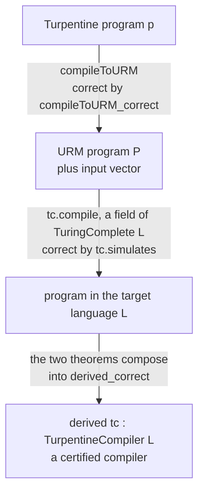
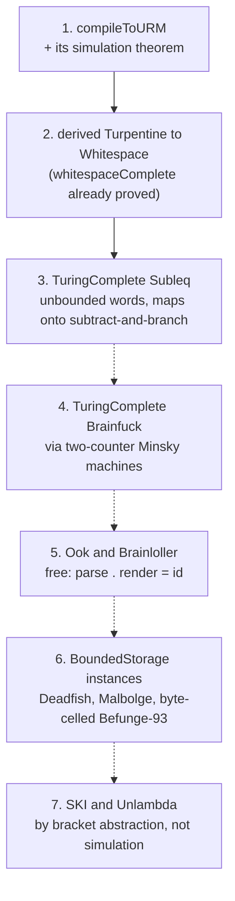

# Certified compilation via the URM

How LangLib gets verified compilers from Turpentine into esoteric
languages without writing a verified backend for each one, and the order
in which the pieces have to land.

This is the concrete plan behind Stage 9 of [PLAN.md](PLAN.md). The design
argument is in [verification.md](verification.md); this page is the
engineering.

## Where the definitions live

| Definition | File |
|---|---|
| `ProgLang`, the class of runnable languages | [Class.lean:40](../Langlib/Computability/Class.lean#L40) |
| `computes_of_turingComplete`, the bridge to cslib | [Class.lean](../Langlib/Computability/Class.lean) |
| `TurpentineCompiler`, a compiler bundled with its proof | [Derived.lean:55](../Langlib/Computability/Derived.lean#L56) |
| **`derived`**, the general correctness theorem | [Derived.lean:83](../Langlib/Computability/Derived.lean#L84) |
| `derivedWhitespace`, `derivedSubleq`, the instances | [Derived.lean:101](../Langlib/Computability/Derived.lean#L102) |
| `agree`, two compilers give one answer | [Derived.lean:115](../Langlib/Computability/Derived.lean#L120) |
| `compileToURM_correct`, the shared first hop | [Compile/URM.lean:2989](../Langlib/Turpentine/Compile/URM.lean#L2989) |
| **`TuringComplete`**, the completeness claim | [Class.lean:80](../Langlib/Computability/Class.lean#L80) |
| `BoundedStorage`, the incompleteness claim | [Class.lean:134](../Langlib/Computability/Class.lean#L134) |
| `halts_iff_search`, decidability from a bound | [Class.lean:162](../Langlib/Computability/Class.lean#L162) |
| `whitespaceComplete`, a proved instance | [Whitespace.lean:1117](../Langlib/Computability/Whitespace.lean#L1117) |
| `subleqComplete`, a proved instance | [Subleq.lean](../Langlib/Computability/Subleq.lean) |
| its compiler, `compile` | [Whitespace.lean:126](../Langlib/Computability/Whitespace.lean#L126) |
| its `simulation` theorem | [Whitespace.lean:1048](../Langlib/Computability/Whitespace.lean#L1048) |
| our URM helpers over cslib's | [URM.lean](../Langlib/Computability/URM.lean) |
| cslib's `Instr` and `Program` | `Cslib/Computability/URM/Defs.lean` |
| **`compileToURM`**, Turpentine to the URM | [Compile/URM.lean:468](../Langlib/Turpentine/Compile/URM.lean#L468) |
| **`compileToURM_correct`**, its simulation | [Compile/URM.lean:2989](../Langlib/Turpentine/Compile/URM.lean#L2989) |
| `TurpentineHaltsWith`, the answer convention | [Compile/URM.lean:2974](../Langlib/Turpentine/Compile/URM.lean#L2974) |
| `TurpentineCompiler`, the interface | [Derived.lean:55](../Langlib/Computability/Derived.lean#L56) |
| `derived`, one construction for every target | [Derived.lean:83](../Langlib/Computability/Derived.lean#L84) |
| `derivedWhitespace` | [Derived.lean:101](../Langlib/Computability/Derived.lean#L102) |
| `derivedSubleq` | [Derived.lean:105](../Langlib/Computability/Derived.lean#L106) |
| `agree`, two compilers give one answer | [Derived.lean:115](../Langlib/Computability/Derived.lean#L120) |
| its tests | [Tests/DerivedWhitespace.lean](../Langlib/Tests/DerivedWhitespace.lean) |
| the axiom audit | [scripts/axioms.lean](../scripts/axioms.lean) |

The bespoke backends, for contrast, are
[Brainfuck.lean](../Langlib/Turpentine/Compile/Brainfuck.lean),
[Whitespace.lean](../Langlib/Turpentine/Compile/Whitespace.lean) and
[Subleq.lean](../Langlib/Turpentine/Compile/Subleq.lean).

## The pipeline

```
Turpentine program
      │
      │  compileToURM          one compiler, proved once
      ▼
URM program + input vector          (cslib's unlimited register machine)
      │
      │  TuringComplete.compile     already proved, per language
      ▼
target program
```

The second arrow is free. It is not a new compiler: it is the `compile`
field of that language's `TuringComplete` instance, which exists because
somebody proved the language Turing complete. Whitespace already has one
([`whitespaceComplete`](../Langlib/Computability/Whitespace.lean#L1117)),
so the only work for a verified Turpentine-to-Whitespace compiler was the
first arrow. `derivedWhitespace` is the composition.

## The interface it plugs into

[`Langlib/Computability/Class.lean`](../Langlib/Computability/Class.lean)
fixes the shape:

```lean
structure TuringComplete (L : Type) [ProgLang L] where
  compile      : URM.Program → List Nat → ProgLang.Prog L
  encodeInput  : List Nat → Input
  decodeOutput : ByteArray → Option Nat
  simulates    : ∀ P inputs result, HaltsWithResult P inputs result →
                   ∃ m, (run (compile P inputs) (encodeInput inputs) m).exit = .halted ∧
                        decodeOutput (…).output = some result
```

`compile` takes the input vector as an argument rather than reading a
stream, because a URM has no I/O: it starts with registers set and halts
with registers set. That choice is what makes the composition below
type-check, and it is also what bounds the fragment.

## What is built

### 1. `compileToURM`

[`Langlib/Turpentine/Compile/URM.lean`](../Langlib/Turpentine/Compile/URM.lean):

```lean
def compileToURM : Turpentine.Program → Except String (URM.Program × List Nat)
```

The URM instruction set is four instructions: `Z n` (zero a register),
`S n` (increment), `T m n` (copy), `J m n k` (jump to `k` if registers `m`
and `n` are equal). Everything else is a macro.

* **Registers.** Register 0 is the answer, register 1 is a permanent zero so
  that `J r 1 k` reads as "jump if `r` is zero", registers 2 upward hold one
  Turpentine variable each in declaration order, and the block above them is
  scratch for the arithmetic macros.
* **Arithmetic.** Addition counts a scratch register up to the second operand
  while incrementing the accumulator; multiplication is that loop nested
  inside another; division and modulo share one loop, which counts up to the
  dividend and rolls the running remainder into the quotient every time it
  reaches the divisor. All are quadratic or worse, which is fine because this
  compiler is not for speed.
* **Comparison and booleans.** `J` tests equality only, so `<`, `<=`, `>` and
  `>=` all count a scratch register up from zero and see which operand it
  meets first. `==` and `!=` are one `J` and a two-instruction tail. `!`
  tests against the permanent zero, and `&&` and `||` are branch-free
  selects over two operands that have both already been computed.
* **Declarations.** A declaration list *is* a sequence of assignments, which
  is what `Turpentine.initEnv` computes: initialisers in declaration order,
  each in scope of the earlier ones, and `0` / `false` for the rest.
  `declPrelude` builds that statement and `compileToURM` runs it at the head
  of the body, so initialisers need no machinery of their own. Variables
  without an initialiser are assigned their default explicitly rather than
  skipped; two instructions each, and it makes the desugaring match `initEnv`
  step for step whatever the declaration list looks like, duplicate names
  included.
* **Control flow.** `if` and `while` are jumps, and the targets are absolute
  from the moment the code is emitted: `compileExpr slots q e d` places the
  code for `e` *at position `q`*, so there is no label-resolution pass. The
  price is a pair of size functions, `exprSize` and `stmtSize`, that have to
  agree with the emitted length; `length_compileExpr` and `length_compileStmt`
  prove that they do.

The output has no I/O and no input vector: `compileToURM` always returns
`[]` for the input (`compileToURM_inputs`), because the fragment is I/O-free
and every value the machine needs is built from zero.

**The answer convention.** A URM has no output. It starts with registers set
and halts with registers set, and `Cslib.URM.HaltsWithResult` reads the
answer out of register 0. So the answer is named by a variable rather than
printed: a compilable program declares a scalar `int` variable **`answer`**,
and the compiled machine's last instruction copies it into register 0. This
is why every printing statement is rejected: with `print` in the language
there is a *stream* of answers and no single `Nat` for the theorem to name.

### 2. `TurpentineCompiler`: one interface, many instances

[`Langlib/Computability/Derived.lean`](../Langlib/Computability/Derived.lean)
makes "a verified compiler from Turpentine into `L`" a first-class thing, the
way `TuringComplete L` is, so that the derived compiler and a future verified
hand-written one are two inhabitants of one interface rather than two
unrelated definitions:

```lean
structure TurpentineCompiler (L : Type) [ProgLang L] where
  compile : Turpentine.Program → Except String (ProgLang.Prog L)
  encodeInput : Input
  decodeOutput : ByteArray → Option Nat
  correct : ∀ (p : Turpentine.Program) (prog : ProgLang.Prog L) (result n : Nat),
    compile p = .ok prog → TurpentineHaltsWith p n result →
      ∃ m,
        (ProgLang.run prog encodeInput m).exit = Exit.halted ∧
        decodeOutput (ProgLang.run prog encodeInput m).output = some result
```

`compile` is total, and `Except.error` names the constructs outside the
fragment, so the fragment is part of the data rather than prose. Because
`correct` quantifies over *everything* `compile` accepts, `compileToURM`
accepts exactly the fragment it can prove itself correct on.

`encodeInput` is a single stream rather than a function of the program
because `TurpentineHaltsWith` is I/O-free: the source reads nothing, so
there is nothing for a caller to supply.

**A structure, not a `class`.** The point of the exercise is to have
*several* compilers for the same target at once (a derived one and an
effective one for Whitespace, today), and instance resolution is built to
pick exactly one. A `class` would either be ambiguous or silently choose for
you, which is the opposite of what is wanted. So this is bundled data with
named inhabitants, exactly like `TuringComplete`, and callers say which
compiler they mean. `ProgLang L` stays a real class, because there is only
ever one way to run a given language.

What the interface buys:

* **The derived construction is one function**, not one per language:

  ```lean
  def derived [ProgLang L] (tc : TuringComplete L) : TurpentineCompiler L
  ```

  `L` and `tc` are arbitrary, so it is proved once and every completeness
  proof that lands afterwards yields a verified Turpentine compiler by
  applying it. `derivedWhitespace := derived whitespaceComplete` is the first
  end-to-end certified compiler in the library, and
  `derivedSubleq := derived subleqComplete` is the second, written on one
  line with no new proof.

* **Agreement is a theorem about the interface**, proved once for all
  instances and all targets rather than per pair:

  ```lean
  theorem agree [ProgLang L] (c₁ c₂ : TurpentineCompiler L)
      (p : Turpentine.Program) (prog₁ prog₂ : ProgLang.Prog L) (result n : Nat)
      (h₁ : c₁.compile p = .ok prog₁) (h₂ : c₂.compile p = .ok prog₂)
      (hp : TurpentineHaltsWith p n result) :
      ∃ m₁ m₂,
        (ProgLang.run prog₁ c₁.encodeInput m₁).exit = Exit.halted ∧
        (ProgLang.run prog₂ c₂.encodeInput m₂).exit = Exit.halted ∧
        c₁.decodeOutput (ProgLang.run prog₁ c₁.encodeInput m₁).output =
          c₂.decodeOutput (ProgLang.run prog₂ c₂.encodeInput m₂).output
  ```

  It follows from the two `correct` fields against the one specification.
  That is the formal version of "the derived compiler is an oracle for the
  effective one": once the effective backend has an instance, the oracle
  claim stops being a testing practice and becomes a corollary.

* **A verified effective backend slots in without disturbing anything.**
  Proving `Langlib/Turpentine/Compile/Whitespace.lean` correct means
  producing a second `TurpentineCompiler WhitespaceLang`, and every consumer
  keeps working.

### 3. The theorem, and why it composes

The whole design rests on one statement lining up with `TuringComplete`'s
`simulates` field, so it is written to match that field's shape exactly.

`TuringComplete L` gives, for any URM program `P`, input vector `inputs` and
answer `result`:

```lean
HaltsWithResult P inputs result →
  ∃ m, (run (tc.compile P inputs) (tc.encodeInput inputs) m).exit = .halted ∧
       tc.decodeOutput (…).output = some result
```

`compileToURM` discharges the *hypothesis* of that implication:

```lean
theorem compileToURM_correct
    (p : Turpentine.Program) (P : UProg) (inputs : List Nat)
    (result n : Nat)
    (hc : compileToURM p = .ok (P, inputs))
    (hp : TurpentineHaltsWith p n result) :
    Cslib.URM.HaltsWithResult P inputs result
```

where the source-side convention is named explicitly:

```lean
def TurpentineHaltsWith (p : Turpentine.Program) (n : Nat) (result : Nat) : Prop :=
  ∃ (env₀ : Std.HashMap String Value) (st : Turpentine.State),
    Turpentine.initEnv p = .ok env₀ ∧
    Turpentine.exec n p.body { env := env₀, input := Input.ofString "" } =
      (st, Exit.halted) ∧
    st.env[answerVar]? = some (Value.int (result : Int))
```

`Turpentine.exec` and `Turpentine.initEnv` are the *reference interpreter*
from `Langlib/Turpentine/Semantics.lean`, unmodified: the theorem is about
the language as the rest of the library defines it, not about a second
semantics written to be convenient.

The two then compose without glue, which is what `derived` does: feed the
conclusion of the first into the hypothesis of the second, the URM program
disappears from the statement, and what is left is exactly a
`TurpentineCompiler L` correctness field.

Three details make the composition work, and all three are in the statements
above:

* **The answer is a single `Nat` in register 0**, because that is what
  `HaltsWithResult` says and what `decodeOutput` returns. Hence the `answer`
  variable and the I/O-free fragment.
* **`inputs` is produced by the compiler, not supplied by the caller.**
  `compileToURM` returns the pair; a program's initial register vector comes
  from its declarations, and here it is always empty.
* **Fuel is universal on the source side and existential on the target
  side.** `n` is given, `m` is produced, and nothing relates them. The proof
  is phrased through `Langlib.Common.Reaches`, which carries an exact target
  cost and composes by `Reaches.trans`, so no fuel monotonicity lemma is
  needed and no cost model of the target leaks into the statement.

**The shape of the proof.** `Agree slots env regs` relates a Turpentine
environment to the registers: each declared variable's value is the content
of its register. `Frame d regs regs'` says a macro at destination `d` touches
no register below `d`, which is what lets an operator's left operand survive
while its right operand is computed. `reaches_compileExpr` is a structural
induction on expressions; `reaches_compileStmt` is the induction `exec`
itself is defined by, outer on the fuel and inner on the statement, because
`seq` recurses on the statement at the same fuel and everything else drops
the fuel by one.

### 3b. Why a bespoke compiler needs a stronger theorem

`TurpentineCompiler.correct` observes one thing: a single `Nat`, read out
of register 0 by `decodeOutput`, on runs the source is *assumed* to finish.
That is adequate here, and only here, because the fragment has no I/O. A
run of an I/O-free program has nothing else to show for itself: it consumes
no input, emits no bytes, and its entire result is the final value of
`answer`. So answer equality *is* observational equality, and the halting
hypothesis costs nothing, since a program with no output that never halts
was never going to be observed at all.

A bespoke backend compiles the whole language, `readInt`, `readByte`,
`print`, `println` and `printByte` included, and every one of those
assumptions fails at once.

* **The observation is a byte stream, not a number.** Two runs can agree on
  every variable at halt and still print different things in different
  orders. The theorem has to compare `output` sequences, which is what
  [verification.md](verification.md) states for the bespoke backends:
  same bytes, in the same order, for every input.
* **Input is a parameter, not compiler data.** `encodeInput : Input` is a
  fixed field precisely because the certified fragment reads nothing. With
  `readInt` in the language the theorem must quantify over the input stream
  and pin down *how much of it is consumed*, which drags each target's EOF
  convention into the statement (brainfuck's `--eof` choice, whitespace's
  read instructions), rather than leaving it as a runner flag.
* **Divergence becomes observable.** Under the halting hypothesis a
  non-terminating compiled program is unconstrained, which is why turning a
  failed `assert` into a self-loop is sound for the derived route (section
  4). Once a program can print, a run that prints and then loops forever
  has emitted real bytes, so the statement needs a divergence clause: if
  the source diverges, the target diverges and their outputs agree on every
  finite prefix. That is a coinductive obligation, not a corollary of the
  terminating one.
* **Value representation stops being invisible.** A URM register is an
  arbitrary `Nat`, so nothing overflows. A bespoke target has its own cell
  width, and the theorem needs either a representability side condition in
  the fragment predicate or a wrapping source semantics to match.

None of this is wrong with the current statement; it is what the current
statement was scoped to. The two are not in competition either: the
stream-level theorem, restricted to programs that read nothing and print
nothing and carry the `answer` convention, *implies* the answer-level
field, so a verified bespoke backend still yields a `TurpentineCompiler`
instance and the [`agree`](../Langlib/Computability/Derived.lean#L120)
corollary still fires. It fires on the overlap, which is the I/O-free
fragment, and says nothing about the programs that made the stronger
theorem necessary.

The practical reading: **the derived route is cheap partly because it
declined the I/O problem**, and the per-language proof work in the "bespoke
correct" column of [the status matrix](README.md) is not the same proof at
higher effort, it is a larger statement about a larger language.

### 4. The fragment, exactly

A URM computes a function from a vector of naturals to a natural, and the
fragment is what survives that. This is the fragment as the current widening
of `compileToURM` leaves it; section 4b says what moved and what is left.

`compileToURM` **accepts**:

* declarations of `int` and `bool` variables, **with or without
  initialisers**, one of them named `answer`. Declarations are desugared
  into a prelude of assignments (`declPrelude`) at the head of the body,
  which is what `Turpentine.initEnv` does anyway: initialisers in
  declaration order, each in scope of the earlier ones, and `0` / `false`
  for the rest, which is where the registers start;
* expressions: non-negative integer literals, boolean literals, variables,
  `!`, `+`, `*`, `/`, `%`, `&&`, `||`, `==`, `!=`, `<`, `<=`, `>`, `>=`;
* statements: `skip`, sequencing, assignment, `if`, `while`, `assert`.

and **rejects**, each with a message naming the construct:

| rejected | why |
|---|---|
| `-`, unary minus, negative literals | Turpentine's integers are `Int` and a register is a `Nat`. Subtraction is the one operation on non-negative operands whose result can be negative, and the machine can only saturate at zero, so the relation between a variable and its register has no value to hold on the intermediate. |
| arrays, in declarations, expressions and assignments | one register per variable is baked into the slot layout and its lemmas. A static index needs those generalised; a computed one needs a dispatch chain on top. |
| `readInt`, `readByte`, `print`, `println`, `printByte` | a URM has neither an input stream nor an output stream. |
| a program with no `answer` variable | for the same reason: register 0 at halt is the entire result, so something has to name it. |

Two things the widened fragment does that are worth stating, because both
look like they should be unsound and are not:

* **`/` and `%` are in.** `Int.ediv` and `Int.emod` of non-negative
  operands are non-negative, so nothing leaves the range a register can
  hold, and `divModCode` computes both with one counting loop. A **zero
  divisor does not trap**: the loop settles on a quotient of `0` and a
  remainder equal to the dividend. That is junk on purpose. The reference
  semantics calls division by zero a runtime error, so the theorem's
  hypothesis (the source halts) never holds there and nothing is claimed;
  the macro must nevertheless *halt* on every input, for the next reason.
* **`&&` and `||` evaluate both operands.** The source short-circuits them
  and the emitted code does not, which is sound because every compiled
  expression runs to its own end from any register state
  (`reaches_compileExpr_total`): evaluating a right operand the source
  skipped costs instructions and changes no answer. This is why a zero
  divisor may not diverge. `b != 0 && a / b == 1` is a program the source
  runs happily with `b = 0`, and the compiled code has to reach the `&&`.

`assert` **is** compiled, and a failing assert becomes a one-instruction
self-loop: `J sb 1 q` at position `q`, taken exactly when the asserted
expression is false. So an assertion failure, which the reference
interpreter reports as a runtime error, becomes divergence in the target.
That is sound for the theorem, whose hypothesis requires the source to halt,
and it is the behaviour the whitespace and subleq backends already have.

### 4b. Widening the fragment, in order

The restrictions are not equally expensive to lift, and they are not equally
often hit. Compiling every example in `Langlib/Examples/Turpentine/` with
`--tc` and recording the *first* complaint gives the real ranking, and it is
the ranking the work followed.

**Landed.** Initialisers, `&&` and `||`, and division and modulo are now in
the fragment. The first two went as predicted: initialisers desugar to a
prelude of assignments, and the booleans needed a totality lemma rather than
a redesign. Division was the surprise. It was filed with subtraction as "the
real work", needing a `Nat`-valued reference semantics or a sign
representation, and it turned out to need neither: Euclidean division of
non-negative operands is non-negative, so it stays inside the existing
relation and only wanted a macro that halts on a zero divisor.

Every `-tc` example in `Langlib/Examples/Turpentine/` now compiles with
`--tc`, except the three that use arrays. Recompiling them all gives:

| first blocker | examples |
|---|---|
| an array | maxelem, sieve, sort, and their `-tc` twins |
| no variable named `answer` | the I/O originals: cat, collatz, fib, gcd, hello, isqrt, primes, sumdigits |

Subtraction never comes first. The nine that do compile were run end to end
through whitespace (`turpentine exec --via whitespace --tc`) and checked
against what the source computes:

| example | answer | needed |
|---|---|---|
| `sumsq.turp` | 30 | — |
| `fact-tc.turp` | 120 | — |
| `fib-tc.turp` | 55 | initialisers |
| `isqrt-tc.turp` | 4 | initialisers |
| `hello-tc.turp` | 18537 | — |
| `gcd-tc.turp` | 21 | `%` |
| `collatz-tc.turp` | 111 | `/`, `%` |
| `primes-tc.turp` | 10 | `%` |
| `sumdigits-tc.turp` | 18 | `/`, `%` |

`cat-tc.turp` compiles and is deliberately trivial: it records that a
streaming echo cannot be expressed at all in this model.

So what is left, in order:

1. **Arrays.** Generalise the slot layout past one register per variable.
   The addressing is easier here than in any esolang backend, because
   register indices are compile-time constants, so a computed index needs
   a dispatch chain rather than self-modifying code. This unblocks the only
   three `-tc` examples that still fail.
2. **Subtraction.** The genuinely hard one, and now the only arithmetic
   restriction left. The two candidates were a `Nat`-valued reference
   semantics plus a bridge to `Turpentine.exec`, and a sign
   representation. **The bridge does not work, and this is worth writing
   down, because it was the recommended option.**

   The bridge runs the wrong way. Give the fragment a `Nat` semantics in
   which `a - b` is undefined when `b > a`, and what you can prove is
   `Nat ⟹ Int`: wherever the `Nat` semantics produces an answer,
   `Turpentine.exec` produces the same one. What
   `compileToURM_correct` needs is the converse, because its *hypothesis*
   is `TurpentineHaltsWith`, that is, `Turpentine.exec` halting. And the
   converse is false. `answer := (2 - 5) + 10;` halts in the reference
   semantics with `7` and has no `Nat`-semantics run at all, so the
   bridge says nothing about it while the theorem still has to.

   The hypothesis cannot be weakened to dodge that.
   `TurpentineHaltsWith`'s shape is fixed by
   [`TurpentineCompiler.correct`](../Langlib/Computability/Derived.lean),
   so a side condition like "no intermediate goes negative" cannot be
   added to it without changing that field, and restating it over a
   second interpreter would quietly change what the theorem claims about
   the language.

   Two cheaper-looking codings fail on the same example. **Truncated
   subtraction** computes `0 + 10 = 10` where the source says `7`.
   **Trapping** on `b > a`, the way a failed `assert` self-loops, makes
   the target diverge where the source halts; it also collides with `&&`,
   which compiles its right operand unconditionally, so
   `b >= a || a - b > 0` would hang on inputs the source runs.

   So the only design that keeps the theorem is one that can *represent*
   negative values, and the choice is which:

   * **A pos/neg or magnitude-and-sign pair, two registers per
     variable.** Easy to explain and to reason about per operation;
     changes `Slot.size` from `1` to `2`, which touches `scratchBase`,
     `GoodSlots`, `Agree` and every layout lemma.
   * **A zigzag encoding in one register** (`n ↦ 2n` for `n ≥ 0`,
     `n ↦ -2n-1` otherwise). Leaves the layout and the `Agree` / `Frame`
     machinery exactly as they are, at the price of a decode and an
     encode inside every macro.

   The recommendation is the **pair**, done *after* arrays. Arrays force
   the layout lemmas to be generalised past one register per variable
   anyway, which is most of the pair representation's cost; doing them in
   that order pays it once. Either way the work is the whole arithmetic
   half of `Compile/URM.lean`: `addCode` needs a comparison and a
   truncated subtraction inside it, `mulCode` needs a sign, and
   `divModCode` has to match `Int.ediv` and `Int.emod` at mixed signs,
   which is the part with no shortcut.
3. **I/O, by convention rather than by changing the model.** A URM has no
   input or output, but it does not need any: it *starts* with registers
   set and *halts* with registers set, which is enough if Turpentine
   agrees to say so.

   **Input** is already plumbed and unused. `compileToURM` returns
   `(UProg × List Nat)` and `TuringComplete.compile` takes that vector,
   but today the compiler always returns `[]`
   (`compileToURM_inputs`). Designate variables, `input0`, `input1` and so
   on, map them to the initial register vector, and input works with no
   change to the model, to `TuringComplete`, or to any completeness proof.

   **One interface does have to change first, and it is not the model.**
   `TurpentineCompiler.encodeInput : Input` is a *constant* field, and
   `derived` sets it to `tc.encodeInput []` and then closes its proof with
   `compileToURM_inputs`, using `inputs = []` to line the two streams up:

   ```lean
   exact tc.simulates P [] result (compileToURM_correct p P [] result n hcu hp)
   ```

   With a non-empty vector the compiled program is run on
   `tc.encodeInput inputs` and the interface offers only
   `tc.encodeInput []`, so the two are different streams and `derived` no
   longer type-checks. The fix is one field: make `encodeInput` a function
   of the program,

   ```lean
   encodeInput : Turpentine.Program → Input
   ```

   set it in `derived` to `fun p => match compileToURM p with
   | .ok (_, inputs) => tc.encodeInput inputs | .error _ => tc.encodeInput []`,
   and thread the same `inputs` through `correct` and through `agree`. That
   is a change to
   [`Derived.lean`](../Langlib/Computability/Derived.lean) and to its two
   consumers' call sites, not to the register machine and not to any
   completeness witness. Until it lands, `compileToURM` keeps returning
   `[]` and `compileToURM_inputs` stays true, which is why the input half
   of this item is designed and not yet built.

   The order matters the other way too: a program's input values have to
   come from the program, because `TurpentineCompiler.compile` takes
   nothing else. So `input0` is a compile-time constant however it is
   supplied, and the vector's real payoff is *size*, not expressiveness.
   That payoff is large. `constCode` builds a literal by counting, so
   `n := 9045` is 9046 URM instructions; `Langlib/Examples/Turpentine/`'s
   `sumdigits-tc.turp` compiles to 42 MB of whitespace for that one line,
   and would compile to a few kilobytes with the literal in the register
   vector instead.

   **Output** stays the single `Nat` in `answer`. To print a string, the
   program builds its base-256 encoding in `answer` and the runner renders
   it as bytes. That is a *presentation* convention sitting outside the
   theorem: the theorem still says the compiled program's answer equals
   the source program's, and rendering that number as text changes
   nothing about what was proved.

   Stated exactly, so that the runner and the example programs agree. The
   answer `n` denotes the byte string that is its **big-endian base-256
   numeral with no leading zero digit**, and `n = 0` denotes the empty
   string. Rendering is therefore: while `n > 0`, prepend the byte
   `n % 256` and replace `n` with `n / 256`. `"Hi"` is `'H' = 72` then
   `'i' = 105`, so `answer = 72 * 256 + 105 = 18537`, which is what
   [`hello-tc.turp`](../Langlib/Examples/Turpentine/hello-tc.turp)
   computes. Two consequences to write down rather than discover: a byte
   string beginning with `NUL` has no encoding, because a leading zero
   digit is not recoverable; and the empty string and the string `"\x00"`
   would collide, which is why the encoding of `0` is fixed as empty.

   The rendering belongs to the runner and must be **opt-in**, because the
   answer is a number in every other program: something like
   `--answer bytes` alongside the present decimal default, applied after
   the target's own `decodeOutput` has produced the `Nat`. Nothing in
   `compileToURM` or in `TurpentineCompiler` changes for it.

   What this cannot do, and the docs must say so: there is no
   interleaving. Output is observable only at halt, not as a stream, so a
   program that prints and then loops forever prints nothing. Input is
   fixed before the run, so nothing can be read that depends on what was
   printed. Programs needing genuine streaming stay with the bespoke
   compilers, and with the stronger theorem of section 3b.

   This is preferred over extending the model to `URM+IO` with `read` and
   `write` instructions. That extension would force every completeness
   proof in the library to say what its language does with two new
   instructions, for a capability the register machine's own conventions
   already provide.

Each step keeps the same obligation: `compileToURM_correct` must still
hold for the widened fragment, with Lean asserting only what is proved.

### 5. What it is for

Not for running programs. The derived compiler emits large, slow output: a
Turpentine `while` becomes a URM loop becomes a whitespace label block, with
every arithmetic operation unrolled into unary counting. Measured numbers are
below. Its uses are:

* **A verified compiler exists at all**, for every language proved
  complete, the day the proof lands.
* **A test oracle** for the hand-written effective backends: same source,
  same input, same answer. Two independent implementations of one
  specification is a stronger check than golden files.
* **Coverage** for languages nobody will hand-write a backend for.

## Should the effective compilers survive? Yes, both stay

The question is whether a verified derived compiler makes the hand-written
whitespace and subleq backends redundant. It does not, and the numbers say
why.

**Size and speed, measured.** Both columns are the same Turpentine source
compiled to whitespace and run on the same interpreter; the effective
backend's version has `print(answer);` appended, since it has no `answer`
convention. Steps are the exact smallest fuel that halts.

| program | URM | derived: chars / steps | effective: chars / steps | ratio |
|---|---|---|---|---|
| `while i < 5 { i := i + 1; answer := answer + i; }` | 40 instrs | 2153 / 1748 | 171 / 129 | 13× / 14× |
| factorial of 6 by repeated `*` | 54 instrs | 3371 / 29756 | 216 / 167 | 16× / 178× |

Code size is about one order of magnitude. Running time is worse and gets
worse with the operand values, because the URM's only arithmetic is increment
and copy, so multiplication is a doubly nested counting loop and every round
of it is a whitespace label block. Nobody would ship that.

**Coverage, in the other direction.** The effective backends accept the
*entire* Turpentine language: I/O, arrays, negative integers. The derived
pipeline accepts the I/O-free, non-negative fragment of section 4, because
that is what a URM is. So the verified compiler is not a superset of the
practical one; each does something the other cannot.

**Cost of keeping both** is low. They share a source language, a test
suite, and the specification they are checked against. The derived one is
generated from a proof that we want anyway.

So the library keeps two compilers per target and says which is which:

| | effective | derived |
|---|---|---|
| written by | hand, per language | composition, once |
| verified | not yet | by construction |
| fragment | the whole language | I/O-free, non-negative, no `-` and no arrays |
| output size | small | 13× to 16× larger, and much slower |
| purpose | running programs | proving, and testing the other one |

The long-term aim is to verify the effective compilers directly, against
the same specification (see [verification.md](verification.md)). Until
then, the derived compiler is the strongest available check on them:
compile the same source both ways, run both, compare. That is two
independent implementations of one specification, which is a much better
test than a golden file.

## Every mode, with real output

`compile` and `exec` each take `--bespoke` or `--tc`, so the choice
of compiler is explicit; passing both is an error, passing neither uses the
bespoke one, and whichever runs is named in the message, so a build log
records which compiler produced an artifact.

Two source programs are used below. `sum.turp` is inside the certified
fragment: I/O-free, no subtraction or division, and its result is in a
variable called `answer`, because a URM has no output and the theorem reads
register 0.

```
cat sum.turp
```

Output:

```
var answer : int;
var i : int;
while i < 5 {
  answer := answer + i;
  i := i + 1;
}
```

`Langlib/Examples/Turpentine/isqrt.turp` is not: it reads a number and
prints one, so only the bespoke compilers accept it.

### Interpret

```
echo 17 | lake exe turpentine run Langlib/Examples/Turpentine/isqrt.turp
```

Output:

```
4
```

### Type-check without running

```
lake exe turpentine check sum.turp
```

Output:

```
sum.turp: well typed (2 variable(s), 2 declaration(s))
```

### Compile and run in one step, bespoke

```
echo 17 | lake exe turpentine exec --via whitespace --bespoke Langlib/Examples/Turpentine/isqrt.turp
```

Output:

```
4
```

### Compile and run in one step, certified

```
lake exe turpentine exec --via whitespace --tc sum.turp
```

Output:

```
10
```

### Emit the target program, then run it yourself

```
lake exe turpentine compile --to subleq --bespoke -o isqrt.sq Langlib/Examples/Turpentine/isqrt.turp
```

Output:

```
turpentine: wrote 22615 bytes to isqrt.sq [bespoke, hand-written and unverified]
```

The emitted file is an ordinary program in that language:

```
echo 17 | lake exe subleq isqrt.sq
```

Output:

```
4
```

The certified compiler for the same target, on the in-fragment program.
Subleq's only output primitive is a single byte, so its `decodeOutput`
counts bytes: ten of them is the answer.

```
lake exe turpentine compile --to subleq --tc -o sum.sq sum.turp
```

Output:

```
turpentine: wrote 1390 bytes to sum.sq [certified, derived from the Turing-completeness proof]
```

```
lake exe subleq sum.sq
```

Output:

```
1111111111
```

### Emit to stdout

With no `-o`, the program goes to stdout and the note to stderr, so
redirecting captures only the program.

```
lake exe turpentine compile --to whitespace --bespoke sum.turp > sum.ws
```

Output:

```
turpentine: emitting 159 bytes [bespoke, hand-written and unverified]
```

### What the two schemes cost

The same program, both compilers, one target:

| | bespoke | certified |
|---|---|---|
| whitespace | 159 bytes | 2151 bytes |
| subleq | 2874 bytes | 1390 bytes |

Subleq is the surprise: the certified output is *smaller*, because the
bespoke backend carries runtime routines for multiplication, division and
decimal printing that this program never uses, while the certified one
emits only what the register machine needs. Code size is roughly one order
of magnitude apart in general; running time is worse, and grows with the
operand values.

### When it refuses

Out of fragment, the certified compiler names the construct rather than
emitting something it cannot justify:

```
echo 17 | lake exe turpentine exec --via whitespace --tc Langlib/Examples/Turpentine/isqrt.turp
```

Output:

```
turpentine exec: the certified URM fragment needs a variable named 'answer' to hold the answer: a URM has no output, so register 0 at halt is all there is
turpentine: the certified compiler accepts only the I/O-free fragment
  (no input or output, no subtraction, no arrays,
  and the result in a variable named 'answer').
turpentine: retry with --bespoke to compile the whole language.
turpentine: nothing was run
```

A rejection says what it did *not* do, so a failed compile cannot be
mistaken for a quiet success: `compile` names the file it did not write,
`exec` says nothing was run, and both exit 1.

A target with no completeness proof has no certified compiler to offer, and
says so rather than falling back to the bespoke one. Every target the CLI
knows now has a proof, so that path has no witness left to show; what is
reachable is an unknown name:

```
lake exe turpentine compile --to piet --tc sum.turp
```

Output:

```
turpentine compile: unknown target 'piet' (expected brainfuck|whitespace|subleq)
```

Running out of fuel is reported distinctly from halting, and exits 2:

```
echo 27 | lake exe turpentine exec --via brainfuck --bespoke --fuel 100000 Langlib/Examples/Turpentine/collatz.turp
```

Output:

```
turpentine exec: out of fuel after 100000 steps of brainfuck (raise with --fuel)
```

## Two diagrams

The first shows how a certified compiler is *obtained* for one target: the
arrows are the steps of the composition. The second shows the *order of
work* across targets, where dashed arrows mark what is still planned.

### How a certified compiler is obtained

A Turpentine program reaches the target in two hops, and **each hop already
has a correctness theorem**. Composing the two theorems is what produces the
certified compiler; no third proof is written.



Read the hops as follows.

**First hop, written once.** `compileToURM` turns a Turpentine program into
a URM program plus the initial register vector. Its theorem says that if the
Turpentine program halts with an answer, the URM halts with the same answer
in register 0. This is the only compiler anyone writes by hand for this
pipeline, and it is shared by every target.

**Second hop, free per target.** `tc.compile` is not new code either: it is
a *field* of `tc : TuringComplete L`, the completeness proof for `L`. Its
theorem, `tc.simulates`, says that a halting URM run becomes a halting `L`
run whose output decodes to the same answer. Anyone who proves `L` Turing
complete has, without intending to, supplied this hop.

**The composition.** `compileToURM_correct` concludes exactly what
`tc.simulates` assumes (`URM.HaltsWithResult P inputs result`), so the two
fit with no glue, and `derived_correct` quantifies over an arbitrary `L` and
an arbitrary `tc`. It is proved once and applies to every language anyone
ever proves complete. That is the sense in which a completeness proof yields
a verified compiler.

For Whitespace both hops are in place:
[`whitespaceComplete`](../Langlib/Computability/Whitespace.lean#L1117) and
`compileToURM_correct` are both proved and axiom-clean, and
`derivedWhitespace := derived whitespaceComplete` is a certified
Turpentine-to-Whitespace compiler with no further work.
[`Langlib/Tests/DerivedWhitespace.lean`](../Langlib/Tests/DerivedWhitespace.lean)
runs it: 55 cases, including a suite that compares every answer against the
Turpentine reference interpreter, a suite that pins every rejection, and a
suite that repeats the exercise through `derivedSubleq`.

### What unlocks what



Step 1 gates everything, which is why it is being built first. Steps 3 and
4 are ordered by difficulty rather than necessity: subleq needs no
encoding at all, brainfuck needs unary counters on a tape, and doing the
easy one first settles the shape of the proof. Step 6 exercises the other
half of the interface, and step 7 is the one completeness argument in the
library that is not a machine simulation.

Per-language status, including which languages have which compilers
today, lives in the status matrix in [README.md](README.md).

## Order of work

1. ~~**`compileToURM`** plus its simulation theorem.~~ Done, for the
   fragment in section 4.
2. ~~**Derived Turpentine to Whitespace**~~, by composing with the proof
   that already existed. Done: `derivedWhitespace`, the first end-to-end
   certified compiler in the library.
3. **`TuringComplete Subleq`**. Unbounded signed words, so no encoding
   pain; the URM's four instructions map onto subtract-and-branch almost
   directly. Second derived compiler, and an oracle for the effective
   subleq backend.
4. **`TuringComplete Brainfuck`**, via two-counter Minsky machines with
   unary counters on the tape rather than through the 16-bit effective
   backend. Unlocks Ook and Brainloller for free through
   `parse ∘ render = id`.
5. **The negative results**: `BoundedStorage` instances for Deadfish,
   Malbolge, and byte-celled Befunge-93. Short, and they exercise the
   other half of the interface.
6. **SKI and Unlambda** by bracket abstraction, the one completeness
   argument in the library that is not a machine simulation.

## Checking the results are real

`scripts/axioms.lean` prints the axiom dependencies of every completeness
result:

```
lake env lean scripts/axioms.lean
```

Output:

```
'Langlib.Computability.whitespaceComplete' depends on axioms: [propext, Classical.choice, Quot.sound]
'Langlib.Computability.subleqComplete' depends on axioms: [propext, Classical.choice, Quot.sound]
'Langlib.Turpentine.Compile.URM.compileToURM_correct' depends on axioms: [propext, Classical.choice, Quot.sound]
'Langlib.Turpentine.Compile.URM.reaches_compileStmt' depends on axioms: [propext, Classical.choice, Quot.sound]
'Langlib.Turpentine.Compile.URM.reaches_compileExpr' depends on axioms: [propext, Classical.choice, Quot.sound]
'Langlib.Turpentine.Compile.URM.compileToURM' depends on axioms: [propext]
'Langlib.Turpentine.Compile.URM.exec_declPrelude' depends on axioms: [propext, Classical.choice, Quot.sound]
'Langlib.Turpentine.Compile.URM.evalExpr_mono' depends on axioms: [propext, Quot.sound]
'Langlib.Turpentine.Compile.URM.reaches_compileExpr_total' depends on axioms: [propext, Classical.choice, Quot.sound]
'Langlib.Turpentine.Compile.URM.reaches_andCode' depends on axioms: [propext, Quot.sound]
'Langlib.Turpentine.Compile.URM.reaches_orCode' depends on axioms: [propext, Quot.sound]
'Langlib.Turpentine.Compile.URM.reaches_divModCode' depends on axioms: [propext, Classical.choice, Quot.sound]
'Langlib.Turpentine.Compile.URM.binCode_correct' depends on axioms: [propext, Classical.choice, Quot.sound]
'Langlib.Computability.derived' depends on axioms: [propext, Classical.choice, Quot.sound]
'Langlib.Computability.derivedWhitespace' depends on axioms: [propext, Classical.choice, Quot.sound]
'Langlib.Computability.derivedSubleq' depends on axioms: [propext, Classical.choice, Quot.sound]
'Langlib.Computability.agree' depends on axioms: [propext, Classical.choice, Quot.sound]
```

The script covers every completeness result in the library; those are the
lines for the certified pipeline. A shorter list than the three is fine and
means only that the proof did not need the rest: `compileToURM` is a
computation, so it uses `propext` alone.

Add a line to it for every new instance. Anything beyond those three
axioms, `sorryAx` above all, means the result is not what it claims.
