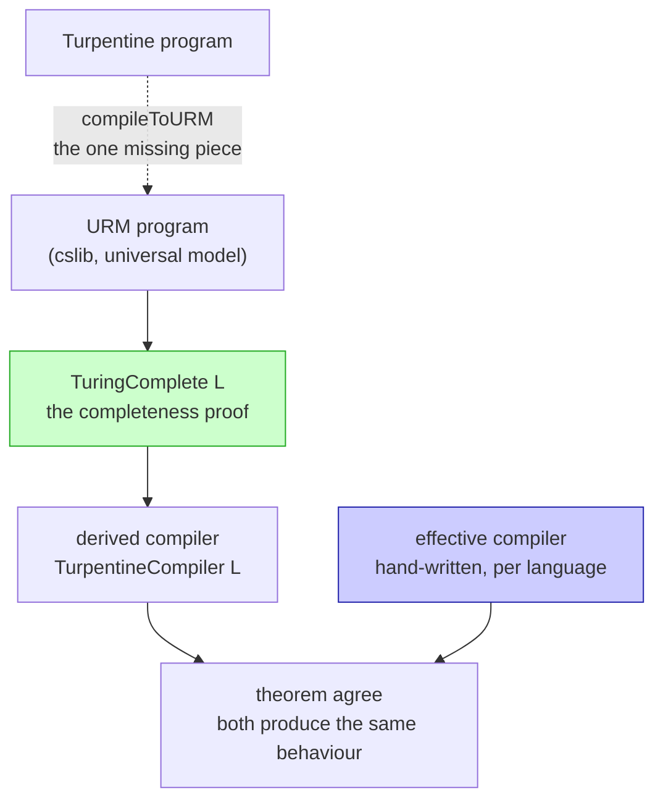
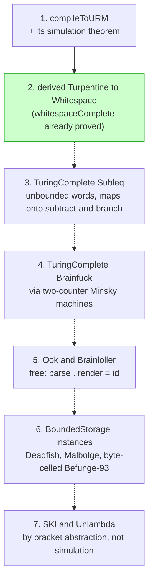

# Certified compilation via the URM

How langlib gets verified compilers from Turpentine into esoteric
languages without writing a verified backend for each one, and the order
in which the pieces have to land.

This is the concrete plan behind Stage 9 of [PLAN.md](PLAN.md). The design
argument is in [verification.md](verification.md); this page is the
engineering.

## Where the definitions live

| Definition | File |
|---|---|
| `Esolang`, the class of runnable languages | [Class.lean:40](../Langlib/Computability/Class.lean#L40) |
| **`TuringComplete`**, the completeness claim | [Class.lean:80](../Langlib/Computability/Class.lean#L80) |
| `BoundedStorage`, the incompleteness claim | [Class.lean:134](../Langlib/Computability/Class.lean#L134) |
| `halts_iff_search`, decidability from a bound | [Class.lean:162](../Langlib/Computability/Class.lean#L162) |
| `whitespaceComplete`, the one proved instance | [Whitespace.lean:1117](../Langlib/Computability/Whitespace.lean#L1117) |
| its compiler, `compile` | [Whitespace.lean:126](../Langlib/Computability/Whitespace.lean#L126) |
| its `simulation` theorem | [Whitespace.lean:1048](../Langlib/Computability/Whitespace.lean#L1048) |
| our URM helpers over cslib's | [URM.lean](../Langlib/Computability/URM.lean) |
| cslib's `Instr` and `Program` | `Cslib/Computability/URM/Defs.lean` |
| the axiom audit | [scripts/axioms.lean](../scripts/axioms.lean) |

The bespoke backends, for contrast, are
[Brainfuck.lean](../Langlib/Turpentine/Compile/Brainfuck.lean),
[Whitespace.lean](../Langlib/Turpentine/Compile/Whitespace.lean) and
[Subleq.lean](../Langlib/Turpentine/Compile/Subleq.lean).

## The pipeline

```
Turpentine program
      │
      │  compileToURM          one compiler, proved once
      ▼
URM program + input vector          (cslib's unlimited register machine)
      │
      │  TuringComplete.compile     already proved, per language
      ▼
target program
```

The second arrow is free. It is not a new compiler: it is the `compile`
field of that language's `TuringComplete` instance, which exists because
somebody proved the language Turing complete. Whitespace already has one
([`whitespaceComplete`](../Langlib/Computability/Whitespace.lean#L1117)),
so the only missing piece for a verified Turpentine-to-Whitespace compiler
is the first arrow.

## The interface it plugs into

[`Langlib/Computability/Class.lean`](../Langlib/Computability/Class.lean)
fixes the shape:

```lean
structure TuringComplete (L : Type) [Esolang L] where
  compile      : URM.Program → List Nat → Esolang.Prog L
  encodeInput  : List Nat → Input
  decodeOutput : ByteArray → Option Nat
  simulates    : ∀ P inputs result, HaltsWithResult P inputs result →
                   ∃ m, (run (compile P inputs) (encodeInput inputs) m).exit = .halted ∧
                        decodeOutput (…).output = some result
```

`compile` takes the input vector as an argument rather than reading a
stream, because a URM has no I/O: it starts with registers set and halts
with registers set. That choice is what makes the composition below
type-check, and it is also what bounds the fragment.

## What has to be built

### 1. `compileToURM` (the only real work)

[`Langlib/Turpentine/Compile/URM.lean`](../Langlib/Turpentine/Compile/URM.lean):

```lean
def compileToURM : Turpentine.Program → Except String (URM.Program × List Nat)
```

The URM instruction set is four instructions: `Z n` (zero a register),
`S n` (increment), `T m n` (copy), `J m n k` (jump to `k` if registers `m`
and `n` are equal). Everything else is a macro:

* **Registers**: one per Turpentine variable, plus scratch. Arrays get a
  contiguous block, which is where this compiler is easier than the subleq
  backend: register indices are compile-time constants, so there is no
  computed addressing and no operand patching. A computed index needs a
  dispatch chain, or the fragment excludes it (see below).
* **Arithmetic**: addition is a copy loop, subtraction is truncated
  subtraction by counting up, multiplication is repeated addition,
  division and modulo are repeated subtraction. All standard, all
  quadratic, all fine because this compiler is not for speed.
* **Comparison and booleans**: `J` tests equality only, so `<` is built
  from truncated subtraction and a test against zero.
* **Control flow**: `if` and `while` are jumps to computed labels, which
  means a resolution pass, exactly as in the whitespace and subleq
  backends.

### 2. `TurpentineCompiler`: one interface, many instances

Make "a verified compiler from Turpentine into `L`" a first-class thing,
the way `TuringComplete L` is, so that the derived compiler and the
hand-written one are two inhabitants of one interface rather than two
unrelated definitions:

```lean
structure TurpentineCompiler (L : Type) [Esolang L] where
  /-- Total; `Except.error` names the constructs outside this compiler's
  fragment, so the fragment is part of the data rather than prose. -/
  compile : Turpentine.Program → Except String (Esolang.Prog L)
  /-- Whenever Turpentine halts on `p` with some observable behaviour, and
  `compile p` succeeds, the compiled program halts with the same
  observable behaviour. -/
  correct : ∀ p prog input, compile p = .ok prog → …
```

**A structure, not a `class`.** The point of the exercise is to have
*several* compilers for the same target at once (a derived one and an
effective one for Whitespace, today), and instance resolution is built to
pick exactly one. A `class` would either be ambiguous or silently choose
for you, which is the opposite of what is wanted. So this is bundled data
with named inhabitants, exactly like `TuringComplete`, and callers say
which compiler they mean. `Esolang L` stays a real class, because there is
only ever one way to run a given language.

What the interface buys:

* **The derived construction becomes one function**, not one per language:

  ```lean
  def derived [Esolang L] (tc : TuringComplete L) : TurpentineCompiler L
  ```

  Every completeness proof yields a verified compiler by applying it.

* **Agreement is a theorem about the interface**, proved once for all
  instances and all targets, rather than per pair:

  ```lean
  theorem agree [Esolang L] (c₁ c₂ : TurpentineCompiler L) (p) (input) :
      -- both accept p ⇒ both produce the same observable behaviour
  ```

  It follows from both `correct` fields against the same specification.
  That is the formal version of "the derived compiler is an oracle for the
  effective one": once the effective backend has an instance, the oracle
  claim stops being a testing practice and becomes a corollary.

* **A verified effective backend slots in without disturbing anything.**
  Proving `Langlib/Turpentine/Compile/Whitespace.lean` correct means
  producing a second `TurpentineCompiler Whitespace`, and every consumer
  keeps working.

### 3. The theorem `compileToURM` must prove, and why it composes

The whole design rests on one statement lining up with `TuringComplete`'s
`simulates` field, so write it to match that field's shape exactly.

`TuringComplete L` gives, for any URM program `P`, input vector `inputs`
and answer `result`:

```lean
HaltsWithResult P inputs result →
  ∃ m, (run (tc.compile P inputs) (tc.encodeInput inputs) m).exit = .halted ∧
       tc.decodeOutput (…).output = some result
```

So `compileToURM` should discharge the *hypothesis* of that implication.
Its theorem is:

```lean
theorem compileToURM_correct
    (p : Turpentine.Program) (P : URM.Program) (inputs : List Nat)
    (result : Nat) (n : Nat)
    (hc : compileToURM p = .ok (P, inputs))
    (hp : TurpentineHaltsWith p n result) :
    URM.HaltsWithResult P inputs result
```

where `TurpentineHaltsWith p n result` says the Turpentine program halts
within fuel `n` having computed `result` as its answer. The two then
compose without any glue: feed the conclusion of the first into the
hypothesis of the second and the URM program disappears from the
statement, leaving

```lean
theorem derived_correct [Esolang L] (tc : TuringComplete L)
    (p : Turpentine.Program) (prog : Esolang.Prog L)
    (result n : Nat)
    (hc : derivedCompile tc p = .ok prog)
    (hp : TurpentineHaltsWith p n result) :
    ∃ m, (Esolang.run prog (tc.encodeInput …) m).exit = .halted ∧
         tc.decodeOutput (…).output = some result
```

which is exactly a `TurpentineCompiler L` correctness field. Note what is
quantified: `L` and `tc` are arbitrary, so **this is proved once and holds
for every backend anyone ever proves Turing complete.** That is the sense
in which a completeness proof yields a verified compiler.

Three details that make the composition work, and are easy to get wrong:

* **The answer must be a single `Nat` in register 0**, because that is
  what `HaltsWithResult` says and what `decodeOutput` returns. So
  `compileToURM` must fix an answer convention and the fragment must
  guarantee one exists. This is why the fragment is I/O-free: with
  `println` in the language there is a *stream* of answers, and the
  statement above cannot express that.
* **`inputs` is produced by the compiler, not supplied by the caller.**
  `compileToURM` returns the pair, so a program's initial register vector
  comes from its declarations. The caller passes nothing.
* **Fuel is existential on the target side and universal on the source
  side.** Turpentine halting within *some* `n` gives a target run halting
  within *some* `m`, with no relation between them. Anything tighter would
  leak the cost model of the target into the statement.

### 4. The fragment

A URM computes a function from a vector of naturals to a natural. So the
derived pipeline accepts the Turpentine fragment that is:

* **I/O-free**: no `readInt`, `readByte`, `print`, `println`, `printByte`.
  Inputs arrive as the initial register vector; the answer is register 0
  at halt.
* **Non-negative**: URM registers hold naturals, so a program that can go
  negative is out unless the compiler picks a sign encoding (two registers
  per variable). Start without it.
* **Statically indexed** for arrays, unless the dispatch chain is built.

That is a real restriction and it must be checked, not assumed: `compile`
returns `Except.error` naming the offending construct, as the other
backends do. Stage 9 of `PLAN.md` records the alternative (extend the
model to `URM+IO`) and why it is preferred later rather than now.

### 5. What it is for

Not for running programs. The derived compiler will emit enormous, slow
output: a Turpentine `while` becomes a URM loop becomes a whitespace label
block, with every arithmetic operation unrolled into unary counting. Its
uses are:

* **A verified compiler exists at all**, for every language proved
  complete, the day the proof lands.
* **A test oracle** for the hand-written effective backends: same source,
  same input, same answer. Two independent implementations of one
  specification is a stronger check than golden files.
* **Coverage** for languages nobody will hand-write a backend for.

## Should the effective compilers survive? Yes, both stay

The question is whether a verified derived compiler makes the hand-written
whitespace and subleq backends redundant. It does not, and the numbers say
why.

**Size.** The effective backend compiles `gcd.turp` to 532 bytes of
whitespace. The derived pipeline runs the same program through a register
machine whose only arithmetic is increment and copy, so multiplication is
repeated addition and division is repeated subtraction, each unrolled into
label blocks. The output will be orders of magnitude larger and slower.
Nobody would ship that.

**Coverage, in the other direction.** The effective backends accept the
*entire* Turpentine language: I/O, arrays, negative integers. The derived
pipeline accepts the I/O-free, non-negative fragment, because that is what
a URM is. So the verified compiler is not a superset of the practical one;
each does something the other cannot.

**Cost of keeping both** is low. They share a source language, a test
suite, and the specification they are checked against. The derived one is
generated from a proof that we want anyway.

So the library keeps two compilers per target and says which is which:

| | effective | derived |
|---|---|---|
| written by | hand, per language | composition, once |
| verified | not yet | by construction |
| fragment | the whole language | I/O-free, non-negative |
| output size | small | enormous |
| purpose | running programs | proving, and testing the other one |

The long-term aim is to verify the effective compilers directly, against
the same specification (see [verification.md](verification.md)). Until
then, the derived compiler is the strongest available check on them:
compile the same source both ways, run both, compare. That is two
independent implementations of one specification, which is a much better
test than a golden file.

## Dependency graph

Two views, both reading top to bottom. Solid arrows are built and checked
in; dashed arrows are planned.

### The pipeline, for any one target language



Every target follows this shape. The only per-language work is the
`TuringComplete L` proof: the derived compiler below it is a composition,
and `agree` is a theorem about the interface rather than about any
particular language.

### What unlocks what



Step 1 gates everything, which is why it is being built first. Steps 3 and
4 are ordered by difficulty rather than necessity: subleq needs no
encoding at all, brainfuck needs unary counters on a tape, and doing the
easy one first settles the shape of the proof. Step 6 exercises the other
half of the interface, and step 7 is the one completeness argument in the
library that is not a machine simulation.

Per-language status, including which languages have which compilers
today, lives in the status matrix in [README.md](README.md).

## Order of work

1. **`compileToURM`** plus its simulation theorem. Unlocks the whole
   right-hand side of the graph.
2. **Derived Turpentine to Whitespace**, by composing with the proof that
   already exists. First end-to-end certified compiler in the library.
3. **`TuringComplete Subleq`**. Unbounded signed words, so no encoding
   pain; the URM's four instructions map onto subtract-and-branch almost
   directly. Second derived compiler, and an oracle for the effective
   subleq backend.
4. **`TuringComplete Brainfuck`**, via two-counter Minsky machines with
   unary counters on the tape rather than through the 16-bit effective
   backend. Unlocks Ook and Brainloller for free through
   `parse ∘ render = id`.
5. **The negative results**: `BoundedStorage` instances for Deadfish,
   Malbolge, and byte-celled Befunge-93. Short, and they exercise the
   other half of the interface.
6. **SKI and Unlambda** by bracket abstraction, the one completeness
   argument in the library that is not a machine simulation.

## Checking the results are real

`scripts/axioms.lean` prints the axiom dependencies of every completeness
result:

```
$ lake env lean scripts/axioms.lean
'Langlib.Computability.whitespaceComplete' depends on axioms: [propext, Classical.choice, Quot.sound]
```

Add a line to it for every new instance. Anything beyond those three
axioms, `sorryAx` above all, means the result is not what it claims.
