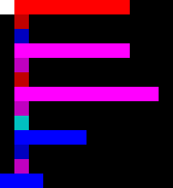
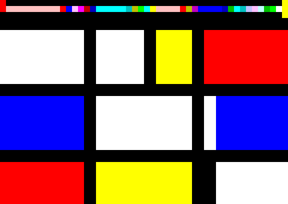

# piet

* **Author**: David Morgan-Mar
* **Year**: ~2002
* **Canonical sources**: Morgan-Mar's specification at
  https://www.dangermouse.net/esoteric/piet.html; the community page is
  https://esolangs.org/wiki/Piet (CC0). The de-facto reference
  implementation is Erik Schoenfelder's npiet
  (https://www.bertnase.de/npiet/).
* **In LangLib**: `Langlib/Languages/Piet/`, runner `lake exe piet`,
  examples in `Langlib/Examples/Piet/`

## History

Piet is named after Piet Mondrian, whose grid-and-primary-colour
abstractions it aspires to imitate: a Piet program is a bitmap, and a good
Piet program passes for art. Morgan-Mar (also responsible for Ook and a
shelf of other esolangs) published the specification in the early 2000s,
and a community of painters-who-compile grew around it; his page links
dozens of independently written interpreters, IDEs, and even a Piet
assembler, so implementing the language is clearly welcome. The
specification text itself is his (his site licenses its content under a
Creative Commons licence); this page is a summary in our own words, and
our example images are LangLib originals.

The joke has formal content: since commands are colour *differences*
between adjacent regions, the same program can be repainted in endless
ways, and enlarging every "pixel" changes nothing. Source code becomes a
matter of composition, in both senses.

## The machine

A Piet program is a grid of **codels** (colour pixels; a codel may be an
N x N pixel square when the image is published upscaled). Each codel has
one of 20 colours: 18 chromatic ones on a 6 x 3 wheel, plus white and
black.

| lightness | red | yellow | green | cyan | blue | magenta |
|-----------|-----|--------|-------|------|------|---------|
| light | `FFC0C0` | `FFFFC0` | `C0FFC0` | `C0FFFF` | `C0C0FF` | `FFC0FF` |
| normal | `FF0000` | `FFFF00` | `00FF00` | `00FFFF` | `0000FF` | `FF00FF` |
| dark | `C00000` | `C0C000` | `00C000` | `00C0C0` | `0000C0` | `C000C0` |

Hue cycles red -> yellow -> green -> cyan -> blue -> magenta -> red;
lightness cycles light -> normal -> dark -> light.

A **colour block** is a maximal 4-connected region of one chromatic
colour (diagonals do not connect). The interpreter stands on a codel and
carries:

* the **direction pointer** (DP): right, down, left, or up;
* the **codel chooser** (CC): left or right, relative to the DP;
* a **stack** of integers, plus byte input and output streams.

Execution starts on the colour block containing the top-left codel, DP
right, CC left.

## Moving

Each step, the interpreter leaves its block through the block's codel
that is *furthest in the DP direction*; ties are broken by the codel
furthest to the CC side (DP right + CC left: uppermost; DP right + CC
right: lowermost; and so on, rotated). It then moves one codel onward in
the DP direction.

* **Chromatic destination**: enter that block and execute the command
  given by the colour difference (next section).
* **Black codel or image edge**: the move fails. The interpreter toggles
  the CC and tries again; if that also fails it rotates the DP clockwise,
  then alternates (CC, DP, CC, DP, ...). After 8 consecutive failures,
  all (DP, CC) combinations are exhausted and the program **halts**. This
  is the only way a Piet program ends.
* **White codel**: the interpreter *slides* through white in a straight
  line, executing nothing, and enters the first chromatic block in its
  path (again no command: transitions into or out of white are silent).
  Blocked while sliding, it toggles the CC *and* rotates the DP, both at
  once, and slides on from where it stands; if it ever revisits a (codel,
  DP) pair while sliding it is trapped, and the program halts. The white
  rules were left open by the original spec and clarified by Morgan-Mar
  in 2004 to match this (npiet's) behaviour.

## The commands

The command is read off the hue and lightness steps from the block being
*left* to the block being *entered* (always moving "forward" on the
cycles):

| lightness steps | 0 hue | 1 | 2 | 3 | 4 | 5 |
|-----------------|-------|---|---|---|---|---|
| 0 | (none) | add | divide | greater | duplicate | in(char) |
| 1 | push | subtract | mod | pointer | roll | out(number) |
| 2 | pop | multiply | not | switch | in(number) | out(char) |

* **push**: push the codel count of the block just left. (This is how
  Piet writes literals: to push 72, paint a 72-codel block and leave it
  one lightness step darker.)
* **pop**: discard the top of the stack.
* **add, subtract, multiply, divide, mod**: pop the top value X, then Y,
  and push Y op X. Division is integer division.
* **not**: pop X; push 1 if X is 0, else 0.
* **greater**: pop X, then Y; push 1 if Y > X, else 0.
* **pointer**: pop X; rotate the DP clockwise X times (counterclockwise
  if X is negative).
* **switch**: pop X; toggle the CC |X| times.
* **duplicate**: push a copy of the top value.
* **roll**: pop the number of rolls X, then the depth Y; rotate the top Y
  stack entries X times (one roll buries the top value at depth Y).
  Negative X rolls the other way.
* **in(number), in(char)**: read a number or a character from input and
  push it.
* **out(number), out(char)**: pop the top value and write it.

Commands that cannot be performed are **simply ignored** and execution
continues; the specification says exactly this for insufficient operands
and recommends it for the error cases below.

## Semantic decisions in LangLib

Our interpreter (`Langlib/Languages/Piet/Semantics.lean`) pins the
underspecified corners down as follows, following the spec's
recommendations and npiet where the spec is silent:

1. **Stack values are unbounded integers** (Lean `Int`). The spec leaves
   the integer width implementation-dependent.
2. **Ignored means untouched.** An ignored command (too few operands;
   divide or mod by zero, which the spec recommends ignoring; `roll` with
   a negative depth or a depth beyond the stack; a failed `in`) leaves
   the stack and input exactly as they were, nothing popped. `roll` with
   depth 0 is performable: it pops its two operands and rolls nothing.
3. **Division is floored; mod takes the divisor's sign.** The mod rule is
   Morgan-Mar's own clarification (the result of `Y mod X` has the sign
   of X); floored division is the unique companion under
   Y = X * (Y div X) + (Y mod X). So -7 div 2 = -4 and -7 mod 2 = 1.
4. **out(number)** writes the decimal digits (with `-` if negative) and
   nothing else: no separator, exactly like npiet's `printf`.
   **in(number)** reads like npiet's `scanf`: skip whitespace, an
   optional sign, then digits; if that fails (EOF or no digits) the
   command is ignored and no input is consumed.
5. **Character I/O is bytes.** `in(char)` reads one byte (0-255);
   `out(char)` writes the low byte of the value (npiet's `putchar`). The
   spec speaks of Unicode; our whole library's I/O model is byte streams,
   so multi-byte characters are the program's own business.
6. **Codel size is a flag** (`--codel-size N`, default 1), and each codel
   is sampled at its upper-left pixel, as npiet does. We do not
   auto-detect: the "obvious" size is not unique (every image is also a
   valid codel-size-1 program). Block *values* count codels, not pixels.
7. **Non-Piet colours are a parse error** by default, with the exact RGB
   and codel coordinates reported; `--unknown-white` reads them as white
   instead (npiet offers the same choice). Loud beats lenient in a
   reference interpreter.
8. **Starting on white or black.** The spec assumes a chromatic top-left
   codel. On white we slide, per the white rules; on black we report a
   runtime error rather than guess.
9. The evaluator is **pure and fuel-based**: one unit of fuel per block
   transition (command or white transit). Colour blocks are labelled once
   by flood fill, O(width x height), before execution; every step is then
   O(1). The runner's default budget is 200 million steps (`--fuel N`),
   and running out is distinct from halting, so divergence (a program
   that never meets the 8-failure condition) is observable in tests.

## Computational class

**Turing complete, and proved so here**:
[`pietComplete`](../../Langlib/Computability/Piet.lean#L3992) compiles an
unlimited register machine into a codel grid and proves that
`Langlib.Piet.evalGrid` — the evaluator specified on this page, with these
DP and CC rules, these exits and these white slides — computes what the
machine computes. The stack of unbounded integers was never the hard part;
the geometry was. [docs/computability-piet.md](../computability-piet.md)
has the proof's shape, including the one fact about the language that fell
out of it: a colour block of a single codel can never halt a Piet program.

## Trying it

The runner reads program files as text, so feed it ASCII PPM (P3);
convert anything else first, for example with
`magick prog.png -compress none prog.ppm`. Binary P6 is handled by the
library (`Langlib.Common.Image.parsePpm`) for direct API users.

A painting that says hi.

```
lake exe piet Langlib/Examples/Piet/hi.ppm
```

Output:

```
Hi
```

The customary greeting, in 166 codels. It reaches each character from the
one before it, which is why it fits in less width than `hi.ppm` uses for
two.

```
lake exe piet Langlib/Examples/Piet/hello.ppm
```

Output:

```
Hello, world!
```

Render any of them instead of running, one SVG rectangle per codel.

```
lake exe piet --svg /tmp/hello.svg --scale 8 Langlib/Examples/Piet/hello.ppm
```

Output:

```
piet: wrote 166x3 codels to /tmp/hello.svg
```

Addition. The program reads two numbers from stdin and prints the sum.

```
echo -n '3 4' | lake exe piet Langlib/Examples/Piet/add.ppm
```

Output:

```
7
```

Squaring, to show that `dup` and `mul` work as advertised.

```
echo -n 12 | lake exe piet Langlib/Examples/Piet/square.ppm
```

Output:

```
144
```

A two-dimensional one. Same greeting, laid out as a stack of bars rather
than a single corridor.

```
lake exe piet Langlib/Examples/Piet/hi-stacked.ppm
```

Output:

```
Hi
```

Counting to ten, which needs a loop, which in Piet means a closed circuit
through a white return corridor.

```
lake exe piet Langlib/Examples/Piet/count.ppm
```

Output:

```
1
2
3
4
5
6
7
8
9
10
```

The truth-machine, thirty-nine codels of it. On `0` it prints `0` and
halts.

```
echo -n 0 | lake exe piet Langlib/Examples/Piet/truth.ppm
```

Output:

```
0
```

On `1` it prints `1` until you take the fuel away, as a truth-machine
should.

```
echo -n 1 | lake exe piet --fuel 200 Langlib/Examples/Piet/truth.ppm
```

Output, the ones on stdout and the complaint on stderr:

```
11111111111111111111111111111piet: out of fuel after 200 steps (raise with --fuel)
```

The Collatz sequence of a number read from input, printed all the way
down to 1.

```
echo -n 6 | lake exe piet Langlib/Examples/Piet/collatz.ppm
```

Output:

```
6
3
10
5
16
8
4
2
1
```

A painting that is also a program. Everything below its top three rows is
decoration the pointer never reaches.

```
lake exe piet Langlib/Examples/Piet/mondrian.ppm
```

Output:

```
Piet
```

Any program can be rendered instead of run, which is how the pictures in
the next section were made; `scripts/render-docs-images.sh` regenerates
all of them at once.

```
lake exe piet --svg /tmp/add.svg --grid --scale 16 Langlib/Examples/Piet/add.ppm
```

Output:

```
piet: wrote 8x3 codels to /tmp/add.svg
```

## Example programs

A Piet program is a picture, but the picture is a file, and the file is
readable. Our runner takes ASCII PPM (P3), so each program below is given
three ways: as the rendered picture, as the literal file text where it is
short enough to quote, and as a **codel map** writing every codel as its
lightness (`l`, `n`, `d`) plus its hue initial, with `..` for white and
`##` for black.

All nine are LangLib originals. The straight-line ones are drawn in the
least painterly Piet style there is: a corridor of blocks between black
walls, ending in a white codel and a full-height bar that no (DP, CC)
attempt can leave. The ones with loops add a white return corridor
underneath, and the last one is an actual painting. Mondrian may keep his
royalties, but only just.

The four programs with control flow are generated by
`scripts/gen-piet-examples.py`, a hundred-line assembler that lays commands
along the two codel geometries `Langlib/Computability/Piet.lean` uses and
proves correct. Nobody paints a loop by hand.

### `add.ppm`: read two numbers, print their sum


Eight codels by three, which is small enough to print in full:

```
P3
8 3
255
255 0 0 0 0 0 0 0 0 0 0 0 0 0 0 0 0 0 0 0 0 255 0 0
255 0 0 255 0 0 192 192 255 0 192 0 0 192 192 192 255 192 255 255 255 255 0 0
255 0 0 0 0 0 0 0 0 0 0 0 0 0 0 0 0 0 0 0 0 255 0 0
```

The same twenty-four codels as a map:

```
nR ## ## ## ## ## ## nR
nR nR lB dG dC lG .. nR
nR ## ## ## ## ## ## nR
```

The pointer starts in the red block on the left — an L of four codels, since
the column and the corridor's first codel are one block — and walks right
between black walls. Each colour change is one command, read off the table
above as (hue steps, lightness steps):

| Transition | Steps | Command |
|---|---|---|
| normal red → light blue | 4 hue, 2 lightness | `in(number)` |
| light blue → dark green | 4 hue, 2 lightness | `in(number)` |
| dark green → dark cyan | 1 hue, 0 lightness | `add` |
| dark cyan → light green | 5 hue, 1 lightness | `out(number)` |

The white codel at the end is not a command; it is a slide into the red bar
on the right, which is where the program dies of eight failed exit attempts.
`echo -n '3 4' | lake exe piet …` prints `7`.

### `square.ppm`: the same skeleton, one codel later


```
P3
8 3
255
255 0 0 0 0 0 0 0 0 0 0 0 0 0 0 0 0 0 0 0 0 255 0 0
255 0 0 255 0 0 192 192 255 192 255 192 0 192 192 192 255 192 255 255 255 255 0 0
255 0 0 0 0 0 0 0 0 0 0 0 0 0 0 0 0 0 0 0 0 255 0 0
```

```
nR ## ## ## ## ## ## nR
nR nR lB lG dC lG .. nR
nR ## ## ## ## ## ## nR
```

`0 192 0` became `192 255 192` — dark green became light green — and the
four commands are now `in(number)`, `duplicate`, `multiply`, `out(number)`.
One codel is the whole difference between `a + b` and `a * a`; nothing else
about the program moved.

### `hi.ppm`: what a Piet literal costs


`push` pushes the size of the block it leaves, so writing the constant 72
means painting a bar 72 codels long, and 105 means a bar of 105. That is
the whole program: two bars, two pushes, two `out(char)`s, and 180 codels
of width to print two characters. There is no text to quote here — the file
is a kilobyte of `255 0 0` — but the picture says it better than the text
would.

### `hi-stacked.ppm`: computing the constants instead



Twelve by thirteen, printing the same `Hi`. The codel map is the readable
form:

```
.. nR nR nR nR nR nR nR nR ## ## ##
## dR ## ## ## ## ## ## ## ## ## ##
## dB ## ## ## ## ## ## ## ## ## ##
## nM nM nM nM nM nM nM nM ## ## ##
## dM ## ## ## ## ## ## ## ## ## ##
## dR ## ## ## ## ## ## ## ## ## ##
## nM nM nM nM nM nM nM nM nM nM ##
## dM ## ## ## ## ## ## ## ## ## ##
## dC ## ## ## ## ## ## ## ## ## ##
## nB nB nB nB nB ## ## ## ## ## ##
## dB ## ## ## ## ## ## ## ## ## ##
## dM ## ## ## ## ## ## ## ## ## ##
nB nB nB ## ## ## ## ## ## ## ## ##
```

Read it downwards. The pointer starts on the white codel at the top left,
slides right into the first bar, and then walks straight down. The wide bars
are the numbers — the 8-codel bars are 8s, the 10-codel bar is a 10, the
5-codel bar is a 5 — and the single codels between them carry the
arithmetic: `8 dup * 8 +` makes 72 (`H`) and `10 dup * 5 +` makes 105 (`i`).
The three-codel bar at the bottom is the terminator, entered at its middle
codel so that its outer codels face black upwards and all eight exits fail.

### `hello.ppm`: thirteen characters, narrower than two


The customary program, and the point `hi.ppm` sets up. Printing thirteen
characters the naive way, pushing each code point as a block of that many
codels, would cost well over a thousand codels. Instead it prints `H`, keeps
that 72 on the stack, and walks to each next character by adding or
subtracting the difference: `+29` to `e`, `+7` to `l`, nothing at all for
the second `l`, `-67` for the comma, and so on. `out(char)` pops, so every
character is duplicated before it is printed, and a final `pop` clears the
stack.

The result is 166 codels wide, which makes a whole Hello, world! program
*narrower than `hi.ppm`*, a program that prints two characters. That is the
cost of a Piet literal stated as plainly as it can be: arithmetic on a value
you already have is nearly free, and pushing a constant is not.

### `count.ppm`: the first loop


Every example above runs left to right and stops. This one is a circuit.
The commands are along the top row, the bottom row is a corridor of white
codels running back the other way, and the lone white codel near the left
joins them. Nothing on the return leg is a command, because a slide through
white executes nothing, so the loop costs one instruction to take and
nothing at all to travel.

That one instruction is `pointer`, at the right-hand end of the top row: it
pops a value and rotates the DP that many quarter-turns clockwise. Pop 1 and
the DP swings south into the return corridor; pop 0 and it carries straight
on east into the terminator. `pointer` is every conditional, every loop and
every jump the language has. The body is

```
push 1   add   dup   out(number)   push 10   out(char)
dup   push 10   sub   not   not   dup   pointer
```

— increment, print, newline, then `n - 10` negated twice into "n ≠ 10", and
duplicated because `pointer` pops what it tests. The two ten-codel bars in
the picture are the `push 10`s: a Piet literal is the size of the block you
leave, so the newline is visibly ten codels long.

### `truth.ppm`: the whole language in thirty-nine codels


The truth-machine — read a digit; print `0` and stop, or print `1` for ever
— is the smallest program that has to decide anything, and the entire
skeleton is legible at this size:

```
.. nR lB .. nR nB dC dY dM lG dG .. dY
## ## ## .. ## ## ## ## ## dG ## dY dY
## ## ## .. .. .. .. .. .. .. ## ## ##
```

The pointer starts on the white codel at the top left and slides east into
`nR`; `nR → lB` is 4 hue steps and 2 lightness steps, `in(number)`. The
white column at x = 3 is the join. The four commands along the body are
`duplicate`, `out(number)`, `duplicate`, `duplicate` — the value is printed
and then copied twice, once for `pointer` to eat and once to keep — and
`dM → lG` is `pointer`. The two `dG` codels are the two ways out of that
pivot, east to the exit and south to the return corridor; both happen to be
`pop`, and they are diagonal neighbours rather than orthogonal ones, so they
stay two separate blocks.

The `dY` cells at the right are the terminator, and their shape is not an
accident: a single codel can never halt a Piet program (see the section
above), because the pointer arrived from an unblocked neighbour and one of
the eight exits walks back into it. Three codels in an L, entered through
the white codel at the notch, are the smallest thing that can.

### `collatz.ppm`: an algorithm, and no second branch


Read n, print its hailstone sequence down to 1: `27` produces the famous
112 terms. The loop test is the same `pointer` as before, but the Collatz
step itself wants a second branch — halve an even number, treble-and-add-one
an odd one — and a branch in Piet is a change of direction, which costs
geometry. So it does not take one. With r = n mod 2, both cases are

```
n' = (n * (1 + 2r) + r) / (2 - r)
```

which is n/2 when r = 0 and 3n + 1 when r = 1: one `mod`, one `div`, and no
turn. Getting the operands into position is the rest of the work, and it is
what `roll` is for — the one Piet command nobody can read. `push 4`,
`push 3`, `roll` rotates the top four stack entries three times, which is
how n gets past the two copies of r that are sitting on top of it.

### `mondrian.ppm`: a program that is a painting



Blocks the pointer never enters cost nothing and constrain nothing. So the
top three rows of this image are an ordinary corridor printing `Piet`, the
two black rows under them are a wall, and everything below is decoration:
fields of white, red, yellow and blue divided by black lines two codels
thick. The program cannot see it, and it cannot see the program.

Piet's normal red, yellow and blue are exactly the primaries — 255,0,0 and
255,255,0 and 0,0,255 — which is convenient for a language named after the
painter who used them, and is presumably why it is. This is the only
example here that renders without codel grid lines, since drawing a mesh
over it would defeat the entire point.

### Rendering these pictures

Piet is one of the two graphical languages in the library, so its pictures
are derived files: everything under `docs/piet/img/` is generated from the
programs in `Langlib/Examples/Piet/` and must never be edited by hand.
Regenerate the whole set — this page's and Brainloller's — with one command:

```
scripts/render-docs-images.sh
```

To check that the committed images match the examples without touching the
tree, which is what to run after changing an example:

```
scripts/render-docs-images.sh --check
```

Output:

```
docs images are up to date
```

The rendering goes through the interpreter itself, so a picture cannot drift
from what the interpreter reads. Each of the seven corridor programs is
drawn at sixteen SVG pixels per codel with codel boundaries marked:

```
lake exe piet --svg docs/piet/img/add.svg --grid --scale 16 Langlib/Examples/Piet/add.ppm
```

Output:

```
piet: wrote 8x3 codels to docs/piet/img/add.svg
```

`hello.ppm` is 166 codels wide, so it gets half the scale and no grid — at
that width the grid lines are all a reader would see:

```
lake exe piet --svg docs/piet/img/hello.svg --scale 8 Langlib/Examples/Piet/hello.ppm
```

Output:

```
piet: wrote 166x3 codels to docs/piet/img/hello.svg
```

`mondrian.ppm` is drawn at twelve pixels per codel and *without* `--grid`,
because it is meant to be looked at rather than counted.

Any Piet program can be rendered this way, not just the examples, and
`--codel-size N` samples a program drawn at more than one pixel per codel.

The four generated programs come from a separate script, which writes the
PPMs the renderer then draws:

```
python3 scripts/gen-piet-examples.py
```

Output:

```
Langlib/Examples/Piet/count.ppm: 40x3 codels
Langlib/Examples/Piet/truth.ppm: 13x3 codels
Langlib/Examples/Piet/collatz.ppm: 65x3 codels
Langlib/Examples/Piet/mondrian.ppm: 48x34 codels
```
