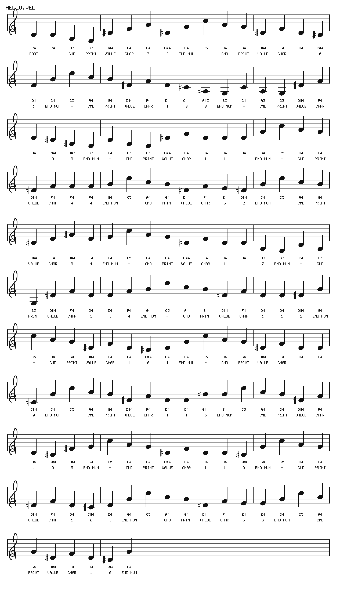
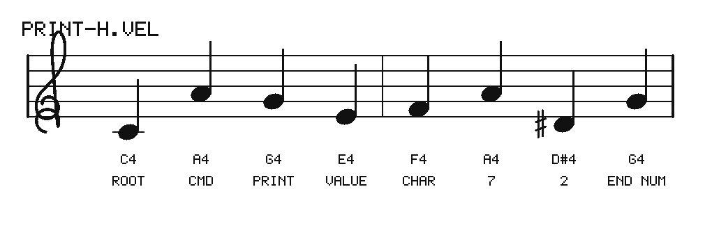
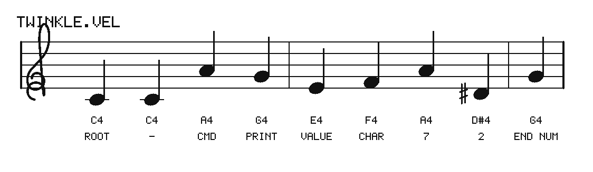
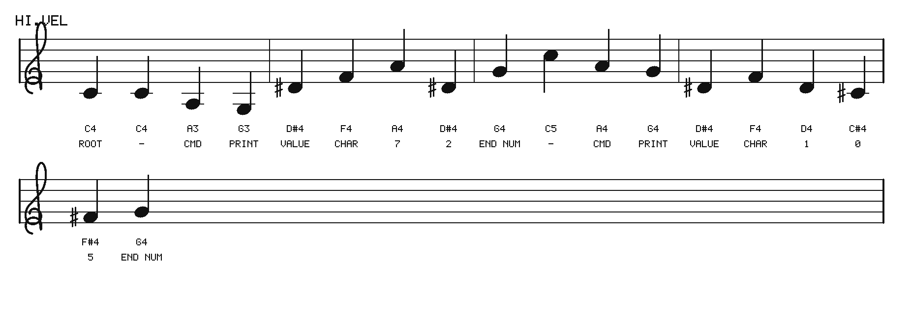
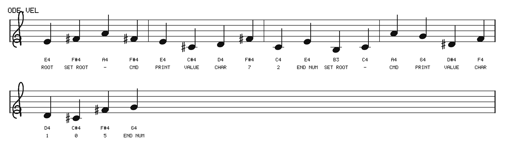
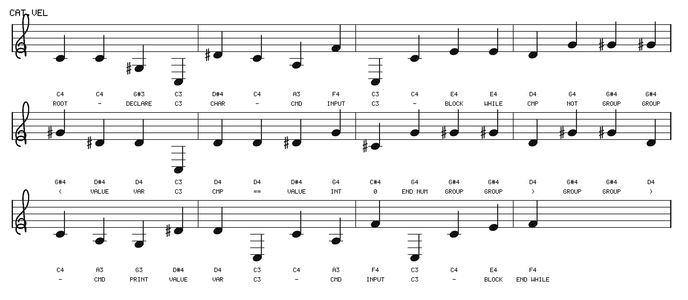
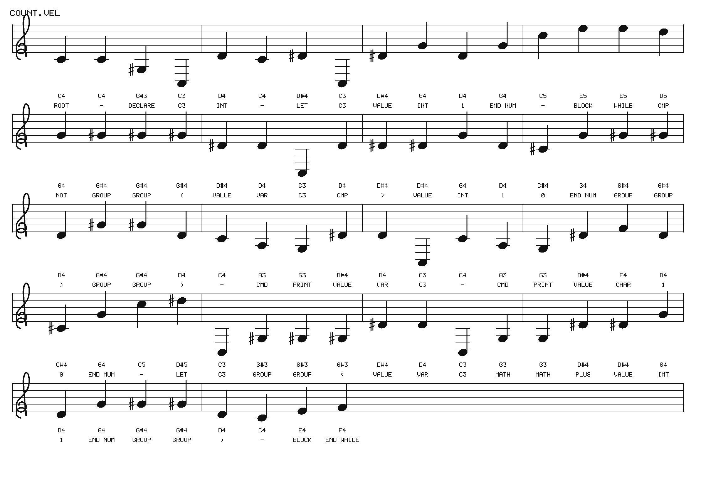

# velato

* **Author**: Daniel Temkin
* **Year**: 2009 (a second dialect, driven by whistling rather than by MIDI
  files, followed in 2024)
* **Canonical sources**: the language's own site, https://velato.net/, whose
  [intro](https://velato.net/#intro), [language
  rules](https://velato.net/#commandList) and [Hello World
  tutorial](https://velato.net/Language/HelloWorld/) are the specification
  this page follows; the 2009 reference compiler in C#,
  https://github.com/rottytooth/Velato (MIT); a Python interpreter,
  https://github.com/rottytooth/VelatoPy (MIT); the whistling dialect,
  https://github.com/rottytooth/VelatoJS (MIT); an independent JavaScript
  implementation by Erik Erwitt, https://github.com/eerwitt/velato-js; and
  the wiki page, https://esolangs.org/wiki/Velato. Velato also appears in
  Temkin's *Forty-Four Esolangs* (MIT Press, 2025),
  https://mitpress.mit.edu/9780262553087/forty-four-esolangs/
* **In LangLib**: `Langlib/Languages/Velato/`, runner `lake exe velato`,
  [examples](../../Langlib/Examples/Velato/), tests in
  [`Langlib/Tests/Velato.lean`](../../Langlib/Tests/Velato.lean), Turing
  completeness in [`Langlib/Computability/Velato.lean`](../../Langlib/Computability/Velato.lean)
  and [docs/computability-velato.md](../computability-velato.md)

## The whole thing, end to end

Four commands take two lines of Turpentine to a tune you can hear. Nothing
below needs anything installed except the last one, which needs a way to
play a sound.

Compile the Turpentine program into Velato. Two lines of source become 166
notes.

```
lake exe turpentine compile --to velato -o /tmp/tune.vel Langlib/Examples/Turpentine/hello.turp
```

Run the notes. They are a program, and this is what it says.

```
lake exe velato /tmp/tune.vel
```

Output:

```
Hello, Turpentine!
```

Engrave the same notes as sheet music: a one-page PDF, about 124 kB.

```
lake exe velato --sheet /tmp/tune.pdf /tmp/tune.vel
```

Play them. About a minute of audio.

```
scripts/velato-audio.sh /tmp/tune.vel
```

If you only want the message and not the music, one command does the
compiling and the running together:

```
lake exe turpentine exec --via velato Langlib/Examples/Turpentine/hello.turp
```

Output:

```
Hello, Turpentine!
```

### Do I need to install anything?

For the compiling, the engraving and the audio *rendering*: **no.** The
sheet-music engraver and the synthesiser are both part of this library, so a
bare checkout can turn a program into a PDF and a WAV with nothing else
present.

For *playing* the audio you need some player, and most machines already have
one — `afplay` on macOS, `aplay` or `paplay` on Linux. To find out what this
machine has, and what to install if the answer is nothing:

```
scripts/velato-audio.sh --deps
```

If it finds no player it says so and leaves you the file rather than failing
silently. Where a package is wanted:

```
sudo apt install alsa-utils          # Debian, Ubuntu
sudo dnf install alsa-utils          # Fedora
brew install sox                     # macOS, if afplay is somehow absent
```

Two optional extras, neither needed for the line above. To hear a real
instrument instead of the built-in plucked string, `scripts/velato-audio.sh
--midi` wants a synthesiser and a SoundFont (`brew install fluid-synth`, or
`sudo apt install fluidsynth fluid-soundfont-gm`). And to run the
differential tests against the Python reference implementation,
`./scripts/get-references.sh` fetches it and installs `mido` into a virtual
environment under `.difftools/`, touching nothing outside that directory.

The rest of this page explains what those notes mean. [Trying
it](#trying-it) has the commands one at a time, [Hearing a
program](#hearing-a-program) covers the audio in full, and [A program, end
to end](#a-program-end-to-end-turpentine-in-music-out) walks the pipeline
through with the output of every step.

## History

Velato is a programming language whose source code is a MIDI file. Not a
file *describing* a program, and not a program that happens to make noise:
the notes **are** the program, and the compiler reads their pitches in the
order the file sounds them.

Temkin's stated aim is a language that puts the programmer in the position of
a composer with a secret. Any piece of music you write is, if the intervals
happen to fall right, also a program; and any program you write is, whether
you meant it to be or not, also a piece of music. The interesting work is
making both halves good at once, and the language is arranged so that the
composer keeps as much freedom as the encoding can spare: octave is ignored,
key can be changed mid-piece, extra instrumental parts are ignored
altogether, and where a program needs "a third" it will accept either a
major or a minor one so that the composer can stay in the scale they are
writing in. The result, as the site puts it, tends toward dense, jazz-like
harmony — which is less an aesthetic choice than a consequence of the
command table, as the "computational class" section below explains.

The 2009 implementation is a *compiler*: it reads the MIDI, emits C#, and
hands that to the C# compiler. That matters throughout this page, because it
means Velato's dynamic semantics is C#'s, restricted to the fragment the
code generator emits, and every question of the form "what does this
program do?" is really a question about the generated C#.

## The idea

Three sentences carry most of the language.

1. A program is the sequence of pitches sounded by the note-on events of the
   first track that has any, in the order they appear in the file.
2. Everything is measured as an **interval** from the **command root**,
   modulo an octave. The first note of the piece is the initial root; a
   major 2nd changes it to whatever note comes next.
3. A note at the unison (or an octave) from the root is a **no-op**.

Together those give the language its central property: **a valid program
stays valid, and means the same thing, when you transpose it**. Only the
distances between notes matter, so the same program can be played in any
key. Two things escape this rule and both are deliberate. Variables are
absolute pitches, octave included, so that a root change does not silently
rename them; and the note that *establishes* a new root is of course itself
absolute.

Everything else about the file is invisible. Rhythm, tempo, metre, key
signature, dynamics, articulation, bar lines, repeats, instrument choice,
and every track after the first with notes in it — none of it reaches the
compiler. That is what makes accompaniment possible: a Velato piece can have
as much harmony and counterpoint as you like, provided the program lives in
the first track.

Notes sounded together are read in the order they appear in the file, which
velato.net flags as the one place a composer has to be careful: a chord is
not a simultaneity to the compiler, it is a sequence, and the sequence is
whatever the sequencer happened to write.

## Reading a program

### Intervals

Velato names the twelve semitone classes the way a musician would. This is
the table from velato.net's language rules:

| semitones | interval | | semitones | interval |
| --- | --- | --- | --- | --- |
| 0 | unison or octave | | 6 | diminished 5th |
| 1 | minor 2nd | | 7 | perfect 5th |
| 2 | major 2nd | | 8 | minor 6th |
| 3 | minor 3rd | | 9 | major 6th |
| 4 | major 3rd | | 10 | minor 7th |
| 5 | perfect 4th | | 11 | major 7th |

Two readings of that table are in play at once, and keeping them straight is
most of what it takes to read a Velato program.

* **Commands** are read **exactly**. A minor 3rd is not a major 3rd, and a
  command spelled with one will not be recognised from the other.
* **Expressions** are read **coarsely**, by scale degree. A "3rd" is either
  third, a "6th" either sixth, a "5th" either a diminished or a perfect
  fifth. velato.net gives the reason: insisting on the exact quality would
  force a composer writing in C into progressions like C E C E♭, and the
  point of the language is that they get to pick whichever fits.

The perfect 4th is the one interval with no alternative, and it is forced
rather than chosen: five semitones is a perfect 4th, six semitones is the
tritone, and Velato calls the tritone a diminished *fifth*. There is nothing
left over to be an augmented fourth.

MIDI has no spelling, so G♯ and A♭ are the same note and the language cannot
tell them apart. Write whichever reads better.

### Commands

All intervals are from the current command root.

| command | second note | third note | then |
| --- | --- | --- | --- |
| *(no-op)* | — | — | a note at the unison does nothing |
| Change root note | major 2nd | | the next note becomes the new root |
| Let (assignment) | minor 3rd | | a variable, then an expression |
| Declare variable | minor 6th | | a variable, then a type |
| **Blocks** | major 3rd | | |
| While | | major 3rd | a condition, then commands, then End While |
| End While | | perfect 4th | |
| If | | perfect 5th | a condition, then commands, then Else or End If |
| Else | | major 6th | |
| End If | | major 7th | |
| **Special** | major 6th | | |
| Print | | perfect 5th | an expression |
| Input | | perfect 4th *or* major 6th | a variable |

The specification says every statement begins with the command root. The
reference compiler achieves that by treating a note at the unison as a
placeholder that does nothing, and reading the *following* interval as the
command — which is the same thing said in a way that also explains why a
composer may sprinkle extra root notes through a piece to fill out a bar.
This implementation reads it the reference's way.

A root change costs two notes and leaves nothing behind: the major 2nd, and
the note that becomes the new root. That second note is then re-read as the
start of the next statement, where it sits at the unison and is a no-op.

### Expressions

Expressions do not begin with the command root, but their intervals are
still measured from it. Read coarsely, per the note above.

| expression | first | second | third | then |
| --- | --- | --- | --- | --- |
| **value** | 3rd | | | |
| variable | | 2nd | | one note, the variable's name |
| negative int | | 3rd | | digits, then a perfect 5th |
| char | | 4th | | the ASCII code as digits, then a perfect 5th |
| positive int | | 5th | | digits, then a perfect 5th |
| positive double | | 6th | | digits, a perfect 5th, digits, a perfect 5th |
| negative double | | 7th | | digits, a perfect 5th, digits, a perfect 5th |
| **conditional** | 2nd | | | |
| `==` | | 2nd | | |
| `>` | | 3rd | | |
| `<` | | 4th | | |
| `!` | | 5th | | also how `>=` and `!=` are spelled |
| `&&` | | 6th | | |
| `\|\|` | | 7th | | |
| **grouping** | 6th | 6th | | |
| `(` | | | 6th | |
| `)` | | | 2nd | |
| **arithmetic** | 5th | 5th | | |
| `-` | | | 2nd | |
| `+` | | | 3rd | |
| `/` | | | 4th | |
| `*` | | | 5th | |
| `%` | | | 6th | |

### The rule that surprises people

An expression block is **not** "read until the statement ends". The
reference reads exactly **one** expression token, and then keeps going only
while brackets are open. So `Let x 5` is complete after the literal, and a
compound right-hand side has to be bracketed:

```
Let x ( 2 + 3 )
```

`While` and `If` conditions get an *implied* opening bracket, so their
condition runs to the matching close. This is load-bearing rather than
fussy: without it there would be no way to tell where an assignment's
right-hand side stops and the next statement starts.

### Numbers

A number is a run of notes, one decimal digit each, ending at a perfect
5th. The digit table falls out of two reservations — the unison is the
no-op, and the perfect 5th is the terminator — which leaves exactly ten
intervals for ten digits. That is presumably why a language with twelve
symbols counts in base ten.

| semitones | 1 | 2 | 3 | 4 | 5 | 6 | 7 | 8 | 9 | 10 | 11 |
| --- | --- | --- | --- | --- | --- | --- | --- | --- | --- | --- | --- |
| digit | 0 | 1 | 2 | 3 | 4 | 5 | *end* | 6 | 7 | 8 | 9 |

In C, with C as the root, that reads: C♯ is 0, D is 1, D♯ is 2, E is 3, F is
4, F♯ is 5, G ends the number, G♯ is 6, A is 7, A♯ is 8, B is 9.

A note at the unison inside a number is skipped rather than being a digit,
which is what lets a composer land on the tonic in the middle of a numeral.

*(velato.net's prose worked example of encoding 458 does not agree with its
own table — it reads the digit off the semitone count without the offset.
The table, and the reference compiler, are what this implementation
follows.)*

### Types and variables

A declaration names a variable and then a type. Types are read coarsely:

| type | interval |
| --- | --- |
| `int` | 2nd |
| `char` | 3rd |
| `double` | 4th |

A variable is a single note, taken at face value: **pitch and octave**. This
is the only place absolute pitch matters, and it is what makes a variable
survive a root change. It also means a program has at most **128**
variables, one per MIDI note, which turns out to be the most consequential
sentence on this page — see "computational class".

## Semantic decisions in LangLib

Every decision below is either the reference's, or a place where the
reference has no opinion and one had to be taken. Sources given throughout.

**Notes come from the first track that has any.** Note-on events with
velocity greater than zero, in file order. A note-on with velocity zero is a
note-off, which is how most sequencers write one, and counting those would
double every program. *Source*: `MidiLoader.Load` in the 2009 reference.

**Intervals are semitones modulo twelve, from the current root.** The
reference lowers the root by octaves until it is beneath the note and
subtracts; modular arithmetic says the same thing in one step. *Source*:
`Parser.GetInterval`.

**`If` takes a condition, exactly as `While` does.** This is the one place
where the reference and the specification disagree and the specification
wins. velato.net's table lists `If` in the same block family as `While`;
the reference's `If` branch (`Parser.ParseBlock`, `case PERFECT_FIFTH`)
reads no condition at all, advances an extra note, and loops on a condition
that is a tautology, so it cannot return. It is unimplemented rather than
differently implemented. The Python interpreter also reads a condition.

**Power and logarithm are not accepted.** velato.net's expression table
gives a 5th followed by a 7th for an "exponential/other" family, with power
and log under it. No released implementation accepts it: the reference
throws a syntax error, and this implementation does too. The gap is the
specification's, not ours.

**Integers are unbounded.** The reference emits C# `int`, that is
`System.Int32`. This implementation uses Lean's `Int`, which is unbounded.
Every program whose values stay inside `Int32` — which is every published
Velato program — behaves identically under both. The choice matters exactly
once, and it is the whole computational content of the language; the
"computational class" section argues it out.

**Doubles are IEEE binary64.** As C#'s are. Printing them can differ in the
last digits from .NET's shortest-round-trip formatting; the *value* is the
same. No example here uses one.

**Arithmetic promotes like C#'s.** A `char` operand becomes its code point;
a `double` operand makes the whole expression a `double`. So printing
`c - 32` where `c` is a `char` prints a *number*, and the way back to a
letter is to assign into a variable declared `char`, since assignment
converts. `upper.vel` exists to make that visible. *Source*: the generated
C#, `CodeGenerator.UnpackExpressions`.

**Precedence is C#'s.** The reference emits the expression tokens
unparenthesised and lets the C# compiler group them, so C# precedence *is*
Velato's: `*` `/` `%`, then `+` `-`, then `<` `>`, then `==`, then `&&`,
then `||`, all left associative. `&&` and `||` short-circuit.

**Integer division truncates toward zero and `%` takes the sign of the
dividend**, as C#'s do. Division by an integer zero is a runtime error;
division by a floating-point zero is not, and gives an infinity, again as
C# does.

**Conditions are read as "nonzero".** C# has a `bool` and Velato's note
encoding has none: there is no boolean literal, no boolean type to declare,
and no way to store a comparison. So in any program the reference accepts,
every `while` and `if` condition is a comparison, which is already a `bool`.
Reading a condition as "nonzero" agrees with C# on all of those, and gives a
meaning to the ones C# would reject rather than making them a parse error.
Comparisons produce `1` or `0` as an `int`.

**A declared variable starts at zero.** C# calls reading an unassigned
local a compile error, so no program the reference accepts can observe
this. Defaulting rather than erroring is the conservative extension.

**Using an undeclared variable is a runtime error.** In the reference it is
a C# compile error — the generated code names an identifier that was never
declared — and a runtime error is the pure-semantics counterpart.

**`Input` at end of stream stores `0`.** `Console.ReadKey()` blocks on a
console, which an interpreter over a finite stream cannot do, so a choice is
forced. `0` is the value a C# `char` defaults to, it is the convention this
library's brainfuck programs are written against, and it is not a byte that
occurs in text, so a program can test for it. `cat.vel` does.

**A `char` prints as its character, printable or not.** The 2009 reference
emits a C# character literal and `Console.Write` writes it, whatever it is,
so a `char` holding 10 writes a newline. The Python interpreter disagrees:
it prints the character only for codes in `32 … 127` and otherwise prints
the *number* (`velato.py`, the `PRINT` branch), so a program ending in a
newline prints a trailing `10` there. Our differential tests catch this on
`hello.vel` and we follow the C# reference, which is the authority the
Python one names for itself. `docs/TESTING.md` records the divergence.

**Microtones are not read.** The reference supports quarter and eighth tones
through pitch-bend messages, dividing each semitone further. Every table on
velato.net is in semitones and no published program uses the finer
divisions, so this implementation reads pitch only. A microtonal program
would be rejected or misread, and that is a stated limitation rather than an
oversight.

**Programs are kept as text.** Velato's customary extension is `.mid`, and
`lake exe velato` reads a MIDI file directly. But a repository cannot review
a binary, so the examples here are kept in an equivalent text form, `.vel`:
whitespace-separated scientific pitch names, `%`, `;` or `//` to end of
line for comments. This is the same decision this library already makes for
Piet, whose examples are text PPM rather than PNG. `lake exe velato --midi`
converts.

## Computational class

**Velato is Turing complete**, and langlib proves it:
`Langlib.Computability.velatoComplete` is a `TuringComplete VelatoLang`,
compiling an arbitrary unlimited register machine into Velato and proving
the simulation. The prose account is
[docs/computability-velato.md](../computability-velato.md); the summary is
that the proof had to be done differently from every other backend in the
library, and the reason is the 128-variable limit.

Velato has no arrays — velato.net lists them among the features it does not
have — and no functions, and at most 128 variables, one per MIDI note. So
the usual trick of laying a register machine's registers out one per cell is
not available: a URM may mention any register whatever. Every other backend
here spreads the state *across* cells; Velato has to keep it *inside* one.
It can, because a Velato `int` is unbounded, and a register file is just a
number:

    N  =  2^w₀ · 3^w₁ · 5^w₂ · 7^w₃ · ⋯

Increment register `r` by multiplying `N` by the `r`-th prime, decrement by
dividing, and ask "is register `r` nonzero?" by asking "does the `r`-th
prime divide `N`?". One variable — middle C — carries the whole machine, and
the other 127 are spare.

The claim rests on integers being unbounded, and that is worth stating
plainly rather than burying. **Under the 2009 reference compiler's 32-bit
`int`, Velato has a finite state space**: at most 128 variables, each with
at most 2⁶⁴ states, so at most 2^(64·128) configurations plus a program
counter, and a language with a finite state space is not Turing complete —
its halting problem is decidable by running it until it repeats a
configuration. The unbounded reading is the one this library implements,
because the specification fixes no width and because it is the reading under
which the community's Turing-completeness claim is true. Both halves of that
argument are set out in the computability page; the finite-state result for
the 32-bit dialect is stated there and not yet proved, and is tracked in
`docs/PLAN.md`.

There is a second bound worth knowing, and it is not about computation.
Because there are only 128 variables, and because the emitted arithmetic is
exponential in the register values, compiled programs are *short* — five
statements for a small machine — and *slow*. That is the opposite trade from
every other backend here.

## Trying it

Run velato.net's own worked example. It is eight notes and prints one
letter.

```
lake exe velato Langlib/Examples/Velato/print-h.vel
```

Output:

```
H
```

Ask what each note was doing. This is the parser's own account, not a second
guess at the grammar: the labels are recorded as it reads.

```
lake exe velato --notes Langlib/Examples/Velato/print-h.vel
```

Output:

```
  #  note   role
  1  C4     root
  2  A4     cmd
  3  G4     print
  4  E4     value
  5  F4     char
  6  A4     7
  7  D#4    2
  8  G4     end num
```

Play the same program in G. Only intervals matter, so it says the same
thing.

```
echo 'G4 E5 D5 B4 C5 E5 A#4 D5' > /tmp/g.vel && lake exe velato /tmp/g.vel
```

Output:

```
H
```

See a program as structured pseudocode, which is what a composer checks to
find out whether the piece says what they meant.

```
lake exe velato --ast Langlib/Examples/Velato/cat.vel
```

Output:

```
char C3;
C3 = input();
while (!(C3 == 0)) {
  print(C3);
  C3 = input();
}
```

Feed that program some input.

```
echo -n 'meow' | lake exe velato Langlib/Examples/Velato/cat.vel
```

Output:

```
meow
```

Something with arithmetic in it: the primes below fifty, by trial division,
which is two nested loops and a flag.

```
lake exe velato Langlib/Examples/Velato/primes.vel
```

Output:

```
2 3 5 7 11 13 17 19 23 29 31 37 41 43 47 
```

Engrave a program as sheet music. The format is taken from the extension:
`.pdf`, `.svg`, or `.ppm` for a raster.

```
lake exe velato --sheet /tmp/hello.pdf Langlib/Examples/Velato/hello.vel
```

Turn a program into the MIDI file the language actually speaks, so a
sequencer or another implementation can read it.

```
lake exe velato --midi /tmp/hello.mid Langlib/Examples/Velato/hello.vel
```

Get a diagnostic wrong on purpose. Errors name the note and the interval.

```
echo 'C4 F4 G4' > /tmp/bad.vel && lake exe velato /tmp/bad.vel
```

Output:

```
velato: no command begins with a perfect 4th, at note #2 (F4)
```

## Hearing a program

A Velato program is music, so playing one is a reasonable thing to want, and
it needs nothing installed. The synthesiser is part of this library —
[`Langlib/Languages/Velato/Audio.lean`](../../Langlib/Languages/Velato/Audio.lean)
writes a 16-bit PCM WAV directly — so rendering works on a bare checkout,
with no FluidSynth, no SoundFont and no audio toolchain.

### The short way

```
scripts/velato-audio.sh Langlib/Examples/Velato/fugue.vel
```

That renders the program and plays it with whatever the machine already has:
`afplay` on macOS, or `aplay`, `paplay`, `play`, `ffplay` or `mpv` elsewhere.
If it cannot find a player it says so and leaves you the file.

To find out what it found, and what to install if it found nothing:

```
scripts/velato-audio.sh --deps
```

Output on a Mac with nothing extra installed:

```
Rendering audio needs nothing installed: the synthesiser is in the
library itself (lake exe velato --wav).

Playing it needs one of these. Found ones are marked.

  WAV players
    [found]   afplay
    [missing] aplay
    ...
```

### Rendering the audio yourself

To keep the file rather than play it:

```
lake exe velato --wav /tmp/fugue.wav Langlib/Examples/Velato/fugue.vel
```

The result is mono, 44.1 kHz, one note every third of a second, each note a
fundamental and five harmonics through a plucked envelope, with the whole
piece normalised once at the end so a dense chord neither clips nor forces
the rest to be quiet. The instrument is deliberately plain: Velato's
harmonies are thick, and anything with a slow attack turns them to mud.

Durations are the synthesiser's invention, not the program's. Velato ignores
duration entirely, so there is nothing in a `.vel` file to say how long a
note lasts; every note gets the same length. A MIDI file *does* carry
durations, and `lake exe velato --midi` writes them, so a program that
started life as a real piece of music keeps its rhythm through a round trip
only if you keep the MIDI.

### Playing it on a real instrument

For something better than a plucked sine stack, write a MIDI file and give
it to a synthesiser:

```
lake exe velato --midi /tmp/fugue.mid Langlib/Examples/Velato/fugue.vel
```

Any sequencer or player will open it. `scripts/velato-audio.sh --midi` will
do the same and then play it through FluidSynth or TiMidity if one is
installed — which, unlike the WAV path, does need a synthesiser and a
SoundFont:

```
scripts/velato-audio.sh --midi Langlib/Examples/Velato/fugue.vel
```

On Debian or Ubuntu that is `sudo apt install fluidsynth
fluid-soundfont-gm`; on Fedora, `sudo dnf install fluidsynth
fluid-soundfont-gm`; with Homebrew, `brew install fluid-synth`. The `--deps`
output above lists these too.

### Adding accompaniment

The MIDI file the runner writes has one track, which is the program. Velato
reads the first track with notes and ignores every track after it, so
putting a second track in the file changes nothing about what the program
means and everything about what it sounds like. That is how the second of
velato.net's two Hello World programs works, and it is the reliable way to
make a Velato piece sound like something in particular — see the next
section. `Langlib.Velato.Midi.File` takes a list of tracks; give track one
the program's notes and track two whatever you want the audience to hear.

## A program, end to end: Turpentine in, music out

The whole pipeline, with nothing installed beyond this repository. Every
command and every output below is exactly what it produces.

**1. The source.** Two lines of Turpentine.

```
cat Langlib/Examples/Turpentine/hello.turp
```

Output:

```
// The obligatory greeting.
println("Hello, Turpentine!");
```

**2. Compile it to Velato.**

```
lake exe turpentine compile --to velato -o /tmp/hello.vel Langlib/Examples/Turpentine/hello.turp
```

Output:

```
turpentine: wrote 534 bytes to /tmp/hello.vel [bespoke, hand-written and unverified]
```

That is 166 notes. The same file is checked in as
`Langlib/Examples/Velato/compiled/hello.vel`, so the rest of this
walkthrough can be followed without compiling anything, and the commands
below use that path.

```
head -3 Langlib/Examples/Velato/compiled/hello.vel
```

Output:

```
C4 C4 A3 G3 D#4 F4 A4 D#4
G4 C5 A4 G4 D#4 F4 D4 C#4
D4 G4 C5 A4 G4 D#4 F4 D4
```

**3. Ask Velato what it just received.** The compiler is not consulted here:
this is Velato's own parser reading the notes back.

```
lake exe velato --ast Langlib/Examples/Velato/compiled/hello.vel
```

Output, first four lines:

```
print('H');
print('e');
print('l');
print('l');
```

Velato has no strings, so a greeting is one `Print` command per character.

**4. Read it note by note.** The roles are recorded by the parser as it
reads, so this is what the language actually made of each pitch.

```
lake exe velato --notes Langlib/Examples/Velato/compiled/hello.vel
```

Output, first nine notes:

```
  #  note   role
  1  C4     root
  2  C4     -
  3  A3     cmd
  4  G3     print
  5  D#4    value
  6  F4     char
  7  A4     7
  8  D#4    2
  9  G4     end num
```

C4 sets the command root and the second C4 is a no-op at the unison. A3 is a
major 6th above the root and G3 a perfect 5th, which together are `Print`.
D#4 and F4 open a `char`, and A4 and D#4 are the digits 7 and 2 — seventy-two
is `H`. G4 ends the number.

**5. Run it.**

```
lake exe velato Langlib/Examples/Velato/compiled/hello.vel
```

Output:

```
Hello, Turpentine!
```

Steps 2 and 5 in one, if you only want the answer:

```
lake exe turpentine exec --via velato Langlib/Examples/Turpentine/hello.turp
```

Output:

```
Hello, Turpentine!
```

**6. Engrave it.** A one-page PDF, 124 kB:

```
lake exe velato --sheet /tmp/hello.pdf Langlib/Examples/Velato/compiled/hello.vel
```

This is that score. Eleven systems, and you can read the message off the
label row: the digits under each `char` are the ASCII codes, 72, 101, 108,
108, 111, and on.



**7. Hear it.** This is the point of the language, and it needs nothing
installed: the synthesiser is part of the library.

```
scripts/velato-audio.sh Langlib/Examples/Velato/compiled/hello.vel
```

That renders about 58 seconds of audio and plays it with whatever the
machine already has — `afplay` on macOS, `aplay`, `paplay`, `play`, `ffplay`
or `mpv` elsewhere. If it finds no player it says so and leaves you the
file. `scripts/velato-audio.sh --deps` reports what it found.

To keep the audio instead of playing it:

```
lake exe velato --wav /tmp/hello.wav Langlib/Examples/Velato/compiled/hello.vel
```

**8. Or hear it on a real instrument.** Write the MIDI file the language
actually speaks — 1.6 kB — and open it in anything:

```
lake exe velato --midi /tmp/hello.mid Langlib/Examples/Velato/compiled/hello.vel
```

`scripts/velato-audio.sh --midi <file>` will do that and play it through
FluidSynth or TiMidity, which — unlike the WAV path — does need a
synthesiser and a SoundFont installed.

Remember what the MIDI file does *not* carry back: Velato ignores duration,
so the rhythm here is the writer's invention and not the program's. Every
note is the same length because there is nothing in the program to say
otherwise. A piece composed as music, rather than compiled from Turpentine,
keeps its rhythm — it just has to keep its MIDI file to do so.

The compiler that produced this, its fragment, and what it refuses are in
[compiler.md](compiler.md).

## Programs that sound like something else

The obvious game to play with a language like this is to write a program
that is also a piece of music somebody would recognise. It is worth being
precise about how far that can go, because the honest answer is more
interesting than the hopeful one.

**You cannot make a Velato program play an arbitrary tune.** Within a single
statement the pitch *classes* are forced by the encoding: `Print` is a major
6th and a perfect 5th from the root, a `char` is a 3rd and a 4th, and the
digits of the character code are whatever the character code is. Octave is
free, so you can shape the contour; the notes themselves are not yours.

**What is yours is the key, between statements.** velato.net says root
changes exist "to allow versatility in Velato composition ... this allows
the programmer to choose a starting pitch that better fits the flow of the
song", and that is exactly what they buy: moving the root transposes every
interval after it, sliding the whole forced pattern of the next statement to
wherever the tune wants it. A change costs two notes, and those two notes
can be placed against the melody as well.

`Langlib.Velato.emitFollowing` does this: it chops a program at its
statement boundaries — the only places a root change is legal, since a major
2nd anywhere else is a comparison operator — and at each boundary tries all
twelve roots, keeping the one whose forced pattern lies closest to the
melody. Four of the examples are built with it, and each one records what it
actually achieved, computed rather than claimed:

| example | prints | shadowing | notes that are the tune's |
| --- | --- | --- | --- |
| `twinkle.vel` | `H` | "Ah! vous dirai-je, maman" (traditional) | 3 of 9 |
| `ode.vel` | `Hi` | the Ode to Joy theme (Beethoven, 1824) | 3 of 20 |
| `lullaby.vel` | its input | "Ah! vous dirai-je, maman" | 14 of 48 |
| `fugue.vel` | 1 to 10 | a rising C minor line | 23 of 78 |

About a third, and raising the price of missing a note does not improve it:
the encoder is already saturated, and the ceiling is structural. Both
melodies are public domain and only their pitches are used, which is all
Velato reads.

**The reliable way to hide a program inside a recognisable piece is the
other one**, and it is Temkin's own: put the program in the first track and
the tune in the tracks after it. Velato reads the first track with notes and
ignores the rest, so the harmony, the counterpoint and the melody can be
whatever you like, and the piece still compiles. The second of velato.net's
two Hello World programs works this way. `Langlib.Velato.Midi.File` takes a
list of tracks, so writing one is a matter of putting the program's notes in
track one and the tune in track two.

The two techniques compose: shadow the tune with the program as closely as
the encoding allows, and let an accompaniment part play it properly
underneath.

## Example programs

Each program below is the complete contents of its file, engraved as the
runner engraves it. The labels under each staff are the parser's own account
of what it read. Rhythm is editorial throughout: Velato ignores duration, so
every note is a quarter note and the bar lines every four notes are a
reading aid, not a metre.

### `print-h.vel`: velato.net's worked example

The one program on this page written by hand rather than generated, because
it is the one the tutorial walks through and the point is that it is exactly
these eight notes.

```
C4 A4 G4 E4 F4 A4 D#4 G4
```



Read it left to right. C4 is the first note, so it is the command root. A4 is
a major 6th above it, which opens a special command; G4 is a perfect 5th,
which makes that command `Print`. E4 is a major 3rd — a value — and F4 a
perfect 4th, so the value is a `char`. Then the character's code in decimal:
A4 is a major 6th, digit 7; D♯4 is a minor 3rd, digit 2. G4 is a perfect 5th
and ends the number. Seventy-two is `H`.

Running it prints `H`.

### `twinkle.vel`: the same program, wearing a folk tune

```
C4 C4 A4 G4 E4 F4 A4 D#4 G4
```



Also `print('H')` — the AST is identical — but built by the melody-shadowing
encoder against "Ah! vous dirai-je, maman". Its first two notes are the
tune's opening C C, and the extra note at the front is a no-op at the root,
which is free. From there the encoding takes over: the third note has to be
a major 6th to open the print command, and the tune wants a G. Three of its
nine notes are the tune's; the file records the figure, and the section
above explains why it cannot be nine.

### `hi.vel`: two statements

```
C4 C4 A3 G3 D#4 F4 A4 D#4
G4 C5 A4 G4 D#4 F4 D4 C#4
F#4 G4
```



Velato has no strings — velato.net lists arrays, and so strings, among the
features it does not have — so a two-letter message is two `Print` commands.
The first prints 72, `H`; the second prints 105, `i`, whose digits are 1, 0
and 5. Note the encoder's taste showing: it drops to A3 and G3 to keep the
line moving rather than repeating a register, which is the freedom octave
gives it.

Running it prints `Hi`.

### `ode.vel`: the same message, changing key twice

```
E4 F#4 A4 F#4 E4 C#4 D4 F#4
C4 E4 B3 C4 A4 G4 D#4 F4
D4 C#4 F#4 G4
```



The same two `Print` commands, encoded against the Ode to Joy theme. The
labels show the mechanism the section above describes: `set root` appears
twice, once before each statement, and each time the following note is the
new root — chosen so that the statement that follows lands as near the tune
as its forced pitch classes allow. It starts on the theme's E, and three of
its twenty notes are the theme's own.

Running it prints `Hi`.

### `cat.vel`: input, a loop, and a variable

```
C4 C4 G#3 C3 D#4 C4 A3 F4
C3 C4 E4 E4 D4 G4 G#4 G#4
G#4 D#4 D4 C3 D4 D4 D#4 G4
C#4 G4 G#4 G#4 D4 G#4 G#4 D4
C4 A3 G3 D#4 D4 C3 C4 A3
F4 C3 C4 E4 F4
```



The first program here with state. C3 — the low note on the ledger lines,
well below the staff — is the variable, and it stays C3 throughout because a
variable is an absolute pitch and root changes do not touch it. The
program declares it a `char`, reads one character, and loops while that
character is not zero, printing and reading. Zero is what `Input` stores at
end of stream, which is what lets the loop end.

The condition is spelled `! ( c == 0 )`: Velato has no `!=`, and velato.net
points out that `NOT` is how both `!=` and `>=` are written.

```
echo -n 'meow' | lake exe velato Langlib/Examples/Velato/cat.vel
```

Output:

```
meow
```

### `count.vel`: arithmetic and a counter



Seventy-two notes, three systems. The shape is the one every counting
program has: declare an `int`, set it to 1, and loop while it is at most 10,
printing it, printing a newline, and adding one. Printing an `int` prints
its decimal numeral, which is `Console.Write(int)` in the generated C#, so
the two-digit 10 costs no more notes than the one-digit 1.

Running it prints the numbers 1 to 10, one per line.

### The rest

Seventeen more are in [`Langlib/Examples/Velato/`](../../Langlib/Examples/Velato/),
all generated by [`scripts/gen-velato-examples.lean`](../../scripts/gen-velato-examples.lean)
and all round-tripped through the parser before they are written: `hello`,
`sum`, `squares`, `powers`, `fib`, `factorial`, `gcd`, `fizzbuzz`,
`collatz`, `primes`, `triangle`, `upper`, `truth`, `bottles`, `lullaby`,
`fugue`. The largest is `bottles.vel` at 1034 notes, which counts the
traditional song's verses down from ninety-nine and needs a raised fuel
bound to finish:

```
lake exe velato --fuel 40000000 Langlib/Examples/Velato/bottles.vel
```

It prints 198 lines, two per verse, and its golden test builds the expected
text from a formula rather than quoting it, so the expectation and the
program cannot drift apart.

### Rendering these pictures

The images in this directory are derived files: never hand-edit one, and
never check in a picture no example produces. `scripts/render-docs-images.sh`
regenerates every one of them byte for byte, and `--check` fails if a
committed image has gone stale. Each is engraved by the runner itself, so a
picture cannot drift from what the interpreter reads:

```
lake exe velato --sheet /tmp/cat.ppm Langlib/Examples/Velato/cat.vel
```

and then converted by the same PPM-to-PNG script Brainloller uses:

```
python3 scripts/ppm-to-png.py /tmp/cat.ppm docs/velato/img/cat.png 1 --no-grid
```

The same engraving goes to PDF and SVG directly, which is what `--sheet
out.pdf` and `--sheet out.svg` do; all three read one `Scene`, so they
cannot disagree about what a program looks like.
